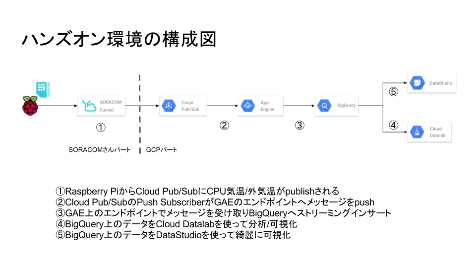

# Google Cloud Platform™ (GCP™)で始める IoT 入門セミナー

# ハンズオン用テキスト

本セミナーでは、大量のデータを管理・活用する「Google Cloud Platform™（以下 GCP）」と IoT 通信プラットフォーム「SORACOM」を組み合わせて IoT システムを構成する手順を、実際に手を動かして体験していただきます。

本ハンズオンでは、シングルボードコンピュータ Raspberry Pi に温度センサーを接続し、得られたセンサーデータを SORACOM を通じて GCP に送信し、可視化・分析を行います。

全体の流れは以下のようになっています。

- [Chapter 1: SORACOM アカウント作成](chapter-1.md)
- [Chapter 2: Raspberry Pi をセットアップする](chapter-2.md)
- [Chapter 3: Raspberry Pi を 3G 接続する](chapter-3.md)
- [Chapter 4: 温度センサーを使ったセンシング](chapter-4.md)
- [Chapter 5: Google Cloud Platformのアカウント作成とセットアップ](chapter-5.md)
- [Chapter 6: センシングデータ収集用の環境のセットアップ](chapter-6.md)
- [Chapter 7: センサーデータの可視化と分析](chapter-7.md)

早速、１章から始めてみましょう。

### NEXT >> [Chapter 1: SORACOM アカウント作成](chapter-1.md)
