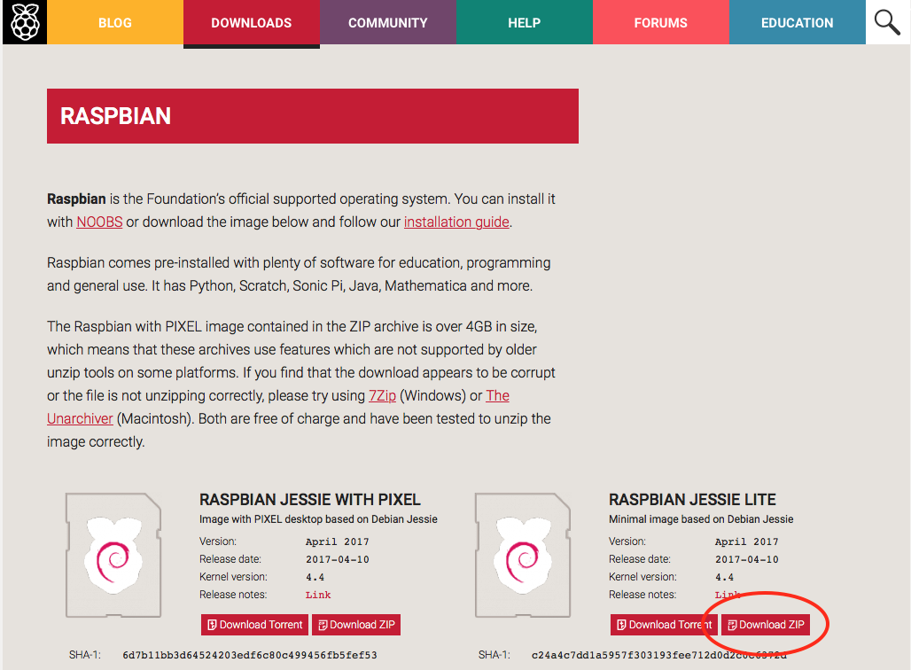
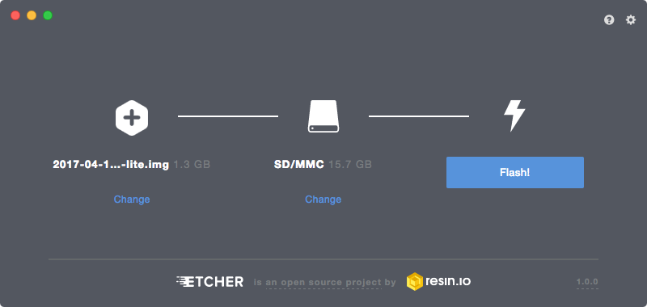
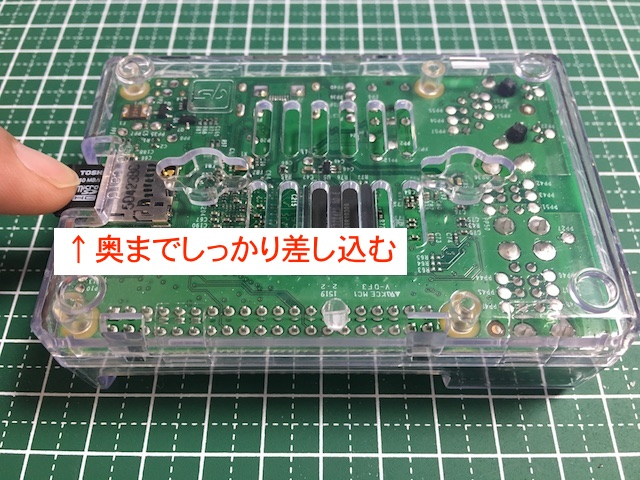
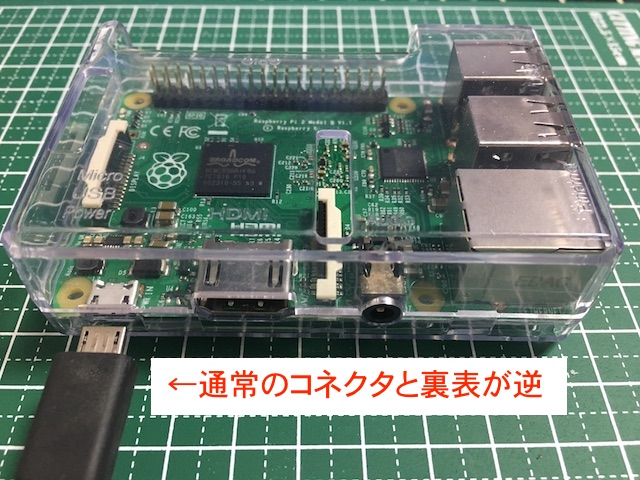

# Chapter 2: Raspberry Pi をセットアップする

ここでは、Raspberry Pi のセットアップ方法について解説します。

### ハンズオンでは、OS(Raspbian) のインストールが既に終わっているため、 【[SSH で Raspberry Pi へ接続する](#SSH)】から進めてください。

## <a name="INSTALL">OS(Raspbian) のインストール</a>
Raspberry Pi で標準的に使用されている、Raspbian を利用します。Raspbian は Linux ディストリビューションの１つ Debian GNU/Linux を、Raspberry Pi 向けに最適化したものとなります。また、本ハンズオンでは、Raspberry Pi にモニターやキーボード・マウスを接続する事を想定していないので、Lite イメージを使用します。  
Raspberry Pi 用の OS のインストールは、Micro SD カードに OS イメージを書き込む事で行います。これは通常はパソコンなどで行います。

### Raspbian イメージのダウンロード
Raspbian の OS イメージは、https://www.raspberrypi.org/downloads/raspbian/ からダウンロード出来ます。  
右側の、Raspbian Jessie Lite のイメージを ZIP 形式でダウンロードします。



ダウンロードが完了したら、ZIP ファイルを解凍して YYYY-MM-DD-raspbian-jessie-lite.img を取り出します。

### Raspbian イメージを書き込む
SDカードへの書き込みには、Ethcer(https://etcher.io) を使います。  
ご使用の環境に合わせたインストーラをダウンロードし、起動します。  
先ほどダウンロードしたイメージを選択し、書き込み先を指定して、Flash! を押すと書き込みを行います。



Flash Complete! となれば、書き込みは完了です。

### SSH サービス有効化と WiFi の事前設定
書き込み完了後、一旦 SD カードを取り出し、再度接続すると boot パーティションが現れます。
ここに２つのファイルをコピーします。

1. ssh というファイル名の空ファイル(0バイト)
2. wpa_supplicant.conf というファイル名の WiFi 設定情報ファイル

wpa_supplicant.conf のフォーマットは
```
network={
	ssid="soracom-event"
	psk="soracom7"
}
```
といったような形式となります(環境に合わせて ssid と psk は適宜変更下さい)。

## <a name="BOOT">Raspberry Pi を起動する</a>
Raspberry Pi を起動します。

SD カードを裏面の SD カードスロットに差し込みます



Micro USB ケーブルを 側面のコネクタに差し込みます



赤の LED が点灯し、緑の LED が点滅して OS が起動します。

> 初回のみ、SDカードのサイズ最適化が行われるため、時間がかかります

<!-- TODO: 写真足す？ -->

## <a name="SSH">SSH で Raspberry Pi へ接続する</a>
SSH クライアントを使用して、Raspberry Pi に接続します。

接続先情報
```
接続先: (後述)
ユーザ名: pi
パスワード: raspberry
```

### Raspberry Pi の 接続先を調べる
> ハンズオンの際には、IPアドレスをあらかじめ調べて、ご案内します

Raspberry Pi にアクセスするには、いくつかの方法があります。

1. HDMI モニターを接続し、起動時のメッセージを確認する
確実に調べるには、この方法が良いでしょう。

2. mDNS(Bonjour/Avahi)を利用する
MacやiTunesをインストールしているWindowsホストからは、Raspberry Pi の初期ホスト名 raspberrypi.local でアクセス可能です。  
ただし、同じ LAN に複数の Raspberry Pi が存在する場合は、使用出来ません(その場合、一台ずつ立ち上げて、ホスト名を変えていく必要があります)。

3. ルータの管理画面を確認する
ルータの管理画面で、DHCPのリース状況を確認する

### SSH で接続する
Windows では、[Tera Term](https://ja.osdn.net/projects/ttssh2/) 等のクライアントソフトを使用するとよいでしょう。  
パッケージをダウンロードしてインストールした後、プログラムを立ち上げて以下のように接続先を指定して接続します。

  


Linux/Mac や Windows10 の Bash on Windows などから、コマンドラインで繋ぐには、以下の様にします。

#### コマンド
```
ssh pi@[接続先]
yes
raspberry
```

#### 実行例
```
~$ ssh pi@192.168.123.101
The authenticity of host '192.168.123.101 (192.168.123.101)' can't be established.
ECDSA key fingerprint is SHA256:abODe45Fy52bXHKiygjnrq8ahT4CJ67fwGt/rt2UIvY.
Are you sure you want to continue connecting (yes/no)? yes (初回のみ)
Warning: Permanently added '192.168.123.101' (ECDSA) to the list of known hosts.
pi@192.168.123.101's password: raspberry (画面には表示されないので注意)

The programs included with the Debian GNU/Linux system are free software;
the exact distribution terms for each program are described in the
individual files in /usr/share/doc/*/copyright.

Debian GNU/Linux comes with ABSOLUTELY NO WARRANTY, to the extent
permitted by applicable law.
Last login: Sun May 28 17:22:32 2017 from 192.168.123.xxx

SSH is enabled and the default password for the 'pi' user has not been changed.
This is a security risk - please login as the 'pi' user and type 'passwd' to set a new password.

pi@raspberrypi:~ $
```

無事に接続が出来たら、本章は完了となります。

NEXT >> [Chapter 3: Raspberry Pi を 3G 接続する](chapter-3.md)
