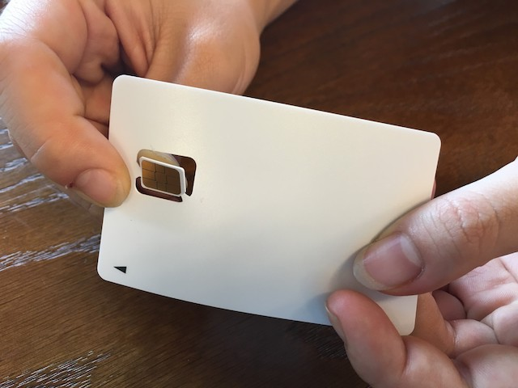
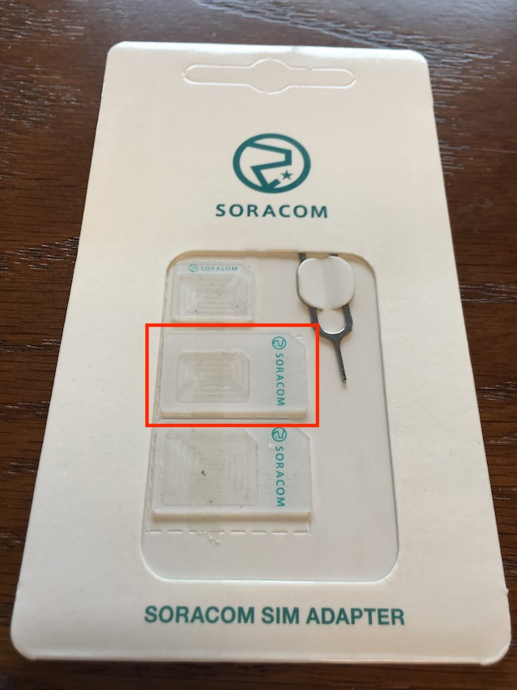
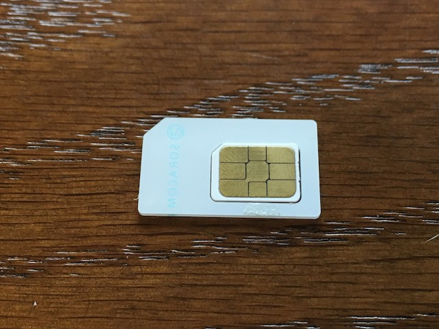
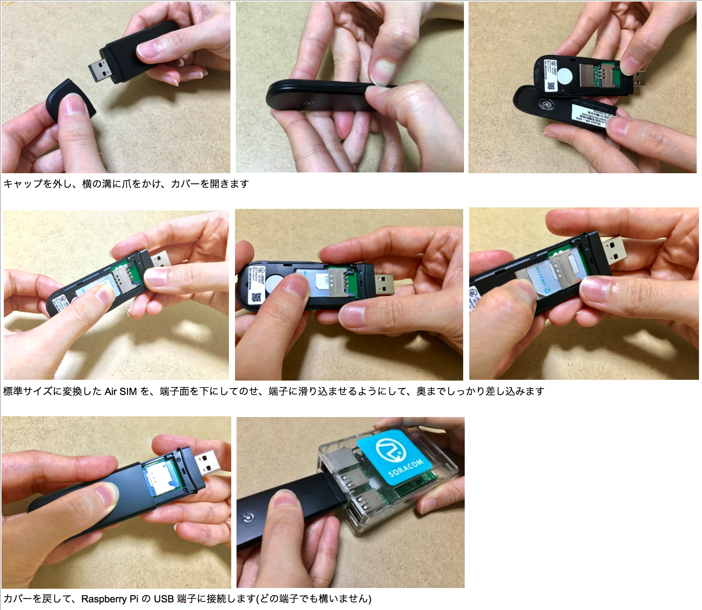

# Chapter 3: Raspberry Pi を 3G 接続する

ここでは、Raspberry Pi を SORACOM Air SIM と USB モデムを使用して、3G 接続します。

## 必要なもの
Raspberry Pi 以外に必要となるものは以下となります

- SORACOM Air SIM
- 3G USB モデム (FS01BU または AK-020)

## SIM のサイズを変換する
Air SIMを取り外します。Air SIMの端子を触らないように気をつけます。



SIM変換アダプタは、真ん中の nano サイズ → 標準サイズ変換を使います。



SIM カードを切り欠きにあわせてアダプタにはめると、このような形となります。



## SIM を モデムに入れて Raspberry Pi に接続する
以下の要領で、SIM カードをモデムに入れ、Raspberry Pi に接続します。

### FUJISOFT FS01BU の場合
TODO 画像作成

### Abit AK-020 の場合


## Raspberry Pi で接続設定を行う
Raspberry Pi に SSH でログインして、以下のコマンドを実行し、3G 接続設定を行います。

### コマンド
```
curl -O https://soracom-files.s3.amazonaws.com/connect_air.sh
chmod +x connect_air.sh
sudo mv connect_air.sh /usr/local/sbin
sudo /usr/local/sbin/connect_air.sh
```

### 実行結果
```
pi@raspberrypi:~ $ curl -O https://soracom-files.s3.amazonaws.com/connect_air.sh
  % Total    % Received % Xferd  Average Speed   Time    Time     Time  Current
                                 Dload  Upload   Total   Spent    Left  Speed
100  2843  100  2843    0     0   7747      0 --:--:-- --:--:-- --:--:--  7767
pi@raspberrypi:~ $ chmod +x connect_air.sh
pi@raspberrypi:~ $ sudo mv connect_air.sh /usr/local/sbin/
pi@raspberrypi:~ $ sudo /usr/local/sbin/connect_air.sh
wvdial is not installed! installing wvdial...
(省略)
Found AK-020
Configuring modem ... done.
waiting for modem device..done.
Resetting modem ...done
could not initialize AK-020
waiting for modem device
--> WvDial: Internet dialer version 1.61
--> Cannot get information for serial port.
--> Initializing modem.
--> Sending: ATZ
ATZ
OK
--> Sending: ATQ0 V1 E1 S0=0 &C1 &D2 +FCLASS=0
ATQ0 V1 E1 S0=0 &C1 &D2 +FCLASS=0
OK
--> Sending: AT+CGDCONT=1,"IP","soracom.io"
AT+CGDCONT=1,"IP","soracom.io"
OK
--> Modem initialized.
--> Sending: ATD*99***1#
--> Waiting for carrier.
ATD*99***1#
CONNECT 21000000
--> Carrier detected.  Starting PPP immediately.
--> Starting pppd at Mon Jul 24 18:53:02 2017
--> Pid of pppd: 2039
--> Using interface ppp0
--> local  IP address 10.xxx.xxx.xxx
--> remote IP address 10.64.64.64
--> primary   DNS address 100.127.0.53
--> secondary DNS address 100.127.1.53
```

3G モデムが初期化され、Raspberry Pi が SORACOM 経由でインターネットに接続されています。

## 操作用のターミナルで接続する
connect_air.sh を実行しているターミナルと別にもう１つターミナルを開き、SSH で Raspberry Pi にログインします。
以下の操作では、この新しい画面に対してコマンドを実行して下さい。

## 接続確認する
接続が出来ている時は、ppp0インターフェースが存在しているはずなので、以下のコマンドで接続状況を確認出来ます。

### コマンド
```
ifconfig ppp0
```

### 実行結果
```
pi@raspberrypi:~ $ ifconfig ppp0
ppp0      Link encap:Point-to-Point Protocol
          inet addr:10.xxx.xxx.xxx  P-t-P:10.64.64.64  Mask:255.255.255.255
          UP POINTOPOINT RUNNING NOARP MULTICAST  MTU:1500  Metric:1
          RX packets:133 errors:0 dropped:0 overruns:0 frame:0
          TX packets:134 errors:0 dropped:0 overruns:0 carrier:0
          collisions:0 txqueuelen:3
          RX bytes:2092 (2.0 KiB)  TX bytes:4039 (3.9 KiB)
```

"inet addr" の後ろに表示されているのが、デバイスに割り当てられた IP アドレスとなります。

次に、インターネットへの疎通が出来るかどうかを確認しましょう。

Google Public DNS (8.8.8.8) への到達性を ping コマンドで調べます。  

### コマンド
```
ping 8.8.8.8
(Ctrl+C で止める)
```

### 実行結果
```
pi@raspberrypi:~ $ ping 8.8.8.8
PING 8.8.8.8 (8.8.8.8) 56(84) bytes of data.
64 bytes from 8.8.8.8: icmp_seq=1 ttl=55 time=343 ms
64 bytes from 8.8.8.8: icmp_seq=2 ttl=55 time=342 ms
64 bytes from 8.8.8.8: icmp_seq=3 ttl=55 time=361 ms
64 bytes from 8.8.8.8: icmp_seq=4 ttl=55 time=340 ms
^C
--- 8.8.8.8 ping statistics ---
4 packets transmitted, 4 received, 0% packet loss, time 3002ms
rtt min/avg/max/mdev = 340.908/347.329/361.814/8.434 ms
```

## まとめ
これで Raspberry Pi が SORACOM Air SIM を使ってクラウドに接続され、インターネットへ接続出来たことを確認できました。

以上で、本章は完了となります。

### NEXT >> [Chapter 4: 温度センサーを使ったセンシング](chapter-4.md)
