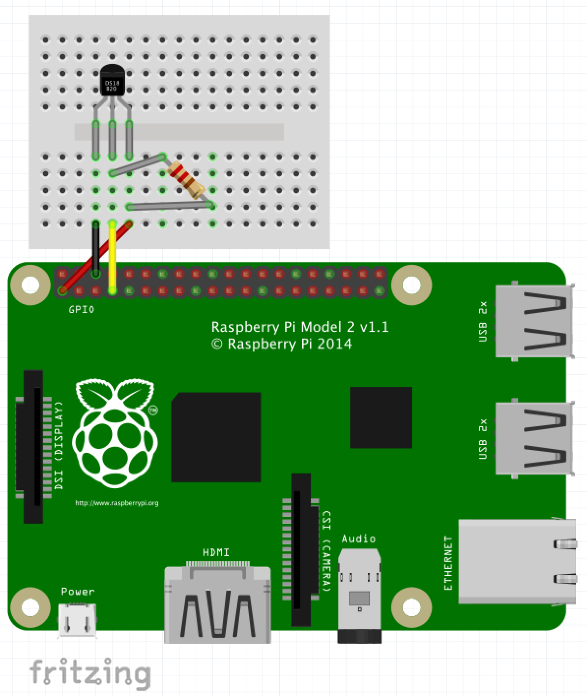
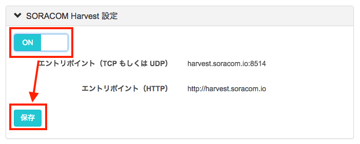
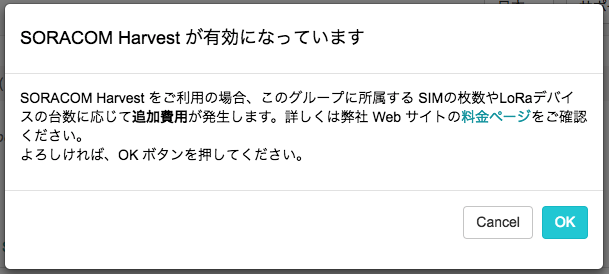
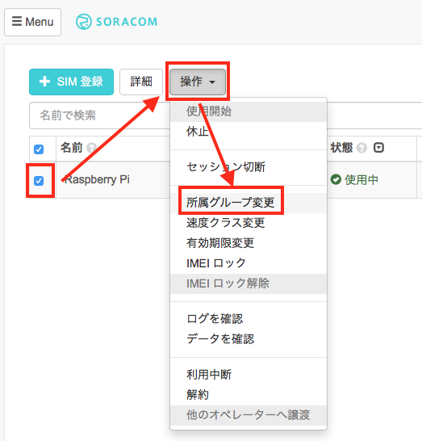
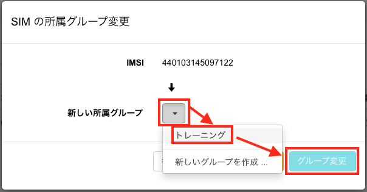
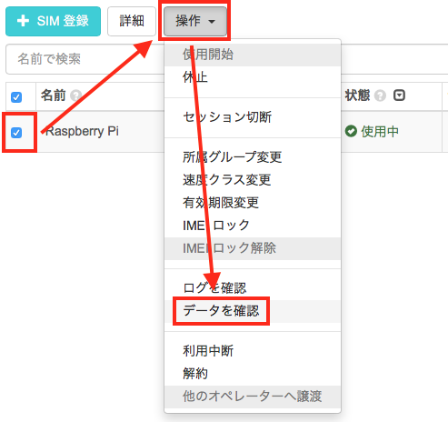
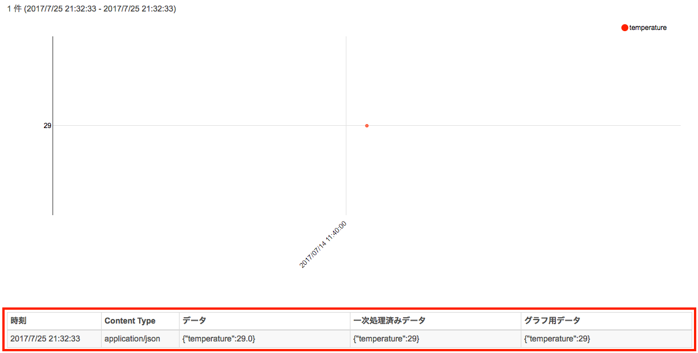
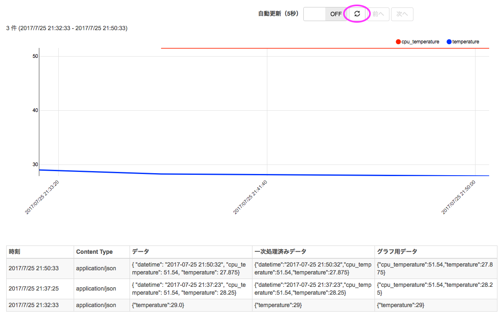

# Chapter 4: 温度センサーを使ったセンシング

## 温度センサー DS18B20+
Raspberry Pi には、GPIO 端子という外部のセンサーや機器などを繋ぐ端子がありますが、Arduino 等とは違い A/D 変換回路がないため、センサー値をアナログ値(電圧)で読み取るようなアナログセンサーをそのまま接続する事はできません。

そこで、本ハンズオンでは、デジタル温度センサーのマキシム・インテグレーテッド・プロダクツ社の、DS18B20+ を使用します。

- [参考:データシート](https://datasheets.maximintegrated.com/en/ds/DS18B20.pdf)

このセンサーは、1-Wire というバスで通信を行うセンサーで、Raspbian では カーネルモジュールでの対応があるため、簡単に扱う事ができます。

まずは、このセンサーの温度データを Raspberry Pi で読み取ってみましょう。

## セットアップ
### 配線する
Raspberry Pi の GPIO(General Purpose Input/Output)端子に、温度センサー DS18B20+ を接続します。

#### 温度センサーの向きを間違えると破損の原因になりますので、十分注意して接続してください



使うピンは、3.3Vの電源ピン(01)、Ground、GPIO 4の３つです。


### Raspberry Pi で温度センサー DS18B20 を使えるように設定する
以下の２ファイルに設定を追記して、適用するために再起動します。

#### /boot/config.txt
```
dtoverlay=w1-gpio-pullup,gpiopin=4
```

#### /etc/modules
```
w1-gpio
w1-therm
```

以下の例では tee コマンドで追記していますが、操作に慣れている場合には vi や nano などのエディタを利用してもよいです。
もしエディタを使う場合には、sudo を頭に付けるのを忘れないようにしましょう。

#### コマンド
```
echo dtoverlay=w1-gpio-pullup,gpiopin=4 | sudo tee -a /boot/config.txt
(echo w1-gpio ; echo w1-therm ) | sudo tee -a /etc/modules
sudo reboot
```

#### 実行例
```
pi@raspberrypi:~ $ echo dtoverlay=w1-gpio-pullup,gpiopin=4 | sudo tee -a /boot/config.txt
dtoverlay=w1-gpio-pullup,gpiopin=4

pi@raspberrypi:~ $ (echo w1-gpio ; echo w1-therm ) | sudo tee -a /etc/modules
w1-gpio
w1-therm
pi@raspberrypi:~ $ sudo reboot
(再起動が行われ、SSH接続が切れる)
```

しばらく待つと、再起動が完了します。もう一度Raspberry Piにログインしてください。
ログインできたら、Raspberry Piがセンサーを認識できているか確認します。再起動後、センサーは /sys/bus/w1/devices/ 以下にディレクトリとして現れます(28-で始まるものがセンサーです)。
cat コマンドでセンサーデータを読み出してみましょう。

#### コマンド
```
ls /sys/bus/w1/devices/
cat /sys/bus/w1/devices/28-*/w1_slave
```

#### 実行例
```
pi@raspberrypi:~ $ ls /sys/bus/w1/devices/
28-0000072431d2  w1_bus_master1
pi@raspberrypi:~ $ cat /sys/bus/w1/devices/28-*/w1_slave
ea 01 4b 46 7f ff 06 10 cd : crc=cd YES
ea 01 4b 46 7f ff 06 10 cd t=30625
```

上記のように、t=30625 で得られた数字は、摂氏温度の1000倍の数字となってますので、この場合は 30.625度となります。センサーを指で温めたり、風を送って冷ましたりして、温度の変化を確かめてみましょう。


> トラブルシュート：
> - もし28-で始まるディレクトリが表示されない場合は、配線が間違っている可能性があります
> - もし数値が０となる場合、抵抗のつなぎ方が間違っている可能性があります

### Raspberry Pi で CPU 温度を確認する
Raspberry Pi には、CPU の温度を計測するセンサーが組み込まれていますので、こちらの数字も確認してみましょう。

#### コマンド
```
cat /sys/class/thermal/thermal_zone0/temp
```

#### 実行結果
```
pi@raspberrypi:~ $ cat /sys/class/thermal/thermal_zone0/temp
49925
```

こちらも同様に、摂氏温度の1000倍の値となっていますので、この場合は 49.925 度となります。CPU負荷をかける事によって、温度が上がるかどうか見て見ましょう。
CPU負荷を簡単に負荷をかけるには yes コマンドが有用です。"y" をひたすら出力するコマンドですが、/dev/null にリダイレクトする事で、CPU使用率をあげる事ができます。Raspberry Pi2/3 は CPUのコアが４つあるので、４回実行して最大限の負荷をかけます。

#### コマンド
```
yes > /dev/null &
yes > /dev/null &
yes > /dev/null &
yes > /dev/null &
cat /sys/class/thermal/thermal_zone0/temp # 何度か実行して変化を見る
killall yes                               # 負荷をかけていたコマンドを停止
cat /sys/class/thermal/thermal_zone0/temp # 何度か実行して変化を見る
```

#### 実行結果
```
pi@raspberrypi:~ $ cat /sys/class/thermal/thermal_zone0/temp
49925
pi@raspberrypi:~ $ yes > /dev/null &
[1] 2659
pi@raspberrypi:~ $ yes > /dev/null &
[2] 2660
pi@raspberrypi:~ $ yes > /dev/null &
[3] 2661
pi@raspberrypi:~ $ yes > /dev/null &
[4] 2669
pi@raspberrypi:~ $ cat /sys/class/thermal/thermal_zone0/temp
59072
pi@raspberrypi:~ $ cat /sys/class/thermal/thermal_zone0/temp
64990
pi@raspberrypi:~ $ cat /sys/class/thermal/thermal_zone0/temp
67679
pi@raspberrypi:~ $ killall yes
[1]   Terminated              yes > /dev/null
[2]   Terminated              yes > /dev/null
[4]+  Terminated              yes > /dev/null
[3]+  Terminated              yes > /dev/null
pi@raspberrypi:~ $ cat /sys/class/thermal/thermal_zone0/temp
52615
```

## 温度情報を手軽に可視化してみる
SORACOM Harvest (以下、Harvest) を使って、この温度情報を手軽に可視化してみましょう。

### Harvest とは
Harves は、IoTデバイスからのデータを収集、蓄積するサービスです。

SORACOM Air が提供するモバイル通信を使って、センサーデータや位置情報等を、モバイル通信を介して容易に手間なくクラウド上の「SORACOM」プラットフォームに蓄積することができます。
保存されたデータには受信時刻や SIM の ID が自動的に付与され、「SORACOM」のユーザーコンソール内で、グラフ化して閲覧したり、API を通じて取得することができます。なお、アップロードされたデータは、40日間保存されます。

#### 容易なデータ収集と蓄積
Harvest を利用することで、お客様は IoT デバイスと SORACOM Air があれば、別途サーバーやストレージを準備することなく、データの送信、保存、可視化までの一連の流れを手軽に実現することができます。アプリケーションの準備が整わずともIoTデバイスのデータの可視化を実現します。


プロトコルは、HTTP、TCP、UDPに対応しています。
デバイスは、これらの簡易な実装だけでクラウドサービスへのデータのインプットが可能となります。

データは 40日間に渡って保存されます。より本格的なデータ収集・分析を行いたい場合には、任意のタイミングで他のクラウドやストレージにデータを移行し、お客様ご自身でデータ分析基盤を構築することも可能です。

#### データの可視化
蓄積されたデータはユーザーコンソールから、グラフおよび送信されたメッセージを確認することができます。


### Harvest を有効にする
Harvest を有効にするには、SIM グループで設定を行う必要があります。ユーザコンソール左上、「Menu」をクリックし「SIM グループ」をクリックします。

グループをまだ作成していない場合、左上の「＋追加」ボタンを押して、グループを作成し、作成されたグループをクリックします。  
既に作成済みのグループを利用する場合は、そのグループ名をクリックします。

「SORACOM Harvest設定」をクリックし、「保存」を押します。



Harvest を有効にすると、SIM あたり１日５円の追加料金が発生します。



Harvest の料金の詳細につきましては、以下のリンクをご参照下さい。
> https://soracom.jp/services_pricing/#harvest

### グループの割り当て

もしグループを新規作成した場合には、利用している SIM カードに対して、グループを割り当てる必要があります。

ユーザコンソール左上、「Menu」をクリックし「SIM 管理」を選びます。使用している SIM を選択し、「操作」から「所属グループ変更」を選びます。



作成したグループを選び、「グループ変更」を押します。



### データ送信のテスト
それでは、Raspberry Pi からデータを送信してみましょう。実際のセンサーデータを送る前に、コマンドラインでダミーデータを送ってみたいと思います。

#### コマンド
curl コマンドで、JSON形式データを HTTP POST リクエストで送信します。  
SORACOM Air SIM で認証が出来ていますので特に認証情報などは必要ありませんが、SORACOM プラットフォーム側ではどの SIM からデータが送信されたかを知ることが出来ます。

```
curl -vH content-type:application/json -d '{"temperature":29.0}' harvest.soracom.io
```

#### 実行結果
```
pi@raspberrypi:~ $ curl -vH content-type:application/json -d '{"temperature":29.0}' harvest.soracom.io
* Rebuilt URL to: harvest.soracom.io/
* Hostname was NOT found in DNS cache
*   Trying 100.127.111.111...
* Connected to harvest.soracom.io (100.127.111.111) port 80 (#0)
> POST / HTTP/1.1
> User-Agent: curl/7.38.0
> Host: harvest.soracom.io
> Accept: */*
> content-type:application/json
> Content-Length: 20
>
* upload completely sent off: 20 out of 20 bytes
< HTTP/1.1 201 Created
< Date: Tue, 25 Jul 2017 12:32:33 GMT
* Server nginx/1.6.2 is not blacklisted
< Server: nginx/1.6.2
< Content-Length: 0
< Connection: Close
<
* Closing connection 0
```

レスポンスコードが `HTTP/1.1 201 Created` になっていれば、データの作成が完了しています。コンソールで確認してみましょう。

### データの確認
Harvest に送られたデータを確認するには、ユーザコンソールを使います。

「SIM 管理画面」より SIM を選択し、「操作」から「データを確認」を選びます。



すると、下記の図のように、ダミーで送信したデータが送られているのが確認いただけます。



### センサーデータを Harvest に送信する
いよいよ、実際のセンサーデータを Harvest に送ってみましょう。


#### コマンド
```
curl -O http://soracom-files.s3.amazonaws.com/handson/report_temperature.sh
chmod +x report_temperature.sh
./report_temperature.sh harvest 60
(Ctrl+Cで止める)
```

#### 実行結果
```
pi@raspberrypi:~ $ curl -O http://soracom-files.s3.amazonaws.com/handson/report_temperature.sh
  % Total    % Received % Xferd  Average Speed   Time    Time     Time  Current
                                 Dload  Upload   Total   Spent    Left  Speed
100  1316  100  1316    0     0    517      0  0:00:02  0:00:02 --:--:--   517
pi@raspberrypi:~ $ chmod +x report_temperature.sh
pi@raspberrypi:~ $ ./report_temperature.sh harvest 60
Air Temperature: 27.875 (c)
CPU Temperature: 51.54 (c)
* Rebuilt URL to: http://harvest.soracom.io/
* Hostname was NOT found in DNS cache
*   Trying 100.127.111.111...
* Connected to harvest.soracom.io (100.127.111.111) port 80 (#0)
> POST / HTTP/1.1
> User-Agent: curl/7.38.0
> Host: harvest.soracom.io
> Accept: */*
> content-type:application/json
> Content-Length: 88
>
* upload completely sent off: 88 out of 88 bytes
< HTTP/1.1 201 Created
< Date: Tue, 25 Jul 2017 12:50:33 GMT
* Server nginx/1.6.2 is not blacklisted
< Server: nginx/1.6.2
< Content-Length: 0
< Connection: Close
<
* Closing connection 0
```

先ほどの Harvest の画面で、上部の更新ボタンを押してみましょう。追加のデータが表示されると思います。  
データを送りながら結果を確認する際には、左側の自動更新ボタンも便利ですので、ぜひ活用してみて下さい。



## まとめ
これで Raspberry Pi に接続したセンサーから読み取ったデータをクラウドへ送信する準備が整いました。

以上で、本章は完了となります。

### NEXT >> [Chapter 5: Google Cloud Platformのアカウント作成とセットアップ](chapter-5.md)

----
## Appendix

### スクリプト解説
スクリプトは、Bashのシェルスクリプトとなっているので、比較的理解しやすいと思います。

- 引数なしで実行した場合には、温度センサーとCPU温度のセンサーを読み取ります。
- 第一引数に harvest もしくは funnel (Chapter-5 で利用します)を指定した場合には、データ送信を行います。
- 第二引数に 秒数を指定すると、その秒数のインターバルを置いてデータを連続で送信します。

```
#!/bin/bash
# set timezone as JST
export TZ=JST-9

# check air & cpu temperature
check_temp(){
  if [ -f /sys/bus/w1/devices/28-*/w1_slave ]
  then
    temp=$(
      tail -1 /sys/bus/w1/devices/28-*/w1_slave | \
      tr = \  | \
      awk '{print $11/1000}'
    )
    echo "Air Temperature: $temp (c)"
  else
    cat <<EOF
ERROR: Could not find temperature sensor DS18B20+
       Please check /boot/config.txt and /etc/modules, and reboot.
-- /boot/config.txt (at bottom)
dtoverlay=w1-gpio-pullup,gpiopin=4

-- /etc/modules (at bottom)
w1-gpio
w1-therm
EOF
  exit 1
  fi

  if [ -f /sys/class/thermal/thermal_zone0/temp ]
  then
    cpu_temp=$(cat /sys/class/thermal/thermal_zone0/temp | awk '{print $1/1000}')
    echo "CPU Temperature: $cpu_temp (c)"
  fi
}

# send temperature data to soracom services (harvest, funnel)
send_temp(){
  cat << EOF | curl -v -d @- -H content-type:application/json http://$target.soracom.io
{
  "datetime": "$(date +"%Y-%m-%d %H:%M:%S")",
  "cpu_temperature": $cpu_temp,
  "temperature": $temp
}
EOF
}

# target could be harvest or funnel
target=$1

# seconds to wait between sending data
interval=$2

# main loop
while [ 1 ]
do
  check_temp
  if [ "$target" != "" ]
  then
    send_temp $target
  fi
  if [ "$interval" = "" ]
  then
    exit 0
  else
    sleep $interval
  fi
done
```
