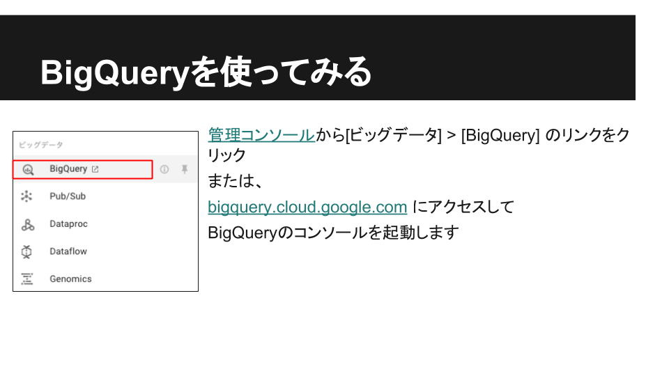

Google Cloud Platformのアカウント作成とセットアップ
===

## Google Cloud Platformとは？
Google Cloud Platformとは、Googleが提供しているクラウドサービスをまとめた総称です。Googleが社内で利用しているテクノロジーと同等のものをサービスとして提供していることが特徴のクラウドサービスです。

## Google Cloud Platformのアカウント開設
本ハンズオンでは、初めてGCPのアカウントを開設する方を対象としています。GCPには、初めてサインアップされた方向けに無料トライアルの期間が設けられています。本ハンズオンは複数のGCPコンポーネントを利用しますが、基本的には無料トライアルの範囲内で収まるようになっています。アカウント開設の詳細なステップは、[Google Cloud Platformの簡単スタートアップガイド](https://docs.google.com/presentation/d/1LPBAnXSncyKCFDKC1KgDrTFYoWmx2DD9otfID-6t6Fk/edit#slide=id.p)のP11-P20を参考にアカウント開設を完了させてください。


## Google Cloud SDKの設定
本ハンズオンでは、GCPの各種コンポーネントの起動/設定/停止等を行うために、Google Cloud SDK (gcloudコマンド) が使えるようになる必要があります。Google Cloud SDKが利用可能になる方法としては2つあります。

1. Google Cloud Shellを使う
2. Google Cloud SDKをローカルマシンにインストールする

双方にはメリット・デメリットがあるため、ユーザーの状況に合わせて選択します。本セッションでは、設定の容易性などから、Google Cloud Shellを使う方法を選択します。Google Cloud Shellは、Google Cloud SDKなどのGCPに必要となる各種ツール類がインストール済みのシェルがブラウザから利用可能になるというものです。Google Cloud Shellは、GCPのコンソールから1クリックで立ち上げて利用することが可能になります。詳しくは、
[Google Cloud Platformの簡単スタートアップガイド](https://docs.google.com/presentation/d/1LPBAnXSncyKCFDKC1KgDrTFYoWmx2DD9otfID-6t6Fk/edit#slide=id.p)のP23-P25を参照してください。また、Cloud Shellに予めインストールされているツール群については[こちら](
https://cloud.google.com/shell/docs/features?hl=ja#persistent_disk_storage)よりご確認ください。


以下、[Google Cloud Platformの簡単スタートアップガイド](https://docs.google.com/presentation/d/1LPBAnXSncyKCFDKC1KgDrTFYoWmx2DD9otfID-6t6Fk/edit#slide=id.p)に従って進めていきます。

### Google Cloud Shellの起動

以下のように、GCPのコンソール上からクリックすると立ち上がります。


### Google Cloud Shellの動作確認

プロジェクトの一覧を確認してみます。


## 本ハンズオンで利用するGCPのサービス

本ハンズオンで利用するGCPのサービスは以下のものになります。
- [Cloud Pub/Sub](https://cloud.google.com/pubsub/?hl=ja)
- [BigQuery](https://cloud.google.com/bigquery/?hl=ja)
- [App Engine](https://cloud.google.com/appengine/?hl=ja)
- [Cloud Datalab](https://cloud.google.com/datalab/?hl=ja)

### Cloud Pub/Sub


Cloud Pub/Subとは、フルマネージドなメッセージングサービスです。アプリケーション間でのメッセージの送受信ができるようになるため、GCPの各種サービスはもちろんのこと、GCPのサービス以外で作られたアプリケーション間についても、うまく疎結合に設計できるようになります。詳細は[ドキュメント](https://cloud.google.com/pubsub/docs/overview?hl=ja)を一読いただくと良いのですが、以下に基本的な概念を説明します。

- `トピック`と呼ばれる名前付きリソースを通じてメッセージの送受信を行う
- `パブリッシャー`は`トピック`にメッセージを送信する
- `サブスクライバー`は`トピック`からメッセージを受信する。受信する方法としては、pullとpushがある
  - 設定されたエンドポイントにpushする方法
  - メッセージをpullする方法

次に`gcloud`コマンドを使ってCloud Pub/Subの動作を体験してみます。

```
# トピックの作成
$ gcloud beta pubsub topics create test_topic

# pullサブスクリプションの登録
$ gcloud beta pubsub subscriptions create --topic test_topic test_subscription

# メッセージの送信
$ gcloud beta pubsub topics publish test_topic "hello"

# メッセージの受信
$ gcloud beta pubsub subscriptions pull --auto-ack test_subscription

# トピックの削除
# gcloud beta pubsub topics delete test_topic
```

### BigQuery
BigQueryとは、フルマネージドなデータウェアハウスです。非常に大規模（ペタバイト級）のデータについても高速かつ低料金で処理することができるサービスです。
[Google Cloud Platformの簡単スタートアップガイド](https://docs.google.com/presentation/d/1LPBAnXSncyKCFDKC1KgDrTFYoWmx2DD9otfID-6t6Fk/edit#slide=id.g10edd0302_19)のP103-114を参考にBigQueryの基本的な操作を体感してみましょう。

#### BigQueryのWebUIへのアクセス

コンソールの左メニュー下らBigQueryのWebUIへと進みます。


#### パブリックなデータセットに対してのWebUI上でのクエリ発行
BigQueryにはクエリの実行を試すためのサンプルのテーブルが用意されています。その中の`natality`テーブルを使ってクエリを発行してみます。`natality`は、1969～2008年に全米50州、コロンビア特別区、ニューヨーク市で登録された、米国のすべての出生数を表したデータセットです。`natality`以外の公開データセットについては[こちら](https://cloud.google.com/bigquery/sample-tables?hl=ja)を参照ください。

まずはデータセット/テーブルを選びます。


その後、"Query Table"ボタンを押し、テーブルに対してクエリを実行させます。


"Query Table"を押しただけでは、列が指定されていないため実行可能なクエリになっていません。スキーマから検索対象としたい列を選び実行します。また、右下にあるマークが緑色のチェックマークの時は実行可能なクエリであることを示し、赤いビックリマークの時はクエリに何らかの問題があり実行可能でないことを示しています。ビックリマークをクリックするとエラーの原因が表示されます。

#### クエリを発行してみる
SQLに近い文法でクエリを発行することができます。`natality`テーブルに対して様々なクエリを発行してみます。

##### テーブルは何行か？
```sql
SELECT COUNT(*) FROM [bigquery-public-data:samples.natality]
```

##### 何年から何年までのデータが含まれているか？
``` sql
SELECT year
FROM [bigquery-public-data:samples.natality]
GROUP BY year
ORDER BY year
```

##### 出生数が多い年順にソート
```sql
SELECT year, COUNT(*) as cnt
FROM [bigquery-public-data:samples.natality]
GROUP BY year
ORDER BY cnt DESC
```

##### 出生数が多い都市順にソート
```sql
SELECT state, COUNT(*) as cnt
FROM [bigquery-public-data:samples.natality]
WHERE state IS NOT null
GROUP BY state
ORDER BY cnt DESC
```

##### 年ごとの平均体重の推移
```sql
SELECT year, AVG(weight_pounds) avg
FROM [bigquery-public-data:samples.natality]
GROUP BY year
ORDER BY year
```

その他にも様々クエリを発行できます。どのようなクエリが発行できるかは[リファレンス](https://cloud.google.com/bigquery/query-reference?hl=ja)を参照してください。


### App Engine
App EngineはフルマネージドなWebアプリケーション開発のためのプラットフォームです。主要なプログラミング言語をサポートし、負荷対策等のアプリケーションの運用に必要な機能一式が揃ったサービスです。[Google Cloud Platformの簡単スタートアップガイド](https://docs.google.com/presentation/d/1LPBAnXSncyKCFDKC1KgDrTFYoWmx2DD9otfID-6t6Fk/edit#slide=id.gd4fd55995_2_0)のP81-93を参考にサンプルアプリケーションをデプロイしてみましょう。

#### サンプルコードをgitでダウンロードする
実行可能なApp Engineのプログラムがgithub上で公開されているため、まずはそのリポジトリを取得します。まずはCloud Shellを起動し、Cloud Shell内で`git clone`を実行します。

```bash
$ git clone https://github.com/GoogleCloudPlatform/python-docs-samples
```

`python-docs-samples`というリポジトリにはApp Engine以外にも様々なGCPサービスのサンプルコードが含まれていますので、興味がある方は確認してみてください。さて、今回は`python-docs-samples/appengine/standard/hello_world`という、App EngineのStandard Environmentで"Hello World"を表示するというシンプルなアプリケーションを使います。

#### サンプルコードをローカル環境で起動させる
AppEngineは`app.yaml`にアプリケーションの設定を書き、`main.py`にアプリケーションのプログラムを書くというお作法があります。サンプルの`hello_world`もこのお作法に習っているので確認してみます。
```bash
$ cd python-docs-samples/appengine/standard/hello_world
$ ls
app.yaml main.py main_test.py
```

`app.yaml`と`main.py`を確認してみましょう。`/`に対してGETがあった場合返すプログラムが書かれていることが分かるでしょう。ローカル環境でこのアプリケーションを動作させるためには`dev_appserver.py`を使います。

```bash
$ dev_appserver.py .
```

ログを見ると、localhostの8080ポートで起動したことが確認できます。Cloud ShellのWeb Preview機能を使うとCloud Shellの環境の8080番ポートにアクセスすることができます。


`dev_appserver.py`は"Ctrl + C"で停止させることができます。

#### サンプルコードをApp Engineにデプロイする

最後に、`gcloud`コマンドを使ってApp Engineにサンプルプログラムをデプロイします。

```bash
$ cd python-docs-samples/appengine/standard/hello_world
$ gcloud app deploy
```

デプロイが完了した後にコンソールからデプロイが完了していることを確認し、アプリケーションをブラウザから確認してみましょう。


この時にアクセスしたURL（デフォルトだと`https://[project_id].appspot.com`）は後ほど利用しますので、覚えておいてください。


### Cloud Datalab
Cloud Datalabとは、[Jupyter](http://jupyter.org/)というデータ分析者に人気のあるツールをベースとして、GCPとの各種サービスとの統合されたインタラクティブな分析環境です。必要となるデータ分析のモジュールも一通りインストールされており、データ分析において非常に使い勝手の良いサービスとなっています。Cloud DatalabはCloud Shellにインストール済みの`datalab`コマンドを使えば簡単に利用を始めることができます。

```
$ datalab create --zone asia-northeast1-a datalab-test
```

ネットワークやディスク、またDockerコンテナのデプロイなど様々な処理が行われるため、少々起動まで時間があかかります。最終的に以下のような表示が出たらデプロイが完了したので、ウェブでプレビューをクリックし、"ポートの変更" > "ポート8081"をクリックしてください。

```
The connection to Datalab is now open and will remain until this command is killed.
Click on the *Web Preview* (up-arrow button at top-left), select *port 8081*, and start using Datalab.
```


Datalabを起動した画面


"+Notebook"部分をクリックすると新しいnotebookを作成することができ、作業を行うことができます。

notebook形式のサンプル


Cloud Datalabはブロック単位でプログラムを書くことができます。また、ブロックを分ければ同じnotebookの中にMarkdownとPythonのプログラムを同居させることができます。各ブロックはそれぞれ独立に実行することができるため、インタラクティブな作業に向いています。

最後に作成したdatalab環境をを削除します。
```
$ datalab delete --delete-disk datalab-test
```
