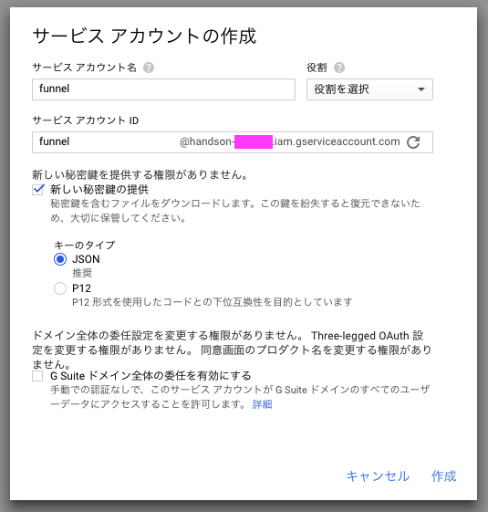
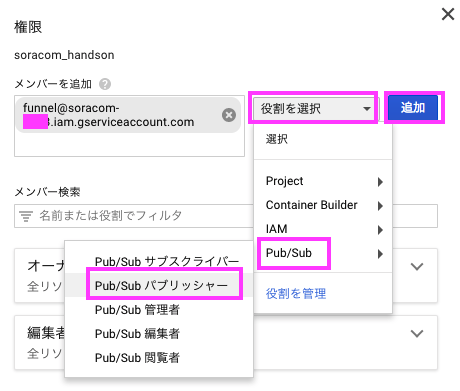
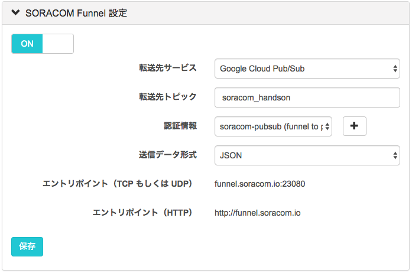
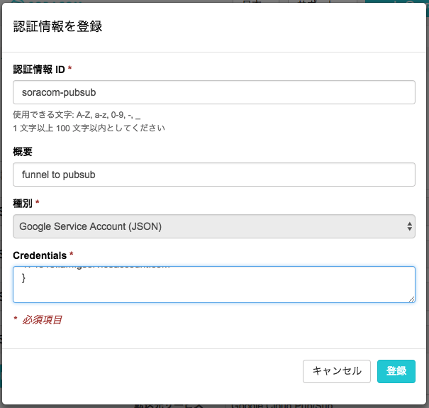

センシングデータ収集用の環境のセットアップ
===

この章では、Chap5で紹介したGCPの各サービスを利用して、Raspberry Piから収集されたデータをリアルタイムでBigQueryに集約するための環境を構築します。改めて本ハンズオンの全体像を確認してみましょう。以下のような流れになっています。


1. Raspberry Piで取得したデータをCloud Pub/SubにメッセージとしてPublishする
2. Publishされたメッセージは、Pushメッセージとして、指定したエンドポイントに通知される。エンドポイントはGAEで構築する
3. 受け取ったメッセージは、BigQueryにストリーミングインサートとして1レコードずつ挿入する
4. Cloud DatalabやDataStudioを利用して収集したデータの分析や可視化を行う

この章では、1から3までの環境を構築し、データを蓄えるための準備を行います。

## BigQueryのデータセットとテーブルを作成
まずは、受け取ったデータを挿入するためのBigQueryのデータセットとテーブルを作成します。作成するデータセットとテーブルは以下の通りです。データセット名/テーブル名ともに、好みに応じて変更可能ですが、名前を変更する場合は関係するプログラムや設定を変更する必要があります。

データセットとテーブル名

|Datasets or Table |名前|
|:--:|:--:|
|Dataset|soracom_handson|
|Table|raspi_env|

テーブルのスキーマ

|カラム名|データ型|
|:--:|:--:|
|datetime|DATETIME|
|cpu_temperature|FLOAT|
|temperature|FLOAT|

データセットとテーブルの作成には、Chap5で説明したWebUIもしくはbqコマンドを使うことができます。ここではWebUIを使う場合の流れを説明します。

### データセットの作成
- BigQueryの[WebUIにアクセス](bigquery.cloud.google.com)
- プロジェクト名右横の▼ボタンをクリックし、"Create new Dataset"を選択
- データセット名として"soracom_handson"を入力しOKボタンを押す

この手順でデータセットの作成は完了です。実際にWebUI上に作成したデータセットが表れていることを確認してください。

### テーブルの作成
- 作成したデータセットの右横の▼ボタンをクリックし、"Create new table"を選択
  - Create Table画面が表示されます
- 空のテーブルを作りたいので"Source Data"は"Create empty table"を選択
- "Table name"は"raspi_env"と設定
- Schemaにカラム情報を設定
  - Name, Typeは上述の通り、また、全てのカラムを必須とするため、Modeは"REQUIRED"とします
- 最後に"Create Table"ボタンを押す


この手順でテーブルの作成は完了です。実際にWebUI上に作成したテーブルが、データセット配下に表れていることを確認してください。


## メッセージのpush先のAPIをGAEで作成

続いて、Cloud Pub/SubからのPush通知でメッセージを受け取る先のエンドポイントを作成します。エンドポイントとなり、push配信により受け取ったメッセージをBigQueryにストリーミングインサートするアプリケーションは`cloud/gcp/src/gae`配下にありますので、そちらを利用します。アプリケーションをデプロイする前に`app.yaml`内の各種環境変数をご自身の環境に合わせて設定し直してください。

### app.yaml内の環境変数

|環境変数名|説明|値（変更可能）
|:--:|:--:|:--:|
|PROJECT_ID|本ハンズオンで利用しているGCPのプロジェクトIDです。| ご自身のproject_id|
|PUBSUB_VERIFICATION_TOKEN|Cloud Pub/Subがpushする時に使うtokenです。任意の文字列を設定してください|soracom|
|BQ_DATASET_NAME|本ハンズオンで利用するBigQueryのデータセット名です。作成したデータセット名としてください。|soracom_handson|
|BQ_TABLE_NAME|本ハンズオンで利用するBigQueryのテーブル名です。作成したテーブル名としてください。|raspi_env|

### アプリケーションの解説

GAEのアプリケーションは以下のようになっています。

- GAEデフォルトのフレームワークである`webapp2`ではなく、Pythonで人気のある`Flask`と呼ばれるマイクロフレームワークを採用しています。
- メソッドがPOSTで、`/pubsub/push`というエンドポイントを用意しています。
  - これは、push配信を行うサブスクライバーに配信先URLを指定する必要があり、そちらと合わせる形で今回はこのようなURLとしています。実際には、サブスクライバー側と同一のURLとなるのであれば、任意のURLを作成して問題ありません。
- token（`PUBSUB_VERIFICATION_TOKEN`として設定したもの）が含まれているPOSTのみ受け付ける仕組みになっていること
  - これは、エンドポイントへのアクセスがPub/Subからのpush配信であることを示すためのものです。
- `appengine_config.py`は今回のデモで必要となる追加モジュールの情報が含まれています。

### アプリケーションのデプロイ

```bash
$ cd /path/to/handson/dir/cloud/gcp/src/gae
# 必要となるモジュールを所定の場所にインストール
$ pip install -t lib -r requirements.txt
$ gcloud app deploy
```

無事にデプロイができたら、URLを控えておいてください。

## Cloud Pub/Subのセットアップ

最後に、Cloud Pub/Subのセットアップを行います。

### トピックの作成
まず初めに、Cloud Pub/Subのトピックを作成します。トピックの作成にはWebコンソールから、`gcloud`コマンドからの両方が可能ですが、ここでは`gcloud`コマンドを使ってトピックを作成します。トピック名はメッセージをpublishする側のアプリケーション側でも使う情報となりますが、ここでは`soracom_handson`という名前で作成してみましょう。

```
# トピックの作成
$ gcloud beta pubsub topics create soracom_handson

# 作成したトピックの確認
$ gcloud beta pubsub topics list
```

### サブスクライバーの登録
続いて、publishされたメッセージを任意のエンドポイントへpushするサブスクライバーを登録します。サブスクライバーもWebコンソール、`gcloud`コマンドの双方から作成可能ですが、ここでは`gcloud`コマンドを使ってサブスクライバーの登録を行います。

```
# サブスクライバーの登録
$ gcloud beta pubsub subscriptions create push-subscriber \
    --topic soracom_handson \
    --push-endpoint \
        https://[your_project_id].appspot.com/pubsub/push?token=soracom \
    --ack-deadline 30

# --topicには、トピック名を指定
# --push-endpointには、立ち上げたGAEのエンドポイントのURLとPUBSUB_VERIFICATION_TOKENとして設定したtokenを指定

# 作成したサブスクライバーの確認
$ gcloud beta pubsub topics list-subscriptions soracom_handson
```


## Raspberry Piからデータを流し込んでみましょう
ここまでで、Raspberry Pi側からデータを受け取るために必要なセットアップは完了しました。実際にRaspberry Piから SORACOM Funnel を経由してデータをCloud Pub/Subにpublishし、そのデータがBigQueryに蓄えれられているかを確認してみましょう。

### SORACOM Funnel とは
SORACOM Funnel(以下、Funnel) は、デバイスからのデータを特定のクラウドサービスに直接転送するクラウドリソースアダプターです。 Funnel でサポートされるクラウドサービスと、そのサービスの接続先のリソースを指定するだけで、データを指定のリソースにインプットすることができます。


Funnel を利用する上での利点としては、HTTP(POST)、TCPソケット、UDPパケットなどの、簡単なプロトコルでデータを送信するだけで、SORACOMプラットフォーム上で各種クラウドサービスへのデータ送信を行え、また認証情報をデバイス上に保存する必要がないという点も挙げられます。

### サービスアカウントの作成
Funnel で使用するための権限をサービスアカウントとして払い出しましょう。

GCP コンソールの「IAMと管理」->「サービスアカウント」を開き、「＋サービスアカウントを作成」をクリックします。

サービスアカウント名を指定し、キーのタイプは JSON を指定して、作成を押します。



作成すると、JSON形式のファイルがダウンロードされます(後ほど使用します)。

### Topic の権限設定
Pub/Sub のトピック詳細から、権限を追加します。

メンバーに先ほど作成したサービスアカウントを指定し、役割として Pub/SUb → Pub/Sub パブリッシャーを選択して、追加を押します。



### Funnel の設定
Funnel の設定も、Harvest と同様にグループに対して行います。

SIM一覧画面から、グループ名をクリックし、SORACOM Funnel 設定を開きます。



- Funnel 設定を有効にする
- 転送先サービスに Google Cloud Pub/SUb を選択
- 転送先トピックを設定
- 送信データ形式を JSON にする
- 認証情報の右側の ＋ をクリックし、認証情報を登録



登録がおわったら、認証情報が選択されているのを確認し、保存を押します

以上で Funnel の設定は完了です。

### センサーデータの送信
Chapter-4 で使用したスクリプトを利用します。本章では送信先のターゲットとして、 funnel を指定します。

下記のコマンドで、Funnel に対して、60秒間隔でデータを送信します。

#### コマンド
```
./report_temperature.sh funnel 60
```

#### 実行結果
```
pi@raspberrypi:~ $ ./report_temperature.sh funnel 60
Air Temperature: 27.687 (c)
CPU Temperature: 51.002 (c)
* Rebuilt URL to: http://funnel.soracom.io/
* Hostname was NOT found in DNS cache
*   Trying 100.127.65.43...
* Connected to funnel.soracom.io (100.127.65.43) port 80 (#0)
> POST / HTTP/1.1
> User-Agent: curl/7.38.0
> Host: funnel.soracom.io
> Accept: */*
> content-type:application/json
> Content-Length: 89
>
* upload completely sent off: 89 out of 89 bytes
< HTTP/1.1 204 No Content
< Date: Tue, 25 Jul 2017 14:08:32 GMT
< Connection: keep-alive
<
* Connection #0 to host funnel.soracom.io left intact
```

### センサーデータの確認
Google Pub/Sub にデータが正しく飛んでいるかどうか、確認してみましょう。

#### Cloud Shell で実行
```
# テスト用の subscription 作成
$ gcloud beta pubsub subscriptions create --topic soracom_handson test_subscription

# データの受信
$ gcloud beta pubsub subscriptions pull --auto-ack test_subscription
```

無事にデータが届いていたら、本章は完了です。

### NEXT >> [Chapter 7: センサーデータの可視化と分析](chapter-7.md)
