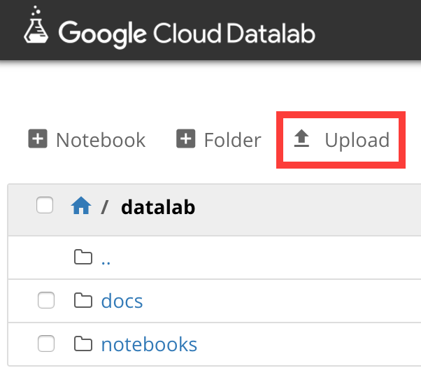

センサーデータの可視化と分析
===

最後に集めたセンサーデータの可視化と分析を行います。データ分析を行うために、本ハンズオンでは[Cloud Datalab](https://cloud.google.com/datalab/?hl=ja)を利用します。

## Cloud Datalabの立ち上げ
まずはじめに、分析環境となるCloud Datalabを立ち上げます。

```bash
$ datalab create --zone asia-northeast1-a handson
```

## Cloud Datalabを使った分析と可視化
Cloud Datalabで行う分析用のコードは`cloud/gcp/src/datalab/`配下に設置しています。datalabには、.ipynbファイルをアップロードして取り込むことができます。アップロードファイルはローカルにデータがある必要があるため、Githubのリポジトリからリポジトリを`git`コマンド、あるいはzipファイルダウンロードを行い、ローカルマシンにリポジトリを準備します。アップロードは、Datalabの画面から行うことができます。



まず初めに`datalab_basic.ipynb`、`sensor_data_analysis.ipynb`をアップロードしましょう。以後は、アップロードした.ipynb上で説明を行います。


## Cloud Datalabの後処理
最後にdatalabの環境を削除します。
```bash
$ datalab delete --delete-disk handson
```
