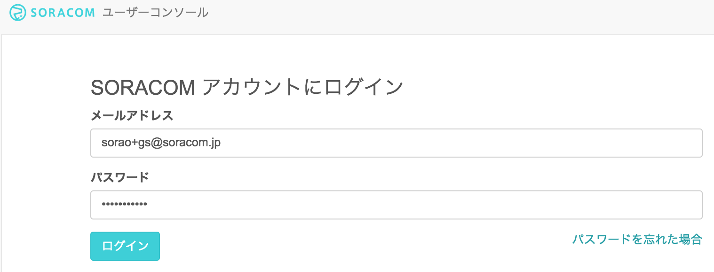
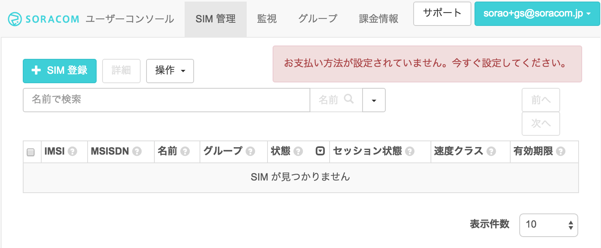

## <a name="chapter1">1章 ユーザーコンソールを使用してAir SIMを管理する
- SORACOM ユーザーアカウントの作成と設定
- SORACOM アカウントの作成
- ユーザーコンソールへのログイン
- 支払情報の設定
- Air SIM の登録
- ユーザーコンソールでの Air SIM の登録

ここでは、SORACOM ユーザーコンソール(以降、ユーザーコンソール)を使用して、SORACOM AirのSIM (以降、Air SIM)をSORACOMのユーザーアカウントに登録します。ユーザーコンソールを使用するために、ユーザーアカウントの作成、および、支払情報の設定(クレジットカード情報)の登録を行います。

### SORACOM ユーザーアカウントの作成と設定
ユーザーコンソールを使用するためには、SORACOMユーザーアカウント(以降、SORACOMアカウント)の作成が必要となります。アカウントの作成には、メールアドレスが必要となります。

### SORACOM アカウントの作成
ユーザーコンソールをご利用いただくためには、まずSORACOM アカウントを作成してください。
https://console.soracom.io/#/signup にアクセスします。
「アカウント作成」画面が表示されますのでメールアドレスおよびパスワードを入力して、[アカウントを作成] ボタンをクリックします。

複数人でAir SIMの管理を行う場合は、事前にメーリングリストのアドレスを取得するなど、共有のメールアドレスをご利用ください。
下記の画面が表示されるので、メールを確認してください。

メールが届いたらリンクをクリックしてください。

自動的にログイン画面に遷移しますので、メールアドレスとパスワードを入力してログインしてください。

### ユーザーコンソールへのログイン
ログイン画面が表示されるので、アカウント作成時に登録したメールアドレスとパスワードを入力し、 [ログイン] ボタンをクリックしてください。(ログイン画面が表示されない場合はブラウザで https://console.soracom.io にアクセスします。)

以下のような「SIM管理」画面が表示されたらログイン完了です。引き続き、支払情報の設定に進みましょう！


###　支払情報の設定
通信料の支払い方法はクレジットカードになります。クレジットカードの情報を登録するには、メイン画面上部のユーザー名から[お支払い方法設定]を開きます。

お支払方法で各情報を入力し、支払い方法を登録します。


### Air SIM の登録

### ユーザーコンソールでの Air SIM の登録

ユーザーコンソールにログインして、Air SIM の登録を行います。左上の [SIM登録] ボタンをクリックします。

「SIM登録」画面で、Air SIM の台紙の裏面に貼ってある IMSI と PASSCODE を入力してください。

名前、グループは空欄のままでも構いません。[登録] を押して SIM 登録を完了してください。（複数の Air SIM を続けて登録することも可能です。）

Air SIM を登録した直後の状態は「準備完了」と表示され、通信可能な状態になっています。ただし、まだセッションは確立されていないので、セッション状態は「オフライン」になっていることを確認してください。

SORACOMではSIMの登録や「使用開始」「休止」「解約」といったモバイル通信の状態の更新をユーザー自身がユーザーコンソールを使用して、実施することが可能です。

なお、初めての通信、もしくは、ユーザーコンソール/APIで使用開始処理を行うことで、状態は「使用中」に変わります。 まだ通信を行いたくない場合は、ユーザーコンソールもしくはAPIで休止処理を行ってください。これにより「休止中」の状態となり通信は行われません。
