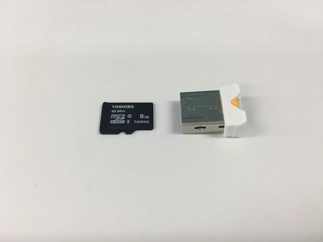
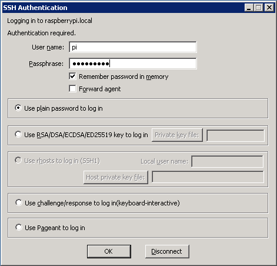

## <a name="chapter2">2章 Raspberry Piのセットアップ
- Raspbian のインストール
- イメージの書き込み(Macの場合)
- イメージの書き込み(Windowsの場合)
- Raspberry Pi への ログイン

### Raspbian のインストール
- Raspbian とは  
Raspberry Pi で使用する事ができる OS は様々なものがありますが、最も多く使われているのは、[Raspbian](https://www.raspbian.org) と呼ばれる Raspberry Pi での動作に最適化された Debian ベースの Linux です。  
SORACOMのハンズオンでは、特に理由がない限りは Raspbian を利用する前提でスクリプトや手順が作られています。ここでは、Raspbian のインストール(MicroSDへの書き込み)方法について、解説します。

- OSイメージファイルのダウンロード  
Raspbian は、デスクトップGUI環境を含む通常版と、CUIのみのLite版があります。  
本ハンズオンでは Raspberry Pi にキーボードやマウスを接続して操作を行わないので、Lite版を利用します。  
Raspbian Lite の イメージは、下記URLのミラーサイトからダウンロードするとよいでしょう。  
http://ftp.jaist.ac.jp/pub/raspberrypi/raspbian_lite/images/

- [2016-05-27バージョン(292MB)](http://ftp.jaist.ac.jp/pub/raspberrypi/raspbian_lite/images/raspbian_lite-2016-05-31/2016-05-27-raspbian-jessie-lite.zip) をダウンロード
- zipファイルを解凍して、イメージファイル(2016-05-27-raspbian-jessie-lite.img)を取り出す

### イメージの書き込み(Macの場合)
- SDカードの接続
PC本体にSDカードスロットがある場合には、変換アダプタを介して接続して下さい。
   
もしPC本体にSDカードスロットがない場合には、USB接続カードリーダー/ライターなどを使って接続して下 さい。


- disk番号の確認
接続をしたら、ターミナルを起動して diskutil list というコマンドを実行します。

```
~$ diskutil list
(略) :
/dev/disk4 (external, physical):
   #:                       TYPE NAME                    SIZE       IDENTIFIER
   0:     FDisk_partition_scheme                        *15.6 GB    disk4
   1:                 DOS_FAT_32 NO NAME                 15.6 GB    disk4s1
```

この場合、容量やフォーマットから disk2 がSDカードである事がわかります。環境によって disk3 であったり disk4 であったりする事がありますので、適宜読み替えて下さい。

> 注意： もし誤って disk0 や disk1 に書き込んでしまった場合、OSが起動できなくなったりする可能性がありますので、十分注意して下さい

- イメージファイルの書き込み
diskの番号が確認できたら、パーティションをマウント解除し、disk全体にイメージを書き込みます。 書き込みが終わったら eject して、SDカードを取り外します。

```
~$ diskutil unmount disk4s1
Volume NO NAME on disk4s1 unmounted
~$ cd Downloads (イメージファイルを解凍した場所mに応じて読み替えてください)
~/Downloads$ sudo dd if=2016-05-27-raspbian-jessie-lite.img of=/dev/rdisk4 bs=1m
Password: (パスワードを打ち込む)
1048576 bytes transferred in 0.427695 secs (2451691 bytes/sec)
1323+0 records in
1323+0 records out
1387266048 bytes transferred in 128.769184 secs (10773277 bytes/sec)
~/Downloads$ diskutil eject disk4
Disk disk4 ejected
```

### イメージの書き込み(Windowsの場合)
- SDカードの接続
PC本体にSDカードスロットがない場合には、USB接続カードリーダー/ライターなどを使って接続して下 さい。


- Win32 Disk Imager のインストール
[Win32 Disk Imager](https://osdn.jp/projects/sfnet_win32diskimager/)のサイトから、インストーラーをダウンロード・実行します。

- イメージファイルの書き込み
Win32 Disk Imager を起動し、右上のDeviceがSDカードのドライブ名である事を確認します。  
ドライブ名の左のボタンを押し、イメージファイルの場所を指定します。  
Write を押すと、SDカードへの書き込みが開始されます。


しばらくして、Write Successful. と表示されれば、書き込み完了です。


### Raspberry Pi への ログイン
Raspberry Pi へ SSH を使ってログインします。
ユーザ名とパスワードは、それぞれ pi / raspberry になります。

- 接続先の調べ方
Raspberry Pi は接続元の PC と同じネットワークに有線LANで接続されているものとします。

接続元のPCが以下のいずれかであれば、Raspberry Pi のIPアドレスが分からなくてもログインが可能です。

````
- Mac を使用している
- Linux 等でAvahiデーモンが動作している
- Windows で Bonjour サービスをインストールしている(iTunesのインストールでもOK)
- Windows10 で mDNS を有効にしている
```

上記の場合、raspberrypi.local というホスト名でLANに接続された Raspberry Pi に接続が出来ます。

もし上記に該当しない場合、HDMIケーブルを使ってPCモニターやテレビなどに Raspberry Pi を接続し、下記のように画面上に表示される IP アドレスを確認する事が出来ます。

```
My IP address is 192.168.1.xxx
```

- ssh接続
接続先がわかったら、自分の端末からRaspberry Piに接続(SSH)します。

MacやLinuxの場合には、ターミナルを立ち上げ、以下のコマンドを実行してください。

```
$ ssh pi@raspberrypi.local
The authenticity of host 'raspberrypi.local (fe80::bb8:70cb:474d:220%en0)' can't be established.
ECDSA key fingerprint is SHA256:MOOy0pXAzbJMFh4ZzkYzQS7Dl6YeU2y6TT0mRYKb/MA.
Are you sure you want to continue connecting (yes/no)? yes
Warning: Permanently added 'raspberrypi.local' (ECDSA) to the list of known hosts.
pi@raspberrypi.local's password: (raspberry と入力)

The programs included with the Debian GNU/Linux system are free software;
the exact distribution terms for each program are described in the
individual files in /usr/share/doc/*/copyright.

Debian GNU/Linux comes with ABSOLUTELY NO WARRANTY, to the extent
permitted by applicable law.
Last login: Sun Jun 26 07:09:55 2016 from 192.168.1.101
pi@raspberrypi:~ $
```

Windowsの場合は、[TeraTerm](https://osdn.jp/projects/ttssh2/)を使用するといいでしょう。

パッケージをダウンロードしてインストールした後、プログラムを立ち上げて以下のように接続先を指定して接続します。


