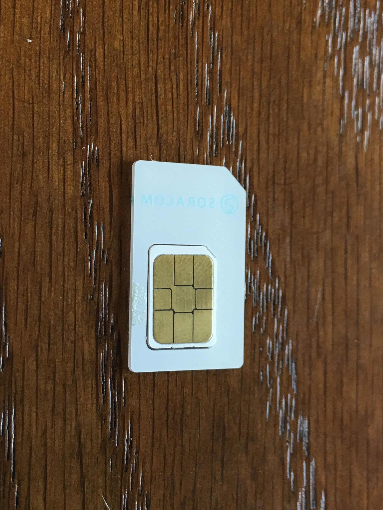

## 3章 <a name="chapter3">Air SIMを使って、インターネットに接続する
ここでは、先ほど登録したSORACOM AirのSIM (以降、Air SIM)を使用して、Raspberry Piからインターネットに接続します。

### Raspberry Pi に USBドングルを接続する


Air SIMを取り外します。Air SIMの端子を触らないように気をつけます。





- Air SIMをドングルから取り出す際の注意


### 必要なパッケージのインストール
> ここから先の作業は、Raspberry Pi にログインした状態でコマンドを実行してください

USBドングルを使用するために、以下のパッケージをインストールし、RaspberryPiをセットアップします。
-	usb-modeswitch
-	wvdial

- usb-modeswitchとwvdialのインストールコマンド

```
pi@raspberrypi:~ $ sudo apt-get install -y usb-modeswitch wvdial
```

```
 	パッケージのインストール中、
  Sorry.  You can retry the autodetection at any time by running "wvdialconf".
     (Or you can create /etc/wvdial.conf yourself.)
と表示されますが、設定ファイル /etc/wvdial.conf は後ほど実行するスクリプトが自動生成しますので、問題ありません。
```

###  接続スクリプトのダウンロード

以下に、モデムの初期化、APNの設定、ダイアルアップなどを行うスクリプトが用意されています。
http://soracom-files.s3.amazonaws.com/connect_air.sh

以下のコマンドを実行し、このスクリプトをダウンロードし、接続用シェルスクリプトを作成します。

```
pi@raspberrypi:~ $ curl -O http://soracom-files.s3.amazonaws.com/connect_air.sh
  % Total    % Received % Xferd  Average Speed   Time    Time     Time  Current
                                 Dload  Upload   Total   Spent    Left  Speed
100  1420  100  1420    0     0   2416      0 --:--:-- --:--:-- --:--:--  2414
pi@raspberrypi ~ $ chmod +x connect_air.sh
pi@raspberrypi ~ $ sudo mv connect_air.sh /usr/local/sbin/

```

### Air SIM を使って、インターネットに接続する

接続の準備ができましたので、接続スクリプトを実行します。接続スクリプトは root 権限で実行する必要があるため、sudoで実行します。

```
pi@raspberrypi:~ $ sudo /usr/local/sbin/connect_air.sh
Bus 001 Device 004: ID 1c9e:98ff OMEGA TECHNOLOGY
Look for target devices ...
 No devices in target mode or class found
Look for default devices ...
   product ID matched
 Found devices in default mode (1)
Access device 004 on bus 001
Current configuration number is 1
Use interface number 0
Use endpoints 0x01 (out) and 0x81 (in)
```

```
USB description data (for identification)

-------------------------
Manufacturer: USB Modem

Product: USB Modem

 Serial No.: 1234567890ABCDEF

-------------------------
Looking for active driver ...
 OK, driver detached
Set up interface 0
Use endpoint 0x01 for message sending ...
Trying to send message 1 to endpoint 0x01 ...
 OK, message successfully sent
Reset response endpoint 0x81
Reset message endpoint 0x01
-> Run lsusb to note any changes. Bye!

insmod /lib/modules/4.1.19-v7+/kernel/drivers/usb/serial/usb_wwan.ko
insmod /lib/modules/4.1.19-v7+/kernel/drivers/usb/serial/option.ko
waiting for modem device
.--> WvDial: Internet dialer version 1.61
--> Cannot get information for serial port.
--> Initializing modem.
--> Sending: ATZ
ATZ
OK
--> Sending: ATQ0 V1 E1 S0=0 &C1 &D2 +FCLASS=0
ATQ0 V1 E1 S0=0 &C1 &D2 +FCLASS=0
OK
--> Sending: AT+CGDCONT=1,"IP","soracom.io"
AT+CGDCONT=1,"IP","soracom.io"
OK
--> Modem initialized.
--> Sending: ATD*99***1#

--> Waiting for carrier.
ATD*99***1#
CONNECT 14400000
--> Carrier detected.  Starting PPP immediately.
--> Starting pppd at Tue Apr 26 04:42:50 2016
--> Pid of pppd: 2395
--> Using interface ppp0
--> pppd: ���v�r[01]�r[01]
--> pppd: ���v�r[01]�r[01]
--> pppd: ���v�r[01]�r[01]
--> pppd: ���v�r[01]�r[01]
--> pppd: ���v�r[01]�r[01]
--> pppd: ���v�r[01]�r[01]
--> local  IP address 10.xxx.xxx.xxx
--> pppd: ���v�r[01]�r[01]
--> remote IP address 10.64.64.64
--> pppd: ���v�r[01]�r[01]
--> primary   DNS address 100.127.0.53
--> pppd: ���v�r[01]�r[01]
--> secondary DNS address 100.127.1.53
--> pppd: ���v�r[01]�r[01]

```

上記のように表示されると接続完了です。

AWS を経由してインターネット接続できていることを確認します。
別のターミナルを立ち上げ、以下のコマンドを実行します。

```
pi@raspberrypi ~ $ curl ifconfig.io
54.65.XXX.XXX  (IPアドレスが表示されます)
pi@raspberrypi ~ $ host 54.65.xxx.xxx
xxx.xxx.65.54.in-addr.arpa domain name pointer ec2-54-65-xx-xxx.ap-northeast-1.compute.amazonaws.com.
```

CurlコマンドによるIPアドレスとhostコマンドにより、EC2からインターネットに接続されていることがわかりました。
