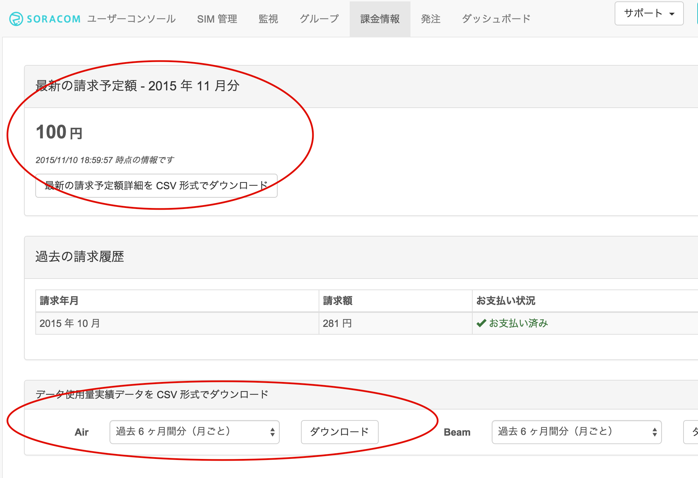

## 4章 <a name="chapter4">ユーザーコンソールによる通信の確認
- データ通信量と利用料金の確認
- Air SIMのデータ通信量の確認
- 利用料金の確認
- 監視機能の確認

インターネットに接続できましたので、ユーザーコンソールからデータ通信量、利用料金を確認して、監視機能を設定しましょう。

### データ通信量と利用料金の確認

- Air SIMのデータ通信量の確認
ユーザーコンソールでは、データ通信量をSORACOM AirのSIM(以降、Air SIM)ごとにチャート形式で確認することができます。<br>
データ通信量を確認したいAir SIMにチェックを入れ [詳細] ボタンをクリックします。

[SIM 詳細] ダイアログが表示されますので、[通信量履歴] タブを開きます。 データ使用量は、表示期間を変更することもできます。

 	データ通信量が反映されるまでに5〜10分かかります。
先ほどのデータ通信が反映されていない場合はしばらくお待ちください。


- 利用料金の確認

ユーザーコンソールからデータ通信料金と基本料金を確認できます。
メイン画面上部のナビゲーションバーから [課金情報] を選択します。


表示されている時間時点の課金情報を確認することができます。




また、画面下部にある [データ使用量実績データを CSV 形式でダウンロード] から、期間を選択して [ダウンロード] ボタンをクリックすることで、基本料金、転送データ量などの詳細を確認することができます。


```
 	請求額詳細のCSVには、IMSIごとに以下の項目が記載されています。
✓	date (日付)
✓	billItemName (basicCharge は基本料金、upload/downloadDataChargeは転送データ量に対する課金)
✓	quantity (数量: upload/downloadDataChargeの場合の単位はバイト)
✓	amount (金額: 日ごとの料金。この項目の総合計が、月額請求額となります)
✓	タグ、グループ
```

- 監視機能の確認
通信量にしきい値を設定し、超えた場合にメールでの通知と通信帯域制限をすることができます。監視できる項目は以下のとおりです。
●	各 SIM の日次通信量
●	各 SIM の今月の合計通信量
●	全ての SIM の今月の合計通信

例えば、全ての Air SIM の合計通信量が5000MB以上になった場合にメール通知を受けたい場合や、ある Air SIM の日次通信量が100MB以上になった場合にはその日の通信速度を制限するというような処理を行いたい場合に、この機能を利用することができます。

通信量はメガバイト単位（1以上の整数値）で入力できます。メールの宛先は登録されているメールアドレスです。通信速度を制限した場合は s1.minimum になり、解除された際は、 s1.standard に復帰します。 (APIを用いた場合には、制限時の通信速度、制限解除時の通信速度を任意に設定することも可能です)

Air SIMに監視の設定をしましょう。当ハンズオンの間に通知がくるように、1MiBで設定します。

「SIM詳細」画面で [監視] タブを開き、[SIM] をクリックして、監視設定を行ったら [設定を更新] ボタンをクリックして保存します。  


ここでの設定は、対象のAir SIMごとに有効になります。

```
 	監視の設定は、以下の3つを対象することができます。
✓	Air SIM<br>
✓	(Air SIMの所属する)グループ<br>
✓	(登録した)全てのSIM
```


すぐに、メール通知を確認したい場合は、Raspberry Piから以下のコマンドを実行して、1MiBのダウンロードを実施してみてください。

```
pi@raspberrypi ~ $ wget http://soracom-files.s3.amazonaws.com/1MB
```

以下のような通知が届きます。(通知は最大で5分程度かかります。)


ここまでで、1〜4章までが完了しました。

- 1章 ユーザーコンソールを使用してAir SIMを管理する
- 2章 Raspberry Piのセットアップ
- 3章 Air SIMを使って、インターネットに接続する
- 4章 ユーザーコンソールによる通信の確認
