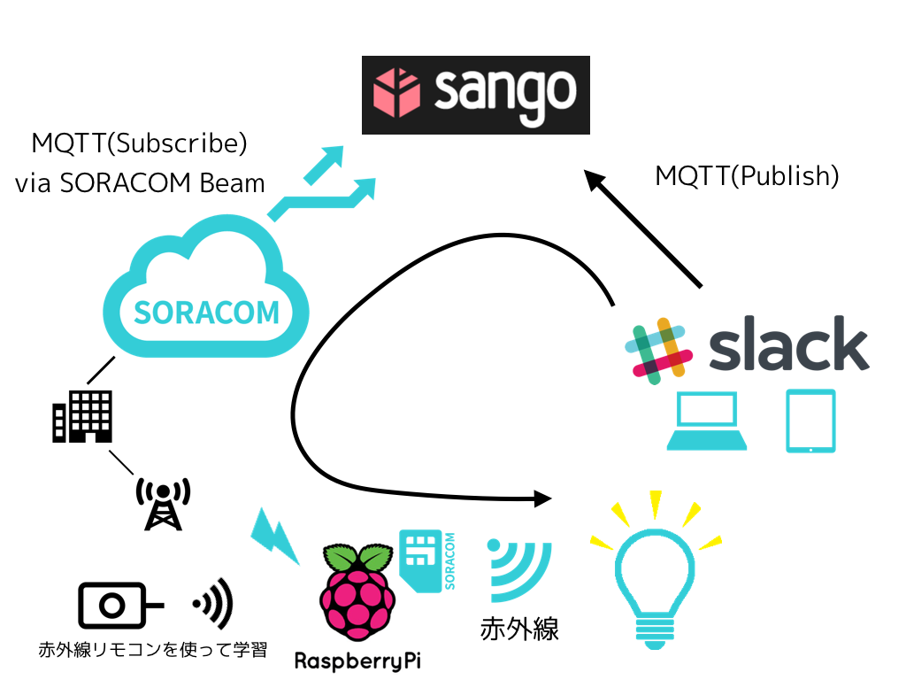

## <a name="chapter9">9章 SORACOM Beam経由で赤外線信号を送信する
- 全体構成
- Raspberry Piにプログラムをダウンロード
- ホストPCにプログラムをダウンロード
- SORACOM Beam経由で赤外線信号を送信する

### 全体構成


### Raspberry Piにプログラムをダウンロード

- プログラムをダウンロード  
`$ curl -O hogehoge`

- MQTTクライアントをインストール  
`$ sudo gem install mqtt`

- 環境変数を設定する  
`$ export MQTT_USERNAME=<Sangoで取得したユーザ名>`

- MQTTを受信する  
`$ ruby ir_tools/subscriber.rb`

上記のプログラムを起動したまま別のタブでホストPCにログイン
### ホストPCにプログラムをダウンロード
- プログラムをダウンロード  
`$ curl -O hogehoge`

- MQTTクライアントをインストール  
`$ gem install mqtt`

- 環境変数を設定する

```
$ export MQTT_PASSWORD=<Sangoで取得したパスワードを入力>
$ export MQTT_USERNAME=<Sangoで取得したユーザ名>
```
- 下記スクリプトでMQTTを送信し、赤外線信号が送信されることを確認  
`$ ruby ir_tools/publisher.rb power_on`  
power_onを他の命令に変えることで他の信号も送信できます。  
詳しくは「5章　応用編」を参照してください。  

おつかれさまでした！！
以上でハンズオンは終了です。
