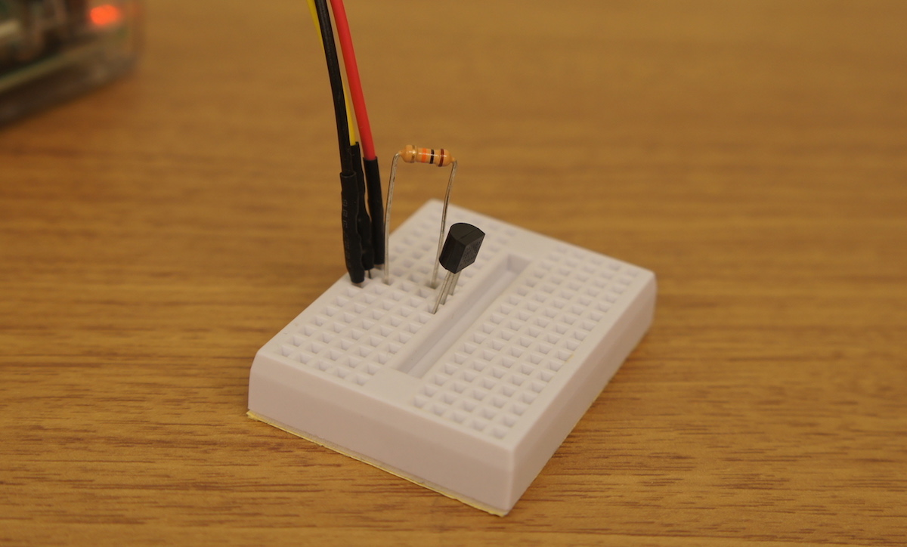

# ラズパイ x ソラコムキャンペーン 植物観察キット

***

## 目次
- [はじめに](#section1)
- [概要](#section2)
- [必要なもの](#section3)
  - [SORACOM アカウントの作成](#section1-2)

- [温度センサー DS18B20+ を使う](#section4)
  - [セットアップ](#section4-1)
  - [クラウドにデータを送る](#section4-2)
  - [クラウド上でデータを確認する](#section4-3)

- [USBカメラを使う](#section5)
  - [セットアップ](#section5-1)
  - [Webカメラとして使う](#section5-2)
  - [定点観測を行う](#section5-3)
  - [画像をクラウドにアップロードする](#section5-4)

- [おまけ](#section6)
  - [低速度撮影(time-lapse)動画を作成する](#section6-1)
  - [動画をストリーミングする](#section6-2)

***

## <a name="section1">はじめに</a>
このドキュメントは、ラズパイ(Raspberry Pi)と SORACOM の SIM を使って、植物などを定点観測するための仕組みを作る方法を解説します。

カメラで撮影したデータと温度データをSORACOMを使ってクラウドに連携し、貯めたデータをタイムラプス動画として表示、温度のデータはElasticSearch(kibana)を使って可視化します。お好きな観察物を選んで、変化を楽しんでください。

[タイムラプス動画サンプル(YouTube)](https://www.youtube.com/watch?v=3--gMeGOV1I)

## <a name="section2">概要</a>
このキットを使うと、以下のような事ができます。

- 温度センサーからの温度データを、毎分クラウドにアップロードし、可視化(グラフ化)する
- USBカメラで静止画を取り、クラウドストレージにアップロードして、スマホなどから確認する
- 撮りためた静止画を繋げて、タイムラプス動画を作成する

これを使って、植物などの成長を観察してみましょう。

## <a name="section3">必要なもの</a>


1. SORACOM Air で通信が出来ている Raspberry Pi  
 - Raspberry Pi に Raspbian (2016-05-27-raspbian-jessie-lite.img を使用)をインストール
 - Raspberry Pi へ ssh で接続ができる(またはモニターやキーボードを刺してコマンドが実行出来る)
 - Raspberry Pi から SORACOM Air で通信が出来ている

  事前に[こちらのテキスト](../setup/setup.md)を参考に、SORACOM Air の接続ができているものとします
2. ブレッドボード
3. 温度センサー DS18B20+  
  Raspberry Piには接続しやすい、ADコンバータのいらない温度センサー
4. 抵抗 4.7 kΩ
  プルアップ抵抗
5. ジャンパワイヤ(オス-メス) x 3 (黒・赤・その他の色の３本を推奨)
6. USB接続のWebカメラ(Raspbianで認識出来るもの)

##  <a name="section4">温度センサー DS18B20+ を使う</a>
### <a name="section4-1">セットアップ</a>
#### <a name="section4-1.1">配線する</a>
Raspberry Pi の GPIO(General Purpose Input/Output)端子に、温度センサーを接続します。


使うピンは、3.3Vの電源ピン(01)、Ground、GPIO 4の３つです。



#### <a name="section4-1.2">Raspberry Pi でセンサーを使えるように設定する</a>
Raspberry Piの設定として、２つのファイルに追記して(以下の例ではcatコマンドで追記していますが、vi や nano などのエディタを利用してもよいです)、適用するために再起動します。

```
pi@raspberrypi:~ $ sudo su -
root@raspberrypi:~# cat >> /boot/config.txt
dtoverlay=w1-gpio-pullup,gpiopin=4
(Ctrl+D)
root@raspberrypi:~# cat >> /etc/modules
w1-gpio
w1-therm
(Ctrl+D)
root@raspberrypi:~# reboot
```

再起動後、センサーは /sys/bus/w1/devices/ 以下にディレクトリとして現れます(28-で始まるものがセンサーです)。

```
pi@raspberrypi:~ $ ls /sys/bus/w1/devices/
28-0000072431d2  w1_bus_master1
```

> トラブルシュート：
> もしディレクトリが見れない場合、配線が間違っている可能性があります

ファイル名は、センサー１つ１つ異なるIDがついています。センサー値を cat コマンドで読み出してみましょう。

```
pi@raspberrypi:~ $ cat /sys/bus/w1/devices/28-*/w1_slave
ea 01 4b 46 7f ff 06 10 cd : crc=cd YES
ea 01 4b 46 7f ff 06 10 cd t=30625
```

t=30625 で得られた数字は、摂氏温度の1000倍の数字となってますので、この場合は 30.625度となります。センサーを指で温めたり、風を送って冷ましたりして、温度の変化を確かめてみましょう。

> トラブルシュート：
> もし数値が０となる場合、抵抗のつなぎ方が間違っている可能性があります

### <a name="section4-2">クラウドにデータを送る</a>
センサーで取得した温度をSORACOM Beam を使ってクラウドへデータを送ってみましょう。

今回のハンズオンではAWSのElasticsearch Service(以下、ES)へデータを送って、可視化を行います。このハンズオンでは簡略化のため、すでにハンズオン用に事前にセットアップされたESのエンドポイントを用いてハンズオンを行います。


#### <a name="section4-2.1">SORACOM Beamとは</a>

SORACOM Beam とは、IoTデバイスにかかる暗号化等の高負荷処理や接続先の設定を、クラウドにオフロードできるサービスです。Beam を利用することによって、暗号化処理が難しいデバイスに代わって、デバイスからサーバー間の通信を暗号化することが可能になります。

プロトコル変換を行うこともできます。例えば、デバイスからはシンプルなTCP、UDPで送信し、BeamでHTTP/HTTPSに変換してクラウドや任意のサーバーに転送することができます。

現在、以下のプロトコル変換に対応しています。


また、上記のプロトコル変換に加え、Webサイト全体を Beam で転送することもできます。(Webサイトエントリポイント) 全てのパスに対して HTTP で受けた通信を、HTTP または HTTPS で転送を行う設定です。

#### <a name="section4-2.2">SORACOM Beamの設定</a>
当ハンズオンでは、以下の用途でBeamを使用します。

- ESへのデータ転送設定 (Webエンドポイント)

ここでは、ESへのデータ転送設定 (Webエンドポイント)を設定します。
Beam は Air SIM のグループに対して設定するので、まず、グループを作成します。

##### <a name="section4-2.2.1">グループの作成</a>

コンソールのメニューから[グループ]から、[追加]をクリックします。


グループ名を入力して、[グループ作成]をクリックしてください。


次に、SIMをこのグループに紐付けします。


##### <a name="section4-2.2.2">SIMのグループ割り当て</a>


SIM管理画面から、SIMを選択して、操作→所属グループ変更を押します

つづいて、Beamの設定を行います。

##### <a name="section4-2.2.3">ESへのデータ転送設定</a>
先ほど作成したグループを選択し、[SORACOM Beam 設定] のタブを選択します。


ESへのデータ転送は[Webエントリポイント]を使用します。[SORACOM Beam 設定] から[Webサイトエントリポイント]をクリックします。


表示された画面で以下のように設定してください。

- 設定名：ES(別の名前でも構いません)
- 転送先のプロトコル：HTTPS
- ホスト名 : __search-handson-z3uroa6oh3aky2j3juhpot5evq.ap-northeast-1.es.amazonaws.com__


__※上記のスクリーンショットはホスト名が完全には表示されていないので、必ず画像の上に掲載されているアドレスをコピーして入力して下さい__

[保存]をクリックします。

以上でBeamの設定は完了です。

##### <a name="section4-2.2.4">メタデータサービスの設定</a>
次にメタデータサービスを設定してください。
メタデータサービスとは、SORACOM Beamではなく、SORACOM Airのサービスとなります。
デバイス自身が使用している Air SIM の情報を HTTP 経由で取得、更新することができます。

当ハンズオンでは、メタデータサービスを使用して、ESにデータを送信する際にSIMのID(IMSI)を付与して送信します。

先ほど作成したグループを選択し、[SORACOM Air 設定] のタブを選択します。


[メタデータサービス設定]を[ON]にして、[保存]をクリックします。

#### <a name="section4-2.3">プログラムのダウンロード・実行</a>

クラウドへの送信をおこないます。
以下のコマンドを実行し、プログラムをダウンロード・実行し、Beamを経由して正しくデータが送信できるか確認しましょう。

__<font color="red">Beamを使用する(「send_temp_to_cloud.py」の実行時)には、SORACOM Airで通信している必要があります。</font>__

```
pi@raspberrypi:~ $ sudo apt-get install -y python-pip  
:
pi@raspberrypi ~ $ sudo pip install elasticsearch
:
pi@raspberrypi:~ $ wget http://soracom-files.s3.amazonaws.com/send_temp_to_cloud.py
--2016-07-18 10:46:41--  http://soracom-files.s3.amazonaws.com/send_temp_to_cloud.py
Resolving soracom-files.s3.amazonaws.com (soracom-files.s3.amazonaws.com)... 54.231.229.21
Connecting to soracom-files.s3.amazonaws.com (soracom-files.s3.amazonaws.com)|54.231.229.21|:80... connected.
HTTP request sent, awaiting response... 200 OK
Length: 1208 (1.2K) [text/plain]
Saving to: ‘send_temp_to_cloud.py’

send_temp_to_cloud.py     100%[====================================>]   1.18K  --.-KB/s   in 0s

2016-07-18 10:46:41 (36.3 MB/s) - ‘send_temp_to_cloud.py’ saved [1208/1208]

pi@raspberrypi ~ $ python send_temp_to_cloud.py /sys/bus/w1/devices/28-*/w1_slave
- メタデータサービスにアクセスして IMSI を確認中 ... 440103125380131
- ただいまの温度 30.375000
- Beam 経由でデータを送信します
{u'_type': u'temperature', u'_id': u'AVX9nyA6DpzhkadZHaVx', u'created': True, u'_version': 1, u'_index': u'sensor'}
```

> トラブルシュート  
> requests.exceptions.ConnectionError: ('Connection aborted.', error(110, 'Connection timed out'))  
> になる場合、SORACOM Air による 3G 接続を行っていない可能性があります。  
> 必ず connect_air.sh を実行しながら、実行してください。

うまくデータが送信出来たのを確認したら、cronを使って１分に１回通信を行うようにしてみましょう。

(以下ではcronの設定をコマンドラインから行っていますが、crontab -e から行っても構いません)

```
pi@raspberrypi:~ $ ( crontab -l ; echo '* * * * * python send_temp_to_cloud.py /sys/bus/w1/devices/28-*/w1_slave &> /dev/null' ) | crontab -
pi@raspberrypi:~ $ crontab -l
# Edit this file to introduce tasks to be run by cron.
#
# Each task to run has to be defined through a single line
# indicating with different fields when the task will be run
# and what command to run for the task
#
# To define the time you can provide concrete values for
# minute (m), hour (h), day of month (dom), month (mon),
# and day of week (dow) or use '*' in these fields (for 'any').#
# Notice that tasks will be started based on the cron's system
# daemon's notion of time and timezones.
#
# Output of the crontab jobs (including errors) is sent through
# email to the user the crontab file belongs to (unless redirected).
#
# For example, you can run a backup of all your user accounts
# at 5 a.m every week with:
# 0 5 * * 1 tar -zcf /var/backups/home.tgz /home/
#
# For more information see the manual pages of crontab(5) and cron(8)
# m h  dom mon dow   command
* * * * * python send_temp_to_cloud.py /sys/bus/w1/devices/28-*/w1_slave &> /dev/null
```

### <a name="section4-3">クラウド上でデータを確認する</a>
Elasticsearch Service 上にインストールされている Kibana にアクセスします。  
http://bit.ly/kibana4


さらに、折れ線グラフとして可視化されている様子を見てみましょう。  
http://bit.ly/temp-graph

> 全ての SIM カードからの情報が集まっていますので、もし自分の SIM だけの情報を見たい場合には、検索ウィンドウに imsi=[自分のSIMカードのIMSI]  と入れてフィルタ出来ます。


## <a name="section5">USBカメラを使う</a>
Raspberry Pi に USBのカメラ(いわゆるWebカメラ)を接続してみましょう。本キットでは Buffalo 社の　BSWHD06M シリーズを使用しています。

### <a name="section5-1">セットアップ</a>
#### <a name="section5-1.1">接続</a>
USB カメラは、Raspberry Pi の USB スロットに接続して下さい。


#### <a name="section5-1.2">パッケージのインストール</a>
fswebcam というパッケージを使用します。apt-getコマンドでインストールして下さい。

```
pi@raspberrypi:~ $ sudo apt-get install -y fswebcam
```

> トラブルシュート：  
> E: Unable to fetch some archives, maybe run apt-get update or try with --fix-missing?  
> と表示されたら、 sudo apt-get update を行ってから、再度 apt-get install してみてください

#### <a name="section5-1.3">コマンドラインによるテスト撮影</a>
インストールが出来たら、実際に撮影してみましょう。先ほどインストールした、fswebcam コマンドを使います。 -r オプションで解像度を指定する事が出来ます。

```
pi@raspberrypi:~ $ fswebcam -r 640x480 test.jpg
--- Opening /dev/video0...
Trying source module v4l2...
/dev/video0 opened.
No input was specified, using the first.
--- Capturing frame...
Captured frame in 0.00 seconds.
--- Processing captured image...
Writing JPEG image to 'test.jpg'.
```

scp コマンドなどを使って、PCにファイルを転送して開いてみましょう。

##### <a name="section5-1.3.1">Macの場合</a>
```
~$ scp pi@raspberrypi.local:test.jpg .
pi@raspberrypi.local's password:
test.jpg                                      100%  121KB 121.0KB/s   00:00    
~$ open test.jpg
```


##### <a name="section5-1.4">Windowsの場合</a>
TODO: winscp を使う？

> もし難しければ、次に進んで Web ブラウザ経由でも確認出来ますので、スキップして構いません

### <a name="section5-2">Webカメラとして使う</a>

Raspberry PiをWebサーバにして、アクセスした時にリアルタイムの画像を確認できるようにしてみましょう。

まずapache2 パッケージをインストールします
```
pi@raspberrypi:~ $ sudo apt-get install -y apache2
```

インストールが出来たら、CGIが実行出来るようにします。
```
pi@raspberrypi:~ $ sudo ln -s /etc/apache2/mods-available/cgi.load /etc/apache2/mods-enabled/
pi@raspberrypi:~ $ sudo gpasswd -a www-data video
Adding user www-data to group video
pi@raspberrypi:~ $ sudo service apache2 restart
```

最後にCGIプログラムをダウンロードして設置します。
```
pi@raspberrypi:~ $ cd /usr/lib/cgi-bin/
pi@raspberrypi:/usr/lib/cgi-bin $ sudo wget https://soracom-files.s3.amazonaws.com/camera
--2016-07-14 08:04:34--  https://soracom-files.s3.amazonaws.com/camera
Resolving soracom-files.s3.amazonaws.com (soracom-files.s3.amazonaws.com)... 54.231.225.58
Connecting to soracom-files.s3.amazonaws.com (soracom-files.s3.amazonaws.com)|54.231.225.58|:443... connected.
HTTP request sent, awaiting response... 200 OK
Length: 374 [text/plain]
Saving to: ‘camera’

camera              100%[=====================>]     374  --.-KB/s   in 0s     

2016-07-14 08:04:35 (1.45 MB/s) - ‘camera’ saved [374/374]

pi@raspberrypi:/usr/lib/cgi-bin $ sudo chmod +x camera
```

ここまで設定をしたら、Webブラウザでアクセスしてみましょう。

http://raspberrypi.local/cgi-bin/camera

> Windowsの場合や、複数のRaspberry PiがLAN内にある場合には、http://{RaspberryPiのIPアドレス}/cgi-bin/camera でアクセスをしてみて下さい。

リロードをするたびに、新しく画像を撮影しますので、撮影する対象の位置決めをする際などに使えると思います。  
一度位置を固定したら、カメラの位置や対象物の下にビニールテープなどで位置がわかるように印をしておくとよいでしょう。

### <a name="section5-3">定点観測を行う</a>
毎分カメラで撮影した画像を所定のディレクトリに保存してみましょう。

#### <a name="section5-3.1">準備</a>

まず保存するディレクトリを作成して、アクセス権限を変更します。

```
pi@raspberrypi:~ $ sudo mkdir /var/www/html/images
pi@raspberrypi:~ $ sudo chown -R pi:pi /var/www/html/
```

#### <a name="section5-3.2">スクリプトのダウンロードと実行</a>

次にスクリプトをダウンロードしてテスト実行してみましょう。

```
pi@raspberrypi:~ $ wget http://soracom-files.s3.amazonaws.com/take_picture.sh
--2016-07-19 02:19:01--  http://soracom-files.s3.amazonaws.com/take_picture.sh
Resolving soracom-files.s3.amazonaws.com (soracom-files.s3.amazonaws.com)... 54.231.228.9
Connecting to soracom-files.s3.amazonaws.com (soracom-files.s3.amazonaws.com)|54.231.228.9|:80... connected.
HTTP request sent, awaiting response... 200 OK
Length: 444 [text/plain]
Saving to: ‘take_picture.sh’

take_picture.sh           100%[====================================>]     444  --.-KB/s   in 0.001s

2016-07-19 02:19:01 (451 KB/s) - ‘take_picture.sh’ saved [444/444]
pi@raspberrypi:~ $ chmod +x take_picture.sh
pi@raspberrypi:~ $ ./take_picture.sh
checking current temperature ... 29.75 [c]
taking picture ...
--- Opening /dev/video0...
Trying source module v4l2...
/dev/video0 opened.
No input was specified, using the first.
--- Capturing frame...
Captured frame in 0.00 seconds.
--- Processing captured image...
Setting title "Temperature: 29.75 (c)".
Writing JPEG image to '201607190219.jpg'.
```

現在の温度を取得して、温度をキャプションとした画像を保存する事に成功しました。

http://raspberrypi.local/images/
> Windowsの場合や、複数のRaspberry PiがLAN内にある場合には、http://{RaspberryPiのIPアドレス}/images でアクセスをしてみて下さい。

にアクセスするとファイルが出来ていると思います。

あとはこれを定期的に実行するように設定しましょう。

#### <a name="section5-3.3">cron設定</a>

先ほどの温度センサー情報と同じく、cronの設定を行います。

```
* * * * * ~/take_picure.sh &> /dev/null
```

のように crontab に追記すれば、毎分撮影となります。

画像サイズは場合にもよりますが、640x480ドットでだいたい150キロバイト前後になります。
もし毎分撮った場合には、１日に約210MB程度の容量となります。
画像を撮る感覚が狭ければ狭いほど、より滑らかな画像となりますが、SDカードの容量には限りがありますので、もし長期に渡り撮影をするのであれば、

```
*/5 * * * * ~/take_picure.sh &> /dev/null
```

のように５分毎に撮影を行ったり、

```
0 * * * * ~/take_picure.sh &> /dev/null
```

のように毎時０分に撮影を行ったりする事で、間隔を間引いてあげるとよいでしょう。

### <a name="section5-4">画像をクラウドにアップロードする</a>
撮影した画像をインターネットから参照出来るように、クラウドストレージにアップロードしてみましょう。
その際、画像がどのSIMを持つデバイスから送信されたのかを証明するために、SORACOM Endorse を利用します。

#### <a name="section5-4.1">SORACOM Endorse とは</a>
SORACOM Endorse(以下、Endorse) は、Air SIM を使用しているデバイスに対して、SORACOM が認証プロバイダーとしてデバイスの認証サービスを提供します。 SIM を使用した認証を Wi-Fi などの SIM 以外の通信にも使うことが可能となります。


Air SIM で接続後、Endorse に対して認証トークンの発行リクエストを送ると、Endorse が IMSI、IMEI などのデータを含んだ認証トークンを発行します。このトークンは SORACOM の秘密鍵で署名がされています。

デバイスがこのトークンをサーバーに送信すると、サーバー側はこのトークンが SORACOM が発行した正しいものかどうかを、SORACOM の公開鍵で検証することができます。一旦トークンの受け渡しが終われば、サーバーは接続元のデバイスがどの SIM を持っているかを把握できるため、例えばそのままサーバーにログインするような仕組みを作ることもできます。そして一旦認証トークンの受け渡しが終わり認証が完了すれば、接続経路が Air SIM ではなく、Wi-Fi を使用していても、利用者のシステムではどの SIM から接続されているのかを確かなものとして扱うことができます。

### <a name="section5-5">システム構成</a>
下図のような仕組みで、画像をアップロードします。


1. SORACOM Endorse にアクセスをしてトークンを取得
2. 一番最近撮影した画像に、1. で得られたトークン情報をカスタムヘッダとして付与して、アップロード
3. AWS上のプログラム(Lambda)でヘッダ(トークン)が正しいものかどうかを確認し、正しいものと確認できた場合にのみ公開用の領域にコピー
4. スマホ等からIMSI毎の公開URLにアクセスすると、アップロードされた画像にアクセスできます

> 3番のクラウド側の処理は、SORACOM側で用意してあります

### <a name="section5-6">設定</a>
#### SORACOM Endorse設定
SORACOM Endose を有効にします。

1. グループ設定画面で、SORACOM Endorseを開き、下記のように IMSI にチェックボックスを入れて、保存を押します

2. 下記のようなダイアログが表示されますので、OKを押します


SORACOM 側の設定は以上になります。

> アカウント作成から１年以内であれば、無料利用枠に SORACOM Endorse の SIMカード１枚分が無料となります
> ２枚以上でEndorseを有効にしたり、作成から１年以上経ちましたアカウントでは、追加の料金が発生する旨、お気をつけください

### <a name="section5-6.2">Raspberry Pi設定</a>
次に Raspberry Pi の設定を行います。

#### PyJWT のインストール
Python で Endorse で使われている JWT(JSON Web Token) を扱うためのライブラリ、PyJWTをインストールします。
```
pi@raspberrypi:~ $ sudo pip install pyjwt
Downloading/unpacking pyjwt
  Downloading PyJWT-1.4.1-py2.py3-none-any.whl
Installing collected packages: pyjwt
Successfully installed pyjwt
Cleaning up...
```

#### スクリプトのダウンロード＆実行
```
pi@raspberrypi:~ $ wget http://soracom-files.s3.amazonaws.com/upload_image.py
--2016-07-22 05:27:36--  http://soracom-files.s3.amazonaws.com/upload_image.py
Resolving soracom-files.s3.amazonaws.com (soracom-files.s3.amazonaws.com)... 52.219.4.1
Connecting to soracom-files.s3.amazonaws.com (soracom-files.s3.amazonaws.com)|52.219.4.1|:80... connected.
HTTP request sent, awaiting response... 200 OK
Length: 1073 (1.0K) [text/plain]
Saving to: ‘upload_image.py’

upload_image.py                     100%[====================================================================>]   1.05K  --.-KB/s   in 0s

2016-07-22 05:27:36 (32.9 MB/s) - ‘upload_image.py’ saved [1073/1073]
pi@raspberrypi:~ $ python upload_image.py /var/www/html/image.jpg
- SORACOM Endorse にアクセスして token を取得中 ...
{
    "aud": "soracom-endorse-audience",
    "iss": "https://soracom.io",
    "soracom-endorse-claim": {
        "imsi": "440101111111111"
    },
    "jti": "kENUDfNrej4LE2N1VQawlQ",
    "exp": 1469165906,
    "iat": 1469165306,
    "nbf": 1469165246,
    "sub": "soracom-endorse"
}
- Amazon S3 にファイルをアップロード中 ...
PUT https://soracom-handson.s3.amazonaws.com/incoming/camera/kENUDfNrej4LE2N1VQawlQ
status: 200
```

最後に status が 200 となっていれば、アップロードが無事完了しています。

アップロードが完了してから数秒おいて、 ```http://soracom-handson.s3.amazonaws.com/camera/{IMSI}``` にアクセスすると、アップロードした画像にアクセスすることが出来ます。

#### 定期的な実行(cron設定)
毎分撮影したとしても、必ずしも毎分画像をアップロードする必要はありません。  
仮に画像サイズが平均150KBであるとすると、月間の転送にかかる費用(s1.minimumを使用した場合)は、下記のようになります。

|頻度|転送回数/月|転送容量/月|概算費用/月|
|---|---:|---:|---:|
|毎分|43200|約 6.3GB|約 1265円|
|5分毎|8640|約 1.3GB|約 253円|
|10分毎|4320|約 0.6GB|約 126円|

用途やニーズに合わせて頻度を調整してみるとよいでしょう。

頻度の調整は、やはりcronの設定で行います。

##### 毎分
```
* * * * * python upload_image.py /var/www/html/image.jpg &> /dev/null
```

##### ５分毎
```
* * * * * python upload_image.py /var/www/html/image.jpg &> /dev/null
```

しばらくしてから、先ほどのURLをリロードし、画像が更新されていることを確かめましょう。

## <a name="section6">おまけ</a>
### <a name="section6-1">低速度撮影(time-lapse)動画を作成する</a>
Coming soon...

### <a name="section6-2">動画をストリーミングする</a>
Coming soon...
