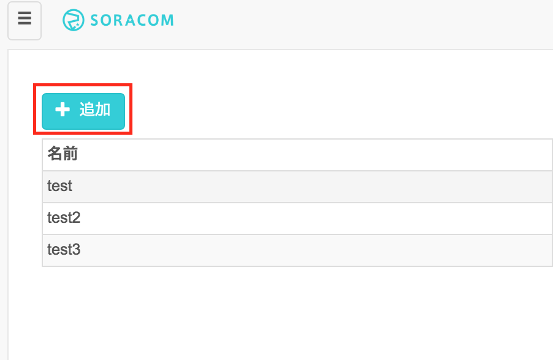
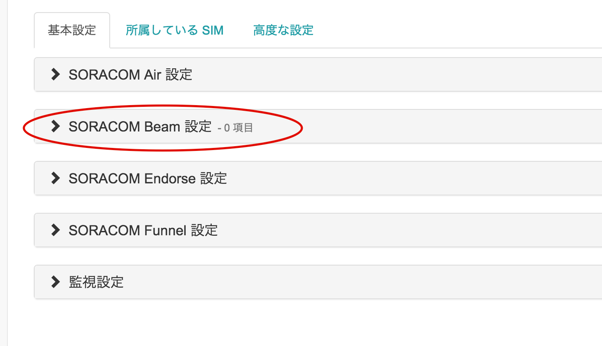

# ラズパイ x ソラコムキャンペーン 植物観察キット

## はじめに
このドキュメントは、ラズパイ(Raspberry Pi)と SORACOM の SIM を使って、植物などを定点観測するための仕組みを作る方法を解説します。

静止画を撮りためていくと、以下の様な動画を作成する事も可能なので、ぜひお試し下さい。

<!--
<iframe width="420" height="315" src="https://www.youtube.com/embed/3--gMeGOV1I" frameborder="0" allowfullscreen></iframe>
-->

## 概要
このキットを使うと、以下のような事ができます。

- 温度センサーからの温度データを、毎分クラウドにアップロードし、可視化(グラフ化)する
- USBカメラで静止画を取り、クラウドストレージにアップロードして、スマホなどから確認する
- 撮りためた静止画を繋げて、タイムラプス動画を作成する

これを使って、植物などの成長を観察してみましょう。

## 必要なもの
1. SORACOM Air で通信が出来ている Raspberry Pi  
 - Raspberry Pi に Raspbian (2016-05-27-raspbian-jessie-lite.img を使用)をインストール
 - Raspberry Pi へ ssh で接続ができる(またはモニターやキーボードを刺してコマンドが実行出来る)
 - Raspberry Pi から SORACOM Air で通信が出来ている

  事前にこちら(TODO:リンクする)のテキストを参考に、SORACOM Air の接続ができているものとします
2. ブレッドボード
3. 温度センサー DS18B20+  
  Raspberry Piには接続しやすい、ADコンバータのいらない温度センサー
4. 抵抗 4.7 kΩ
  プルアップ抵抗
5. ジャンパワイヤ(オス-メス) x 3 (黒・赤・その他の色の３本を推奨)
6. USB接続のWebカメラ(Raspbianで認識出来るもの)

## 温度センサー DS18B20+ を使う
### セットアップ
#### 配線する
Raspberry Pi の GPIO(General Purpose Input/Output)端子に、温度センサーを接続します。


使うピンは、3.3Vの電源ピン(01)、Ground、GPIO 4の３つです。


#### Raspberry Pi でセンサーを使えるように設定する
Raspberry Piの設定として、２つのファイルに追記して(以下の例ではcatコマンドで追記していますが、vi や nano などのエディタを利用してもよいです)、適用するために再起動します。

```
pi@raspberrypi:~ $ sudo su -
root@raspberrypi:~# cat >> /boot/config.txt
dtoverlay=w1-gpio-pullup,gpiopin=4
(Ctrl+D)
root@raspberrypi:~# cat >> /etc/modules
w1-gpio
w1-therm
(Ctrl+D)
root@raspberrypi:~# reboot
```

再起動後、センサーは /sys/bus/w1/devices/ 以下にディレクトリとして現れます(28-で始まるものがセンサーです)。

```
pi@raspberrypi:~ $ ls /sys/bus/w1/devices/
28-0000072431d2  w1_bus_master1
```

> トラブルシュート：
> もしディレクトリが見れない場合、配線が間違っている可能性があります

ファイル名は、センサー１つ１つ異なるIDがついています。センサー値を cat コマンドで読み出してみましょう。

```
pi@raspberrypi:~ $ cat /sys/bus/w1/devices/28-*/w1_slave
ea 01 4b 46 7f ff 06 10 cd : crc=cd YES
ea 01 4b 46 7f ff 06 10 cd t=30625
```

t=30625 で得られた数字は、摂氏温度の1000倍の数字となってますので、この場合は 30.625度となります。センサーを指で温めたり、風を送って冷ましたりして、温度の変化を確かめてみましょう。

> トラブルシュート：
> もし数値が０となる場合、抵抗のつなぎ方が間違っている可能性があります

### クラウドにデータを送る
センサーで取得した温度をSORACOM Beam を使ってクラウドへデータを送ってみましょう。

今回のハンズオンではAWSのElasticsearch Service(以下、ES)へデータを送って、可視化を行います。このハンズオンでは簡略化のため、すでにハンズオン用に事前にセットアップされたESのエンドポイントを用いてハンズオンを行います。


#### SORACOM Beamとは

SORACOM Beam とは、IoTデバイスにかかる暗号化等の高負荷処理や接続先の設定を、クラウドにオフロードできるサービスです。Beam を利用することによって、暗号化処理が難しいデバイスに代わって、デバイスからサーバー間の通信を暗号化することが可能になります。

プロトコル変換を行うこともできます。例えば、デバイスからはシンプルなTCP、UDPで送信し、BeamでHTTP/HTTPSに変換してクラウドや任意のサーバーに転送することができます。

現在、以下のプロトコル変換に対応しています。


また、上記のプロトコル変換に加え、Webサイト全体を Beam で転送することもできます。(Webサイトエントリポイント) 全てのパスに対して HTTP で受けた通信を、HTTP または HTTPS で転送を行う設定です。

#### SORACOM Beamの設定
当ハンズオンでは、以下の用途でBeamを使用します。

- ESへのデータ転送設定 (Webエンドポイント)

ここでは、ESへのデータ転送設定 (Webエンドポイント)を設定します。
Beam は Air SIM のグループに対して設定するので、まず、グループを作成します。

##### グループの作成

コンソールのメニューから[グループ]から、[追加]をクリックします。



グループ名を入力して、[グループ作成]をクリックしてください。


次に、SIMをこのグループに紐付けします。


##### SIMのグループ割り当て


SIM管理画面から、SIMを選択して、操作→所属グループ変更を押します

つづいて、Beamの設定を行います。

##### ESへのデータ転送設定
先ほど作成したグループを選択し、[SORACOM Beam 設定] のタブを選択します。




ESへのデータ転送は[Webエントリポイント]を使用します。[SORACOM Beam 設定] から[Webサイトエントリポイント]をクリックします。


表示された画面で以下のように設定してください。

- 設定名：ES(別の名前でも構いません)
- 転送先のプロトコル：HTTPS
- ホスト名 : search-handson-z3uroa6oh3aky2j3juhpot5evq.ap-northeast-1.es.amazonaws.com


※上記のスクリーンショットはホスト名が完全には表示されていないので、必ず画像の上に掲載されているアドレスをコピーして入力して下さい

[保存]をクリックします。

以上でBeamの設定は完了です。

##### メタデータサービスの設定
次にメタデータサービスを設定してください。
メタデータサービスとは、SORACOM Beamではなく、SORACOM Airのサービスとなります。
デバイス自身が使用している Air SIM の情報を HTTP 経由で取得、更新することができます。

当ハンズオンでは、メタデータサービスを使用して、ESにデータを送信する際にSIMのID(IMSI)を付与して送信します。

先ほど作成したグループを選択し、[SORACOM Air 設定] のタブを選択します。


[メタデータサービス設定]を[ON]にして、[保存]をクリックします。

#### プログラムのダウンロード・実行

クラウドへの送信をおこないます。
以下のコマンドを実行し、プログラムをダウンロード・実行し、Beamを経由して正しくデータが送信できるか確認しましょう。

Beamを使用する(「send_temp_to_cloud.py」の実行時)には、SORACOM Airで通信している必要があります。

```
pi@raspberrypi:~ $ sudo apt-get install -y python-pip  
:
pi@raspberrypi ~ $ sudo pip install elasticsearch
:
pi@raspberrypi:~ $ wget http://soracom-files.s3.amazonaws.com/send_temp_to_cloud.py
--2016-07-18 10:46:41--  http://soracom-files.s3.amazonaws.com/send_temp_to_cloud.py
Resolving soracom-files.s3.amazonaws.com (soracom-files.s3.amazonaws.com)... 54.231.229.21
Connecting to soracom-files.s3.amazonaws.com (soracom-files.s3.amazonaws.com)|54.231.229.21|:80... connected.
HTTP request sent, awaiting response... 200 OK
Length: 1208 (1.2K) [text/plain]
Saving to: ‘send_temp_to_cloud.py’

send_temp_to_cloud.py     100%[====================================>]   1.18K  --.-KB/s   in 0s

2016-07-18 10:46:41 (36.3 MB/s) - ‘send_temp_to_cloud.py’ saved [1208/1208]

pi@raspberrypi ~ $ pi@raspberrypi:~ $ python send_temp_to_cloud.py /sys/bus/w1/devices/28-*/w1_slave
- メタデータサービスにアクセスして IMSI を確認中 ... 440103125380131
- ただいまの温度 30.375000
- Beam 経由でデータを送信します
{u'_type': u'temperature', u'_id': u'AVX9nyA6DpzhkadZHaVx', u'created': True, u'_version': 1, u'_index': u'sensor'}
```

うまくデータが送信出来たのを確認したら、cronを使って１分に１回通信を行うようにしてみましょう。

(以下ではcronの設定をコマンドラインから行っていますが、crontab -e から行っても構いません)

```
pi@raspberrypi:~ $ ( crontab -l ; echo '* * * * * python send_temp_to_cloud.py /sys/bus/w1/devices/28-*/w1_slave &> /dev/null' ) | crontab -
pi@raspberrypi:~ $ crontab -l
# Edit this file to introduce tasks to be run by cron.
#
# Each task to run has to be defined through a single line
# indicating with different fields when the task will be run
# and what command to run for the task
#
# To define the time you can provide concrete values for
# minute (m), hour (h), day of month (dom), month (mon),
# and day of week (dow) or use '*' in these fields (for 'any').#
# Notice that tasks will be started based on the cron's system
# daemon's notion of time and timezones.
#
# Output of the crontab jobs (including errors) is sent through
# email to the user the crontab file belongs to (unless redirected).
#
# For example, you can run a backup of all your user accounts
# at 5 a.m every week with:
# 0 5 * * 1 tar -zcf /var/backups/home.tgz /home/
#
# For more information see the manual pages of crontab(5) and cron(8)
# m h  dom mon dow   command
* * * * * python send_temp_to_cloud.py /sys/bus/w1/devices/28-*/w1_slave &> /dev/null
```

### クラウド上でデータを確認する
Elasticsearch Service 上にインストールされている Kibana にアクセスします。  
http://bit.ly/kibana4


さらに、折れ線グラフとして可視化されている様子を見てみましょう。  
http://bit.ly/temp-graph

> 全ての SIM カードからの情報が集まっていますので、もし自分の SIM だけの情報を見たい場合には、検索ウィンドウに imsi=[自分のSIMカードのIMSI]  と入れてフィルタ出来ます。


