# ラズパイ x ソラコムキャンペーン 植物観察キット　〜ハンズオンセミナー用テキスト〜

***

## 目次
- [はじめに](#section1)
- [概要](#section2)
- [必要なもの](#section3)

- [ユーザーコンソールを使用してAir SIMを管理する](#account)
  - [SORACOM ユーザーアカウントの作成と設定](#account-1)
  - [SORACOM アカウントの作成](#account-2)
  - [ユーザーコンソールへのログイン](#account-3)
  - [支払情報の設定](#account-4)
  - [Air SIM の登録](#account-5)
  - [ユーザーコンソールでの Air SIM の登録](#account-6)

- [Raspberry Piのセットアップ](#raspberrypi)
  - [Raspbian のインストール](#raspbian-install)
  - [Raspberry Pi への ログイン](#ssh-login)

- [Air SIMを使って、インターネットに接続する](#air)
  - [Raspberry Pi に USBドングルを接続する](#air-1)
  - [接続スクリプトのダウンロード](#air-2)
  - [接続確認する](#air-3)

- [ユーザーコンソールによる通信の確認](#console)
  - [データ通信量と利用料金の確認](#console-1)
  - [Air SIMのデータ通信量の確認](#console-2)
  - [利用料金の確認](#console-3)
  - [監視機能の確認](#console-4)

- [温度センサー DS18B20+ を使う](#section4)
  - [セットアップ](#section4-1)
  - [クラウドにデータを送る](#section4-2)
  - [クラウド上でデータを確認する](#section4-3)

- [USBカメラを使う](#section5)
  - [セットアップ](#section5-1)
  - [Webカメラとして使う](#section5-2)
  - [定点観測を行う](#section5-3)
  - [画像をクラウドにアップロードする](#section5-4)

- [おまけ](#section6)
  - [低速度撮影(time-lapse)動画を作成する](#section6-1)
  - [動画をストリーミングする](#section6-2)

***

## <a name="section1">はじめに</a>
このドキュメントは、ラズパイ(Raspberry Pi)と SORACOM の SIM を使って、植物などを定点観測するための仕組みを作る方法を解説します。

**ハンズオンセミナーを想定した構成となっていますので、セミナー受講者以外の方は、このテキストではなく[「ハンズオンキット用テキスト」](./kit.md)をお使いください。**

カメラで撮影したデータと温度データをSORACOMを使ってクラウドに連携し、貯めたデータをタイムラプス動画として表示、温度のデータはElasticSearch(kibana)を使って可視化します。お好きな観察物を選んで、変化を楽しんでください。

[タイムラプス動画サンプル(YouTube)](https://www.youtube.com/watch?v=3--gMeGOV1I)

## <a name="section2">概要</a>
このセミナーでは以下のような事に取り組みます。

- 温度センサーからの温度データを、毎分クラウドにアップロードし、可視化(グラフ化)する
- USBカメラで静止画を取り、クラウドストレージにアップロードして、スマホなどから確認する
- 撮りためた静止画を繋げて、タイムラプス動画を作成する

これを使って、植物などの成長を観察してみましょう。

## <a name="section3">必要なもの</a>


1. Raspberry Pi
2. OSイメージを書き込んだSDカード
2. ブレッドボード
3. 温度センサー DS18B20+  
  Raspberry Piには接続しやすい、ADコンバータのいらない温度センサー
4. 抵抗 4.7 kΩ
  プルアップ抵抗
5. ジャンパワイヤ(オス-メス) x 3 (黒・赤・その他の色の３本を推奨)
6. USB接続のWebカメラ(Raspbianで認識出来るもの)

## <a name="account"> ユーザーコンソールを使用してAir SIMを管理する</a>
ここでは、SORACOM ユーザーコンソール(以降、ユーザーコンソール)を使用して、SORACOM AirのSIM (以降、Air SIM)を SORACOMのユーザーアカウントに登録します。ユーザーコンソールを使用するために、ユーザーアカウントの作成、および、支払情報の設定(クレジットカード情報)の登録を行います。

### <a name="account-1"> SORACOM ユーザーアカウントの作成と設定</a>
ユーザーコンソールを使用するためには、SORACOMユーザーアカウント(以降、SORACOMアカウント)の作成が必要となります。アカウントの作成には、メールアドレスが必要となります。

#### <a name="account-2"> SORACOM アカウントの作成</a>
ユーザーコンソールをご利用いただくためには、まずSORACOM アカウントを作成してください。
https://console.soracom.io/#/signup にアクセスします。
「アカウント作成」画面が表示されますのでメールアドレスおよびパスワードを入力して、[アカウントを作成] ボタンをクリックします。

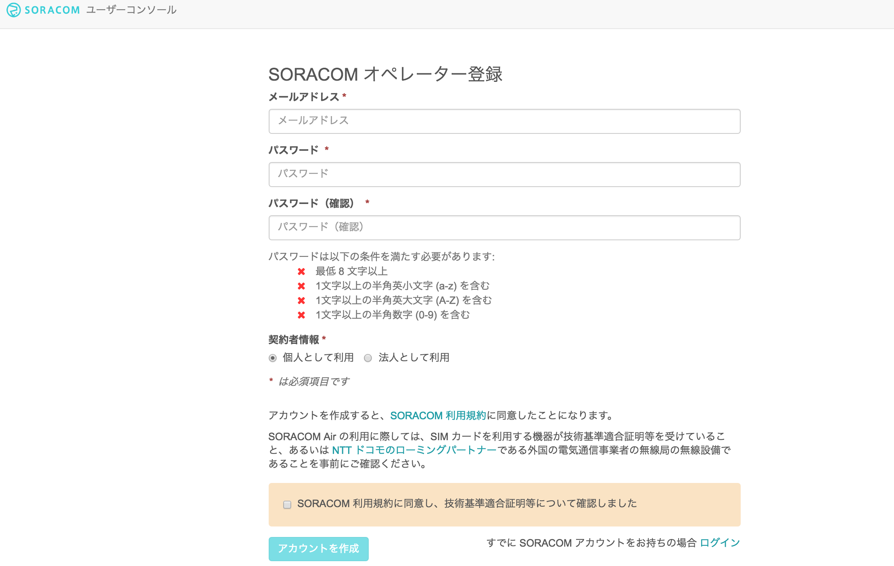

複数人でAir SIMの管理を行う場合は、事前にメーリングリストのアドレスを取得するなど、共有のメールアドレスをご利用ください。
下記の画面が表示されるので、メールを確認してください。


メールが届いたらリンクをクリックしてください。


自動的にログイン画面に遷移しますので、メールアドレスとパスワードを入力してログインしてください。

#### <a name="account-3"> ユーザーコンソールへのログイン</a>
ログイン画面が表示されるので、アカウント作成時に登録したメールアドレスとパスワードを入力し、 [ログイン] ボタンをクリックしてください。(ログイン画面が表示されない場合はブラウザで https://console.soracom.io にアクセスします。)
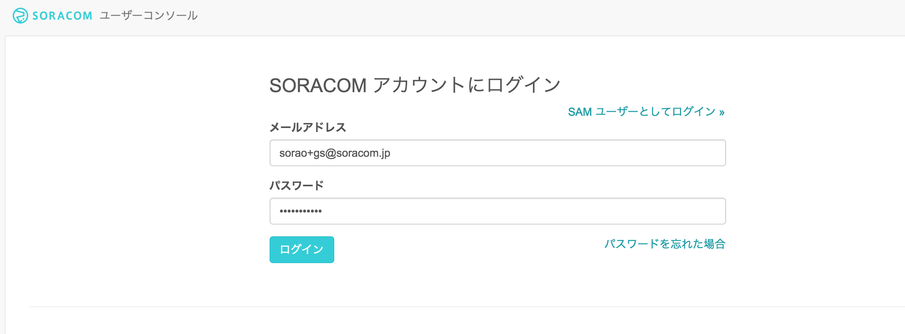


以下のような「SIM管理」画面が表示されたらログイン完了です。引き続き、支払情報の設定に進みましょう！
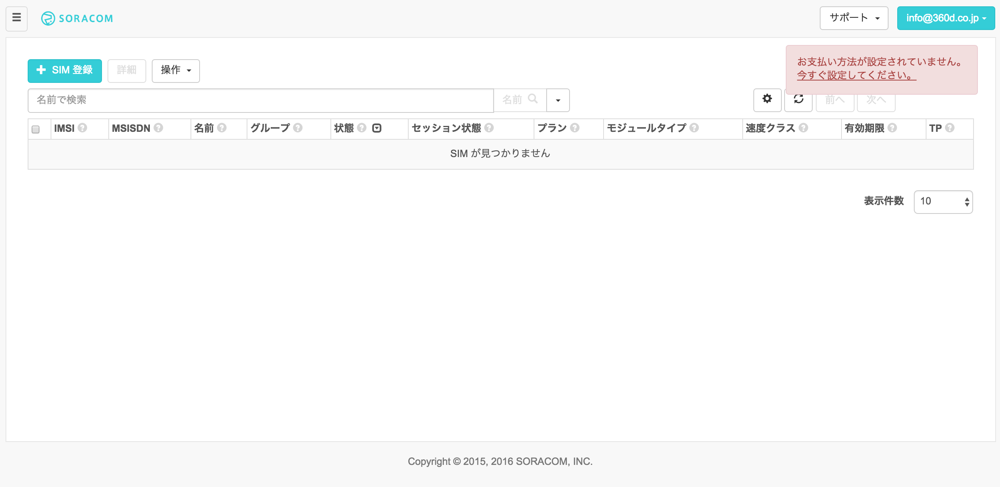


#### <a name="account-4"> 支払情報の設定</a>
通信料の支払い方法はクレジットカードになります。クレジットカードの情報を登録するには、メイン画面上部のユーザー名から[お支払い方法設定]を開きます。


お支払方法で各情報を入力し、支払い方法を登録します。



### <a name="account-5"> Air SIM の登録</a>

#### <a name="account-6"> ユーザーコンソールでの Air SIM の登録</a>

ユーザーコンソールにログインして、Air SIM の登録を行います。左上の [SIM登録] ボタンをクリックします。
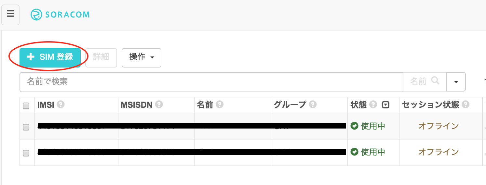


「SIM登録」画面で、Air SIM の台紙の裏面に貼ってある IMSI と PASSCODE を入力してください。


名前、グループは空欄のままでも構いません。[登録] を押して SIM 登録を完了してください。（複数の Air SIM を続けて登録することも可能です。）


Air SIM を登録した直後の状態は「準備完了」と表示され、通信可能な状態になっています。ただし、まだセッションは確立されていないので、セッション状態は「オフライン」になっていることを確認してください。

SORACOMではSIMの登録や「使用開始」「休止」「解約」といったモバイル通信の状態の更新をユーザー自身がユーザーコンソールを使用して、実施することが可能です。

なお、初めての通信、もしくは、ユーザーコンソール/APIで使用開始処理を行うことで、状態は「使用中」に変わります。 まだ通信を行いたくない場合は、ユーザーコンソールもしくはAPIで休止処理を行ってください。これにより「休止中」の状態となり通信は行われません。

## <a name = "raspberrypi"> Raspberry Piのセットアップ</a>
Raspberry Pi で使用する事ができる OS は様々なものがありますが、最も多く使われているのは、[Raspbian](https://www.raspbian.org) と呼ばれる Raspberry Pi での動作に最適化された Debian ベースの Linux です。

SORACOMのハンズオンでは、特に理由がない限りは Raspbian を利用する前提でスクリプトや手順が作られています。

### <a name="raspbian-install"> Raspberry Piの準備
- OSイメージを書き込んだSDカードをRaspberry Piに差し込みます。
  - OSイメージの書き込みが終わっていない場合は、[「セットアップの手順」](../setup/setup.md)を参考にしてください。
- LANケーブル、電源ケーブルを接続し、起動します。数分で起動しますので、しばらく待ってから次のステップ「Raspberry Pi への ログイン」へ進んでください。

### <a name="ssh-login"> Raspberry Pi への ログイン</a>
Raspberry Pi へ SSH を使ってログインします。

```
- ユーザ名: pi
- パスワード: raspberry
```

#### 接続先の確認
自分のRaspberry Piに割り当てられたIPアドレスを確認します。確認方法はセミナー会場でお知らせします。

#### ssh接続
自分のPCからRaspberry Piに接続(SSH)します。

MacやLinuxの場合には、ターミナルを立ち上げ、以下のコマンドを実行してください。

```
$ ssh pi@192.168.123.xxx (割り当てられたIPアドレスを指定してください)
The authenticity of host '192.168.123.xxx (fe80::bb8:70cb:474d:220%en0)' can't be established.
ECDSA key fingerprint is SHA256:MOOy0pXAzbJMFh4ZzkYzQS7Dl6YeU2y6TT0mRYKb/MA.
Are you sure you want to continue connecting (yes/no)? yes
Warning: Permanently added '192.168.123.xxx' (ECDSA) to the list of known hosts.
pi@192.168.123.xxx's password: (raspberry と入力)

The programs included with the Debian GNU/Linux system are free software;
the exact distribution terms for each program are described in the
individual files in /usr/share/doc/*/copyright.

Debian GNU/Linux comes with ABSOLUTELY NO WARRANTY, to the extent
permitted by applicable law.
Last login: Sun Jun 26 07:09:55 2016 from 192.168.1.101
pi@raspberrypi:~ $
```

Windowsの場合は、[TeraTerm](https://osdn.jp/projects/ttssh2/)を使用するといいでしょう。

TeraTermをインストールした後、プログラムを立ち上げて以下のように接続先を指定して接続します。

```
- ホスト：自分のRaspberry Piに割り当てられたIPアドレス
- サービス：SSH
```

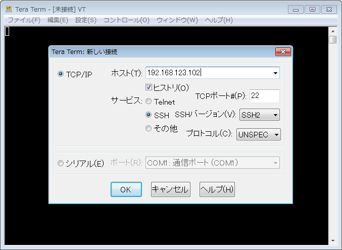

以下のように確認画面が出ますので「続行」をクリックします。

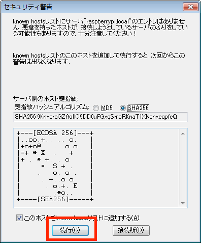

ユーザ名、パスワードを以下のとおり指定してログインします。

```
- ユーザ名: pi
- パスワード: raspberry
```

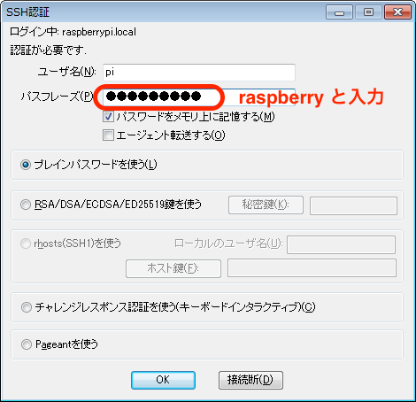

## <a name="air"> Air SIMを使って、インターネットに接続する</a>
ここでは、先ほど登録したSORACOM AirのSIM (以降、Air SIM)を使用して、Raspberry Piからインターネットに接続します。

### <a name = "air-1"> 1.	Raspberry Pi に USBドングルを接続する</a>

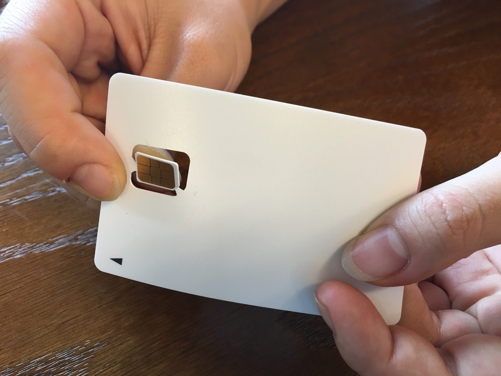

Air SIMを取り外します。Air SIMの端子を触らないように気をつけます。


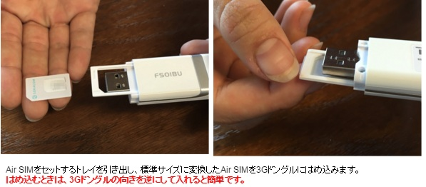
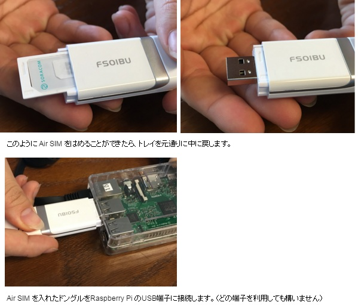


#### Air SIMをドングルから取り出す際の注意


###  <a name = "air-2"> 2. 接続スクリプトのダウンロード</a>

> ここから先の作業は、Raspberry Pi にログインした状態でコマンドを実行してください

以下に、モデムの初期化、APNの設定、ダイアルアップなどを行うスクリプトが用意されています。

https://soracom-files.s3.amazonaws.com/setup_air.sh

以下のコマンドを実行し、このスクリプトをダウンロードし、接続用シェルスクリプトを作成します。

#### コマンド
```
curl -O https://soracom-files.s3.amazonaws.com/setup_air.sh
sudo bash setup_air.sh
```

#### 実行結果
```
pi@raspberrypi:~ $ curl -O https://soracom-files.s3.amazonaws.com/setup_air.sh

  % Total    % Received % Xferd  Average Speed   Time    Time     Time  Current
                                 Dload  Upload   Total   Spent    Left  Speed
100  4040  100  4040    0     0  17211      0 --:--:-- --:--:-- --:--:-- 17264
pi@raspberrypi:~ $ sudo bash setup_air.sh
--- 1. Check required packages
wvdial is not installed! installing wvdial...
  :
  :
ok.

--- 2. Patching /lib/systemd/system/ifup@.service
ok.

--- 3. Generate config files
Adding network interface 'wwan0'.
Adding udev rules for modem detection.
ok.

--- 4. Connect
Found un-initilized modem. Trying to initialize it ...
Now you are all set.

Tips:
 - When you plug your usb-modem, it will automatically connect.
 - If you want to disconnect manually or connect again, you can use 'sudo ifdown wwan0' / 'sudo ifup wwan0' commands.
 - Or you can just execute 'sudo wvdial'.
```

これで、自動的に 3G モデムが初期化され、Raspberry Pi が SORACOM 経由でインターネットに接続します。 また、再起動時やモデムを接続した際にも、自動的に接続されるようになっています。

**このスクリプトをインストールするとRaspberry Pi が起動すると自動的にAir SIMでネットワーク接続が行われるようになります。データの送受信には通信料金が発生しますのでご注意ください。**

### <a name="air-3">3. 接続確認する</a>

接続が出来ている時は、ppp0インターフェースが存在しているはずなので、以下のコマンドで接続状況を確認出来ます。

#### コマンド
```
ifconfig ppp0
```

#### 実行結果
```
pi@raspberrypi:~ $ ifconfig ppp0
ppp0      Link encap:Point-to-Point Protocol
          inet addr:10.xxx.xxx.xxx  P-t-P:10.64.64.64  Mask:255.255.255.255
          UP POINTOPOINT RUNNING NOARP MULTICAST  MTU:1500  Metric:1
          RX packets:133 errors:0 dropped:0 overruns:0 frame:0
          TX packets:134 errors:0 dropped:0 overruns:0 carrier:0
          collisions:0 txqueuelen:3
          RX bytes:2092 (2.0 KiB)  TX bytes:4039 (3.9 KiB)
```

"inet addr" の後ろに表示されているのが、デバイスに割り当てられた IP アドレスとなります。

次に、インターネットへの疎通が出来るかどうかを確認しましょう。

Google Public DNS (8.8.8.8) への到達性を ping コマンドで調べます。

#### コマンド

※下記コマンドは、一行ずつ実行してください

```
ping 8.8.8.8
(Ctrl+C で止める)
```

#### 実行結果
```
pi@raspberrypi:~ $ ping 8.8.8.8
PING 8.8.8.8 (8.8.8.8) 56(84) bytes of data.
64 bytes from 8.8.8.8: icmp_seq=1 ttl=55 time=343 ms
64 bytes from 8.8.8.8: icmp_seq=2 ttl=55 time=342 ms
64 bytes from 8.8.8.8: icmp_seq=3 ttl=55 time=361 ms
64 bytes from 8.8.8.8: icmp_seq=4 ttl=55 time=340 ms
^C
--- 8.8.8.8 ping statistics ---
4 packets transmitted, 4 received, 0% packet loss, time 3002ms
rtt min/avg/max/mdev = 340.908/347.329/361.814/8.434 ms
```

ping コマンドの応答からインターネットへの疎通が取れていることが確認できました。


## <a name = "console"> ユーザーコンソールによる通信の確認</a>
インターネットに接続できましたので、ユーザーコンソールからデータ通信量、利用料金を確認して、監視機能を設定しましょう。


### <a name = "console-1"> 1.	データ通信量と利用料金の確認</a>

#### <a name = "console-2"> Air SIMのデータ通信量の確認</a>
ユーザーコンソールでは、データ通信量をSORACOM AirのSIM(以降、Air SIM)ごとにチャート形式で確認することができます。<br>
データ通信量を確認したいAir SIMにチェックを入れ [詳細] ボタンをクリックします。
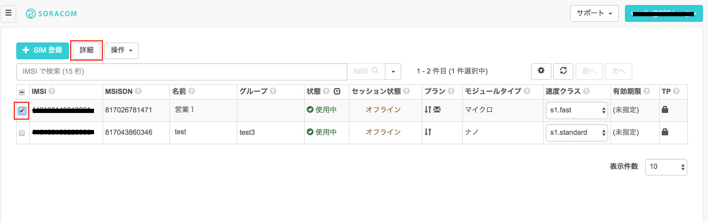
[SIM 詳細] ダイアログが表示されますので、[通信量履歴] タブを開きます。 データ使用量は、表示期間を変更することもできます。

 	データ通信量が反映されるまでに5〜10分かかります。
先ほどのデータ通信が反映されていない場合はしばらくお待ちください。


#### <a name = "console-3"> 利用料金の確認</a>

ユーザーコンソールからデータ通信料金と基本料金を確認できます。
メイン画面左上部のプルダウンメニューから [課金情報] を選択します。


表示されている時間時点の課金情報を確認することができます。


また、画面下部にある [データ使用量実績データを CSV 形式でダウンロード] から、期間を選択して [ダウンロード] ボタンをクリックすることで、基本料金、転送データ量などの詳細を確認することができます。


```
 	請求額詳細のCSVには、IMSIごとに以下の項目が記載されています。
✓	date (日付)
✓	billItemName (basicCharge は基本料金、upload/downloadDataChargeは転送データ量に対する課金)
✓	quantity (数量: upload/downloadDataChargeの場合の単位はバイト)
✓	amount (金額: 日ごとの料金。この項目の総合計が、月額請求額となります)
✓	タグ、グループ
```

#### <a name = "console-4"> 監視機能の確認</a>
通信量にしきい値を設定し、超えた場合にメールでの通知と通信帯域制限をすることができます。監視できる項目は以下のとおりです。
●	各 SIM の日次通信量
●	各 SIM の今月の合計通信量
●	全ての SIM の今月の合計通信

例えば、全ての Air SIM の合計通信量が5000MB以上になった場合にメール通知を受けたい場合や、ある Air SIM の日次通信量が100MB以上になった場合にはその日の通信速度を制限するというような処理を行いたい場合に、この機能を利用することができます。

通信量はメガバイト単位（1以上の整数値）で入力できます。メールの宛先は登録されているメールアドレスです。通信速度を制限した場合は s1.minimum になり、解除された際は、 s1.standard に復帰します。 (APIを用いた場合には、制限時の通信速度、制限解除時の通信速度を任意に設定することも可能です)

Air SIMに監視の設定をしましょう。当ハンズオンの間に通知がくるように、1MiBで設定します。

「SIM詳細」画面で [監視] タブを開き、[SIM] をクリックして、監視設定を行ったら [設定を更新] ボタンをクリックして保存します。  


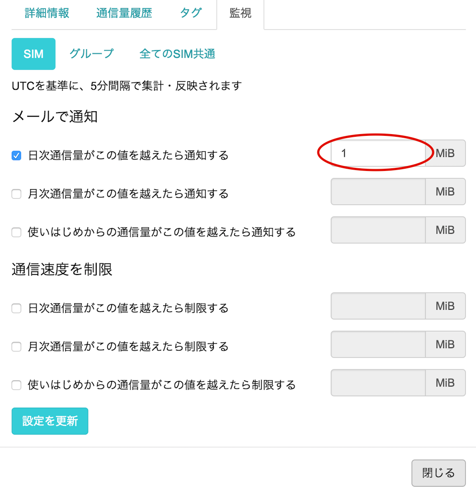


ここでの設定は、対象のAir SIMごとに有効になります。

```
 	監視の設定は、以下の3つを対象することができます。
✓	Air SIM<br>
✓	(Air SIMの所属する)グループ<br>
✓	(登録した)全てのSIM
```


すぐに、メール通知を確認したい場合は、Raspberry Piから以下のコマンドを実行して、1MiBのダウンロードを実施してみてください。

```
pi@raspberrypi ~ $ wget http://soracom-files.s3.amazonaws.com/1MB
```

以下のような通知が届きます。(通知は最大で5分程度かかります。)


##  <a name="section4">温度センサー DS18B20+ を使う</a>
### <a name="section4-1">セットアップ</a>
#### <a name="section4-1.1">配線する</a>
Raspberry Pi の GPIO(General Purpose Input/Output)端子に、温度センサーを接続します。


使うピンは、3.3Vの電源ピン(01)、Ground、GPIO 4の３つです。


#### <a name="section4-1.2">Raspberry Pi でセンサーを使えるように設定する</a>
Raspberry Piの設定として、２つのファイルに追記して(以下の例ではcatコマンドで追記していますが、vi や nano などのエディタを利用してもよいです)、適用するために再起動します。

```
pi@raspberrypi:~ $ sudo su -
root@raspberrypi:~# cat >> /boot/config.txt
dtoverlay=w1-gpio-pullup,gpiopin=4
(Ctrl+Dを押します)

root@raspberrypi:~# cat >> /etc/modules
w1-gpio
w1-therm
(Ctrl+Dを押します)

root@raspberrypi:~# reboot
```

しばらく待つと、再起動が完了します。もう一度Raspberry Piにログインしてください。
* ログイン方法は[セットアップテキスト](../setup/setup.md#-raspberry-pi-への-ログイン)を参照してください。

ログインできたら、Raspberry Piがセンサーを認識できているか確認します。再起動後、センサーは /sys/bus/w1/devices/ 以下にディレクトリとして現れます(28-で始まるものがセンサーです)。

```
pi@raspberrypi:~ $ ls /sys/bus/w1/devices/
28-0000072431d2  w1_bus_master1
```

> トラブルシュート：
> もし28-で始まるディレクトリが表示されない場合は、配線が間違っている可能性があります

ファイル名は、センサー１つ１つ異なるIDがついています。センサー値を cat コマンドで読み出してみましょう。

```
pi@raspberrypi:~ $ cat /sys/bus/w1/devices/28-*/w1_slave
ea 01 4b 46 7f ff 06 10 cd : crc=cd YES
ea 01 4b 46 7f ff 06 10 cd t=30625
```

t=30625 で得られた数字は、摂氏温度の1000倍の数字となってますので、この場合は 30.625度となります。センサーを指で温めたり、風を送って冷ましたりして、温度の変化を確かめてみましょう。

> トラブルシュート：
> もし数値が０となる場合、抵抗のつなぎ方が間違っている可能性があります

### <a name="section4-2">クラウドにデータを送る</a>
センサーで取得した温度をSORACOM Beam を使ってクラウドへデータを送ってみましょう。

今回のハンズオンではAWSのElasticsearch Service(以下、ES)へデータを送って、可視化を行います。このハンズオンでは簡略化のため、すでにハンズオン用に事前にセットアップされたESのエンドポイントを用いてハンズオンを行います。

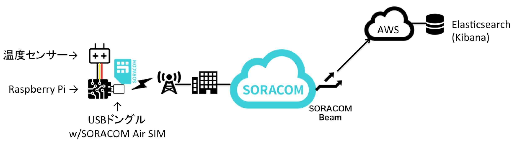

#### <a name="section4-2.1">SORACOM Beamとは</a>

SORACOM Beam とは、IoTデバイスにかかる暗号化等の高負荷処理や接続先の設定を、クラウドにオフロードできるサービスです。Beam を利用することによって、暗号化処理が難しいデバイスに代わって、デバイスからサーバー間の通信を暗号化することが可能になります。

プロトコル変換を行うこともできます。例えば、デバイスからはシンプルなTCP、UDPで送信し、BeamでHTTP/HTTPSに変換してクラウドや任意のサーバーに転送することができます。

現在、以下のプロトコル変換に対応しています。


また、上記のプロトコル変換に加え、Webサイト全体を Beam で転送することもできます。(Webサイトエントリポイント) 全てのパスに対して HTTP で受けた通信を、HTTP または HTTPS で転送を行う設定です。

#### <a name="section4-2.2">SORACOM Beamの設定</a>
当ハンズオンでは、以下の用途でBeamを使用します。

- ESへのデータ転送設定 (Webエンドポイント)

ここでは、ESへのデータ転送設定 (Webエンドポイント)を設定します。
Beam は Air SIM のグループに対して設定するので、まず、グループを作成します。

##### <a name="section4-2.2.1">グループの作成</a>

コンソールのメニューから[グループ]から、[追加]をクリックします。


グループ名を入力して、[グループ作成]をクリックしてください。
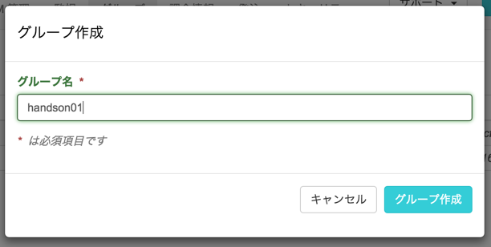


次に、SIMをこのグループに紐付けします。
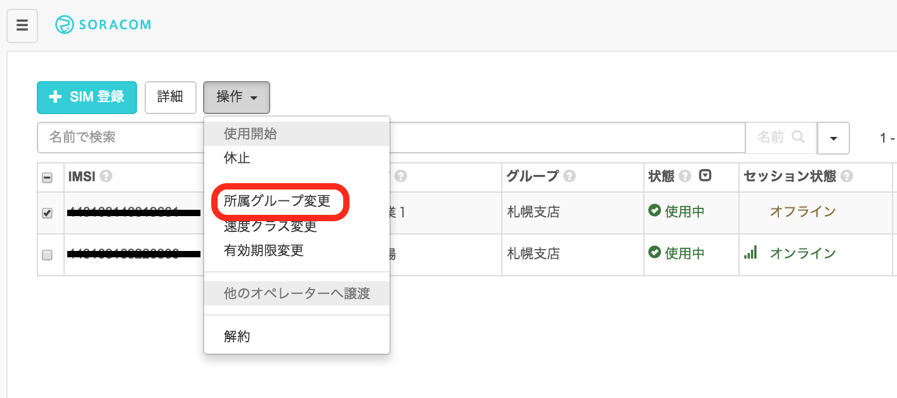

##### <a name="section4-2.2.2">SIMのグループ割り当て</a>


SIM管理画面から、SIMを選択して、操作→所属グループ変更を押します

つづいて、Beamの設定を行います。

##### <a name="section4-2.2.3">ESへのデータ転送設定</a>
先ほど作成したグループを選択し、[SORACOM Beam 設定] のタブを選択します。


ESへのデータ転送は[Webエントリポイント]を使用します。[SORACOM Beam 設定] から[Webサイトエントリポイント]をクリックします。


表示された画面で以下のように設定してください。

- 設定名：ES(別の名前でも構いません)
- 転送先のプロトコル：HTTPS
- ホスト名 : __search-handson-z3uroa6oh3aky2j3juhpot5evq.ap-northeast-1.es.amazonaws.com__

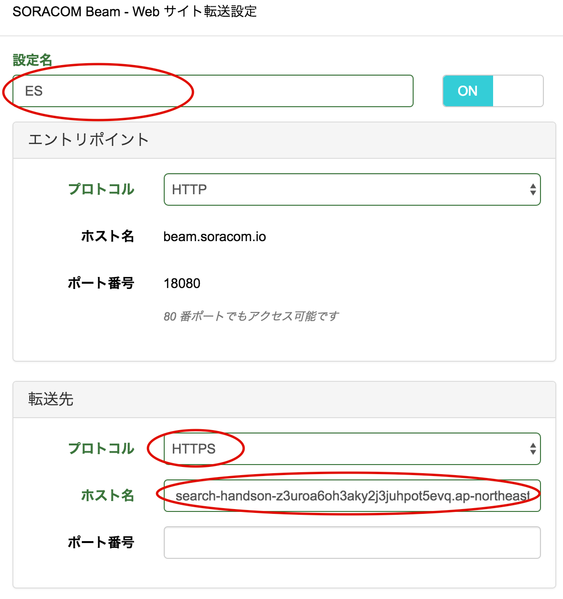
__※上記のスクリーンショットはホスト名が完全には表示されていないので、必ず画像の上に掲載されているアドレスをコピーして入力して下さい__

[保存]をクリックします。

以上でBeamの設定は完了です。

##### <a name="section4-2.2.4">メタデータサービスの設定</a>
次にメタデータサービスを設定してください。
メタデータサービスとは、SORACOM Beamではなく、SORACOM Airのサービスとなります。
デバイス自身が使用している Air SIM の情報を HTTP 経由で取得、更新することができます。

当ハンズオンでは、メタデータサービスを使用して、ESにデータを送信する際にSIMのID(IMSI)を付与して送信します。

先ほど作成したグループを選択し、[SORACOM Air 設定] のタブを選択します。


[メタデータサービス設定]を[ON]にして、[保存]をクリックします。

#### <a name="section4-2.3">プログラムのダウンロード・実行</a>

クラウドへの送信をおこないます。

__<font color="red">Beamを使用する(「send_temp_to_cloud.py」の実行時)には、SORACOM Airで通信している必要があります。</font>__

以下のコマンドを実行し、プログラムをダウンロード・実行し、Beamを経由して正しくデータが送信できるか確認しましょう。

```

pi@raspberrypi:~ $ sudo apt-get install -y python-pip  
:
pi@raspberrypi ~ $ sudo pip install elasticsearch
:
pi@raspberrypi:~ $ wget http://soracom-files.s3.amazonaws.com/send_temp_to_cloud.py
--2016-07-18 10:46:41--  http://soracom-files.s3.amazonaws.com/send_temp_to_cloud.py
Resolving soracom-files.s3.amazonaws.com (soracom-files.s3.amazonaws.com)... 54.231.229.21
Connecting to soracom-files.s3.amazonaws.com (soracom-files.s3.amazonaws.com)|54.231.229.21|:80... connected.
HTTP request sent, awaiting response... 200 OK
Length: 1208 (1.2K) [text/plain]
Saving to: ‘send_temp_to_cloud.py’

send_temp_to_cloud.py     100%[====================================>]   1.18K  --.-KB/s   in 0s

2016-07-18 10:46:41 (36.3 MB/s) - ‘send_temp_to_cloud.py’ saved [1208/1208]

pi@raspberrypi ~ $ python send_temp_to_cloud.py /sys/bus/w1/devices/28-*/w1_slave
- メタデータサービスにアクセスして IMSI を確認中 ... 440103125380131
- ただいまの温度 30.375000
- Beam 経由でデータを送信します
{u'_type': u'temperature', u'_id': u'AVX9nyA6DpzhkadZHaVx', u'created': True, u'_version': 1, u'_index': u'sensor'}
```

> トラブルシュート  
> requests.exceptions.ConnectionError: ('Connection aborted.', error(110, 'Connection timed out'))  
> になる場合、SORACOM Air による 3G 接続を行っていない可能性があります。  
> 必ず connect_air.sh を実行しながら、実行してください。

うまくデータが送信出来たのを確認したら、cronを使って１分に１回通信を行うようにしてみましょう。

(以下ではcronの設定をコマンドラインから行っていますが、crontab -e から行っても構いません)

```
pi@raspberrypi:~ $ ( crontab -l ; echo '* * * * * python send_temp_to_cloud.py /sys/bus/w1/devices/28-*/w1_slave &> /dev/null' ) | crontab -

pi@raspberrypi:~ $ crontab -l
# Edit this file to introduce tasks to be run by cron.
#
# Each task to run has to be defined through a single line
# indicating with different fields when the task will be run
# and what command to run for the task
#
# To define the time you can provide concrete values for
# minute (m), hour (h), day of month (dom), month (mon),
# and day of week (dow) or use '*' in these fields (for 'any').#
# Notice that tasks will be started based on the cron's system
# daemon's notion of time and timezones.
#
# Output of the crontab jobs (including errors) is sent through
# email to the user the crontab file belongs to (unless redirected).
#
# For example, you can run a backup of all your user accounts
# at 5 a.m every week with:
# 0 5 * * 1 tar -zcf /var/backups/home.tgz /home/
#
# For more information see the manual pages of crontab(5) and cron(8)
# m h  dom mon dow   command
* * * * * python send_temp_to_cloud.py /sys/bus/w1/devices/28-*/w1_slave &> /dev/null
```

### <a name="section4-3">クラウド上でデータを確認する</a>
Elasticsearch Service 上にインストールされている Kibana にアクセスします。

- [http://bit.ly/kibana4](http://bit.ly/kibana4) （新しいウィンドウで開いてください）

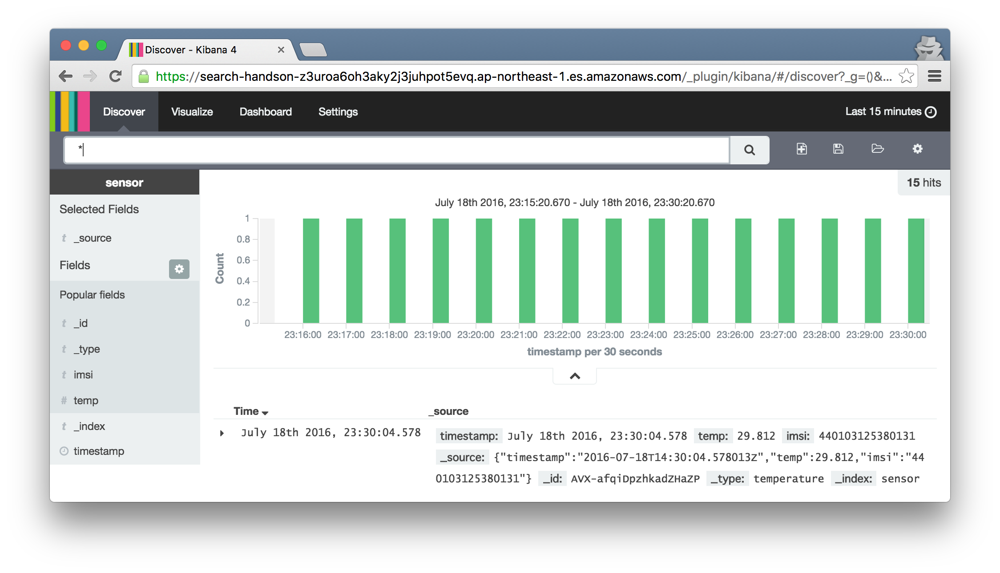

さらに、折れ線グラフとして可視化されている様子を見てみましょう。

- [http://bit.ly/temp-graph](http://bit.ly/temp-graph) （新しいウィンドウで開いてください）

> 全ての SIM カードからの情報が集まっていますので、もし自分の SIM だけの情報を見たい場合には、検索ウィンドウに imsi=[自分のSIMカードのIMSI]  と入れてフィルタ出来ます。

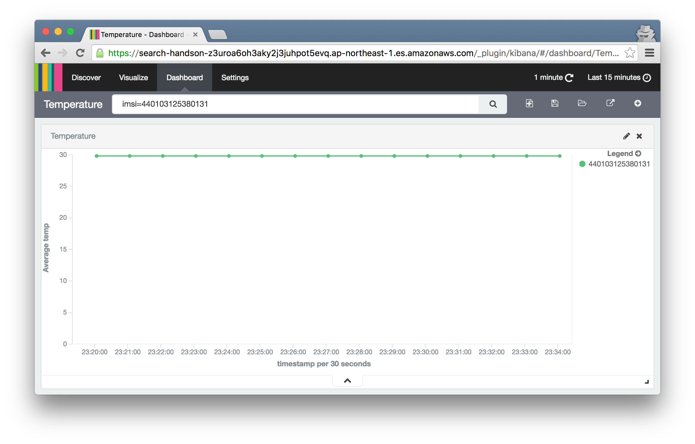

## <a name="section5">USBカメラを使う</a>
Raspberry Pi に USBのカメラ(いわゆるWebカメラ)を接続してみましょう。本キットでは Buffalo 社の　BSWHD06M シリーズを使用しています。

### <a name="section5-1">セットアップ</a>
#### <a name="section5-1.1">接続</a>
USB カメラは、Raspberry Pi の USB スロットに接続して下さい。


#### <a name="section5-1.2">パッケージのインストール</a>
fswebcam というパッケージを使用します。apt-getコマンドでインストールして下さい。

```
pi@raspberrypi:~ $ sudo apt-get install -y fswebcam
```

> トラブルシュート：  
> E: Unable to fetch some archives, maybe run apt-get update or try with --fix-missing?  
> と表示されたら、 sudo apt-get update を行ってから、再度 apt-get install してみてください


### <a name="section5-2">Webカメラとして使う</a>
Raspberry PiをWebサーバにして、アクセスした時にリアルタイムの画像を確認できるようにしてみましょう。

まずapache2 パッケージをインストールします
```
pi@raspberrypi:~ $ sudo apt-get install -y apache2
```

インストールが出来たら、CGIが実行出来るようにします。
```
pi@raspberrypi:~ $ sudo ln -s /etc/apache2/mods-available/cgi.load /etc/apache2/mods-enabled/

pi@raspberrypi:~ $ sudo gpasswd -a www-data video
Adding user www-data to group video

pi@raspberrypi:~ $ sudo service apache2 restart
```

最後にCGIプログラムをダウンロードして設置します。
```
pi@raspberrypi:~ $ sudo wget -O /usr/lib/cgi-bin/camera https://soracom-files.s3.amazonaws.com/camera

--2016-07-14 08:04:34--  https://soracom-files.s3.amazonaws.com/camera
Resolving soracom-files.s3.amazonaws.com (soracom-files.s3.amazonaws.com)... 54.231.225.58
Connecting to soracom-files.s3.amazonaws.com (soracom-files.s3.amazonaws.com)|54.231.225.58|:443... connected.
HTTP request sent, awaiting response... 200 OK
Length: 374 [text/plain]
Saving to: ‘camera’

camera              100%[=====================>]     374  --.-KB/s   in 0s     

2016-07-14 08:04:35 (1.45 MB/s) - ‘camera’ saved [374/374]

pi@raspberrypi:~ $ sudo chmod +x /usr/lib/cgi-bin/camera
```

ここまで設定をしたら、Webブラウザでアクセスしてみましょう。

http://{RaspberryPiのIPアドレス}/cgi-bin/camera

リロードをするたびに、新しく画像を撮影しますので、撮影する対象の位置決めをする際などに使えると思います。  
一度位置を固定したら、カメラの位置や対象物の下にビニールテープなどで位置がわかるように印をしておくとよいでしょう。

### <a name="section5-3">定点観測を行う</a>
毎分カメラで撮影した画像を所定のディレクトリに保存してみましょう。

#### <a name="section5-3.1">準備</a>

まず保存するディレクトリを作成して、アクセス権限を変更します。

```
pi@raspberrypi:~ $ sudo mkdir /var/www/html/images

pi@raspberrypi:~ $ sudo chown -R pi:pi /var/www/html/
```

#### <a name="section5-3.2">スクリプトのダウンロードと実行</a>

次にスクリプトをダウンロードしてテスト実行してみましょう。

```
pi@raspberrypi:~ $ wget http://soracom-files.s3.amazonaws.com/take_picture.sh
--2016-07-19 02:19:01--  http://soracom-files.s3.amazonaws.com/take_picture.sh
Resolving soracom-files.s3.amazonaws.com (soracom-files.s3.amazonaws.com)... 54.231.228.9
Connecting to soracom-files.s3.amazonaws.com (soracom-files.s3.amazonaws.com)|54.231.228.9|:80... connected.
HTTP request sent, awaiting response... 200 OK
Length: 444 [text/plain]
Saving to: ‘take_picture.sh’

take_picture.sh           100%[====================================>]     444  --.-KB/s   in 0.001s

2016-07-19 02:19:01 (451 KB/s) - ‘take_picture.sh’ saved [444/444]

pi@raspberrypi:~ $ chmod +x take_picture.sh

pi@raspberrypi:~ $ ./take_picture.sh
checking current temperature ... 29.75 [c]
taking picture ...
--- Opening /dev/video0...
Trying source module v4l2...
/dev/video0 opened.
No input was specified, using the first.
--- Capturing frame...
Captured frame in 0.00 seconds.
--- Processing captured image...
Setting title "Temperature: 29.75 (c)".
Writing JPEG image to '201607190219.jpg'.
```

現在の温度を取得して、温度をキャプションとした画像を保存する事に成功しました。

http://{RaspberryPiのIPアドレス}/images

にアクセスするとファイルが出来ていると思います。

あとはこれを定期的に実行するように設定しましょう。

#### <a name="section5-3.3">cron設定</a>

先ほどの温度センサー情報と同じく、cronの設定を行います。crontabを編集して設定を追加しましょう。

以下のコマンドを実行し、crontabの編集画面を開きます。

```
pi@raspberrypi:~ $ crontab -e
no crontab for root - using an empty one

Select an editor.  To change later, run 'select-editor'.
  1. /bin/ed
  2. /bin/nano        <---- easiest
  3. /usr/bin/vim.tiny

Choose 1-3 [2]: 2 （2を選択します）
crontab: installing new crontab
```

編集画面が開いたら、以下のように crontab に追記して保存すると、毎分撮影となります。

```
* * * * * ~/take_picture.sh &> /dev/null
```

画像サイズは場合にもよりますが、640x480ドットでだいたい150キロバイト前後になります。
もし毎分撮った場合には、１日に約210MB程度の容量となります。
画像を撮る感覚が狭ければ狭いほど、より滑らかな画像となりますが、SDカードの容量には限りがありますので、もし長期に渡り撮影をするのであれば、

```
*/5 * * * * ~/take_picture.sh &> /dev/null
```

のように５分毎に撮影を行ったり、

```
0 * * * * ~/take_picture.sh &> /dev/null
```

のように毎時０分に撮影を行ったりする事で、間隔を間引いてあげるとよいでしょう。

設定を書き込んだら、[Ctrl+O] を押し、続いて [Enter] を押して保存します。保存できたら、[Ctrl+X] を押してcrontab編集画面を閉じてください。

### <a name="section5-4">画像をクラウドにアップロードする</a>
撮影した画像をインターネットから参照出来るように、クラウドストレージにアップロードしてみましょう。
その際、画像がどのSIMを持つデバイスから送信されたのかを証明するために、SORACOM Endorse を利用します。

#### <a name="section5-4.1">SORACOM Endorse とは</a>
SORACOM Endorse(以下、Endorse) は、Air SIM を使用しているデバイスに対して、SORACOM が認証プロバイダーとしてデバイスの認証サービスを提供します。 SIM を使用した認証を Wi-Fi などの SIM 以外の通信にも使うことが可能となります。


Air SIM で接続後、Endorse に対して認証トークンの発行リクエストを送ると、Endorse が IMSI、IMEI などのデータを含んだ認証トークンを発行します。このトークンは SORACOM の秘密鍵で署名がされています。

デバイスがこのトークンをサーバーに送信すると、サーバー側はこのトークンが SORACOM が発行した正しいものかどうかを、SORACOM の公開鍵で検証することができます。一旦トークンの受け渡しが終われば、サーバーは接続元のデバイスがどの SIM を持っているかを把握できるため、例えばそのままサーバーにログインするような仕組みを作ることもできます。そして一旦認証トークンの受け渡しが終わり認証が完了すれば、接続経路が Air SIM ではなく、Wi-Fi を使用していても、利用者のシステムではどの SIM から接続されているのかを確かなものとして扱うことができます。

### <a name="section5-5">システム構成</a>
下図のような仕組みで、画像をアップロードします。


1. SORACOM Endorse にアクセスをしてトークンを取得
2. 一番最近撮影した画像に、1. で得られたトークン情報をカスタムヘッダとして付与して、アップロード
3. AWS上のプログラム(Lambda)でヘッダ(トークン)が正しいものかどうかを確認し、正しいものと確認できた場合にのみ公開用の領域にコピー
4. スマホ等からIMSI毎の公開URLにアクセスすると、アップロードされた画像にアクセスできます

> 3番のクラウド側の処理は、SORACOM側で用意してあります

### <a name="section5-6">設定</a>
#### SORACOM Endorse設定
SORACOM Endose を有効にします。

1. グループ設定画面で、SORACOM Endorseを開き、下記のように IMSI にチェックボックスを入れて、保存を押します

2. 下記のようなダイアログが表示されますので、OKを押します


SORACOM 側の設定は以上になります。

> アカウント作成から１年以内であれば、無料利用枠に SORACOM Endorse の SIMカード１枚分が無料となります
> ２枚以上でEndorseを有効にしたり、作成から１年以上経ちましたアカウントでは、追加の料金が発生する旨、お気をつけください

### <a name="section5-6.2">Raspberry Pi設定</a>
次に Raspberry Pi の設定を行います。

#### PyJWT のインストール
Python で Endorse で使われている JWT(JSON Web Token) を扱うためのライブラリ、PyJWTをインストールします。
```
pi@raspberrypi:~ $ sudo pip install pyjwt
Downloading/unpacking pyjwt
  Downloading PyJWT-1.4.1-py2.py3-none-any.whl
Installing collected packages: pyjwt
Successfully installed pyjwt
Cleaning up...
```

#### スクリプトのダウンロード＆実行
```
pi@raspberrypi:~ $ wget http://soracom-files.s3.amazonaws.com/upload_image.py
--2016-07-22 05:27:36--  http://soracom-files.s3.amazonaws.com/upload_image.py
Resolving soracom-files.s3.amazonaws.com (soracom-files.s3.amazonaws.com)... 52.219.4.1
Connecting to soracom-files.s3.amazonaws.com (soracom-files.s3.amazonaws.com)|52.219.4.1|:80... connected.
HTTP request sent, awaiting response... 200 OK
Length: 1073 (1.0K) [text/plain]
Saving to: ‘upload_image.py’

upload_image.py                     100%[====================================================================>]   1.05K  --.-KB/s   in 0s

2016-07-22 05:27:36 (32.9 MB/s) - ‘upload_image.py’ saved [1073/1073]

pi@raspberrypi:~ $ python upload_image.py /var/www/html/image.jpg
- SORACOM Endorse にアクセスして token を取得中 ...
{
    "aud": "soracom-endorse-audience",
    "iss": "https://soracom.io",
    "soracom-endorse-claim": {
        "imsi": "440101111111111"
    },
    "jti": "kENUDfNrej4LE2N1VQawlQ",
    "exp": 1469165906,
    "iat": 1469165306,
    "nbf": 1469165246,
    "sub": "soracom-endorse"
}
- Amazon S3 にファイルをアップロード中 ...
PUT https://soracom-handson.s3.amazonaws.com/incoming/camera/kENUDfNrej4LE2N1VQawlQ
status: 200
```

最後に status が 200 となっていれば、アップロードが無事完了しています。

アップロードが完了してから数秒おいて、 ```http://soracom-handson.s3.amazonaws.com/camera/{IMSI}``` にアクセスすると、アップロードした画像にアクセスすることが出来ます。

#### 定期的な実行(cron設定)
毎分撮影したとしても、必ずしも毎分画像をアップロードする必要はありません。  
仮に画像サイズが平均150KBであるとすると、月間の転送にかかる費用(s1.minimumを使用した場合)は、下記のようになります。

|頻度|転送回数/月|転送容量/月|概算費用/月|
|---|---:|---:|---:|
|毎分|43200|約 6.3GB|約 1265円|
|5分毎|8640|約 1.3GB|約 253円|
|10分毎|4320|約 0.6GB|約 126円|

用途やニーズに合わせて頻度を調整してみるとよいでしょう。

頻度の調整は、やはりcronの設定で行います。

##### 毎分
```
* * * * * python upload_image.py /var/www/html/image.jpg &> /dev/null
```

##### ５分毎
```
*/5 * * * * python upload_image.py /var/www/html/image.jpg &> /dev/null
```

しばらくしてから、先ほどのURLをリロードし、画像が更新されていることを確かめましょう。

## <a name="section6">おまけ</a>
### <a name="section6-1">低速度撮影(time-lapse)動画を作成する</a>
撮りためた画像を使用して、低速度撮影(タイムラプス)動画を作成してみましょう。

植物の成長や雲の動きなど、ゆっくり変化をするようなものを一定間隔(例えば１分毎)に撮影した画像を使って、仮に１秒間に30コマ使用すると１時間が動画では約２秒となるような動画を作成する事が出来ます。こういった映像を「低速度撮影(タイムラプス)映像」と呼びます。

#### パッケージのインストール
動画へのコンバートには、avconv というプログラムを利用しますので、下記のコマンドでパッケージをインストールして下さい。

```
pi@raspberrypi:~ $ sudo apt-get install -y libav-tools
```

非常に多くのパッケージをダウンロードしますので、少し時間がかかります。3G接続を切って有線接続でインストールした方がよいかもしれません。

#### スクリプトのダウンロード
スクリプトをダウンロードします。

```
pi@raspberrypi:~ $ wget http://soracom-files.s3.amazonaws.com/timelapse.sh
--2016-08-02 09:13:16--  http://soracom-files.s3.amazonaws.com/timelapse.sh
Resolving soracom-files.s3.amazonaws.com (soracom-files.s3.amazonaws.com)... 52.219.16.1
Connecting to soracom-files.s3.amazonaws.com (soracom-files.s3.amazonaws.com)|52.219.16.1|:80... connected.
HTTP request sent, awaiting response... 200 OK
Length: 1262 (1.2K) [text/plain]
Saving to: ‘timelapse.sh’

timelapse.sh                100%[===========================================>]   1.23K  --.-KB/s   in 0s

2016-08-02 09:13:16 (41.6 MB/s) - ‘timelapse.sh’ saved [1262/1262]

pi@raspberrypi:~ $ chmod +x timelapse.sh

pi@raspberrypi:~ $ ./timelapse.sh
Usage: ./timelapse.sh [options] /full/path/to/output.mp4
Options:
 -d /path/to/images/ (default=/var/www/html/images/)
 -f filter_string (default=no filter)
 -s N (speed, default=30 frames per seconds)
```

引数なしで実行すると、コマンドの説明が表示されます。

```
使い方: ./timelapse.sh [options] /full/path/to/output.mp4 # 出力するMP4ファイルへのフルパス
Options:
 -d /path/to/images/ (default=/var/www/html/images/) # 元となる画像の格納場所
 -f filter_string (default=no filter) # ファイル名のフィルタ
 -s N (speed, default=30 frames per seconds) # スピード、デフォルトでは 30枚/秒、１分に一回撮影したものであれば、30分/秒となる
```

それでは、実際に画像を動画を変換してみましょう。

オプションをを指定しない場合、/var/www/html/images 以下の画像ファイルを全て使用して、動画を作成します。
変換が終わった後の動画をすぐにブラウザで見れるように、/var/www/html/ 以下に動画ファイルを出力しておくと便利です。
画像の枚数やラズパイのバージョンによって変換にかかる時間が変わるので、変換が終わるまで気長に待ちましょう。

```
pi@raspberrypi:~ $ ./timelapse.sh /var/www/html/timelapse.mp4
-- 1. mkdir /var/tmp/time-lapse-2043 for workspace
-- 2. symlinking images as seqeuntial filename (it may take a while...)
288 files found.

-- 3. converting jpeg files to MPEG-4 video (it may also take a while...)
avconv version 11.6-6:11.6-1~deb8u1+rpi1, Copyright (c) 2000-2014 the Libav developers
  built on Mar 22 2016 15:53:22 with gcc 4.9.2 (Raspbian 4.9.2-10)
Input #0, image2, from '%08d.jpg':
  Duration: 00:00:09.60, start: 0.000000, bitrate: N/A
    Stream #0.0: Video: mjpeg, yuvj420p, 640x480 [PAR 96:96 DAR 4:3], 30 fps, 30 tbn
[libx264 @ 0x19d8040] using SAR=1/1
[libx264 @ 0x19d8040] using cpu capabilities: ARMv6 NEON
[libx264 @ 0x19d8040] profile High, level 3.0
[libx264 @ 0x19d8040] 264 - core 142 r2431 a5831aa - H.264/MPEG-4 AVC codec - Copyleft 2003-2014 - http://www.videolan.org/x264.html - options: cabac=1 ref=3 deblock=1:0:0 analyse=0x3:0x113 me=hex subme=7 psy=1 psy_rd=1.00:0.00 mixed_ref=1 me_range=16 chroma_me=1 trellis=1 8x8dct=1 cqm=0 deadzone=21,11 fast_pskip=1 chroma_qp_offset=-2 threads=6 lookahead_threads=1 sliced_threads=0 nr=0 decimate=1 interlaced=0 bluray_compat=0 constrained_intra=0 bframes=3 b_pyramid=2 b_adapt=1 b_bias=0 direct=1 weightb=1 open_gop=0 weightp=2 keyint=250 keyint_min=25 scenecut=40 intra_refresh=0 rc_lookahead=40 rc=crf mbtree=1 crf=23.0 qcomp=0.60 qpmin=0 qpmax=69 qpstep=4 ip_ratio=1.40 aq=1:1.00
Output #0, mp4, to '/var/www/html/timelapse.mp4':
  Metadata:
    encoder         : Lavf56.1.0
    Stream #0.0: Video: libx264, yuv420p, 640x480 [PAR 1:1 DAR 4:3], q=-1--1, 30 fps, 30 tbn, 30 tbc
    Metadata:
      encoder         : Lavc56.1.0 libx264
Stream mapping:
  Stream #0:0 -> #0:0 (mjpeg (native) -> h264 (libx264))
Press ctrl-c to stop encoding
frame=  288 fps=  8 q=-1.0 Lsize=     674kB time=9.50 bitrate= 581.1kbits/s    its/s
video:669kB audio:0kB other streams:0kB global headers:0kB muxing overhead: 0.798229%
[libx264 @ 0x19d8040] frame I:2     Avg QP:23.87  size: 21094
[libx264 @ 0x19d8040] frame P:83    Avg QP:24.61  size:  5384
[libx264 @ 0x19d8040] frame B:203   Avg QP:26.61  size:   960
[libx264 @ 0x19d8040] consecutive B-frames:  0.7%  4.9% 33.3% 61.1%
[libx264 @ 0x19d8040] mb I  I16..4:  5.7% 84.4% 10.0%
[libx264 @ 0x19d8040] mb P  I16..4:  1.9%  6.2%  0.2%  P16..4: 53.0% 12.1%  6.7%  0.0%  0.0%    skip:20.0%
[libx264 @ 0x19d8040] mb B  I16..4:  0.2%  0.4%  0.0%  B16..8: 28.8%  1.1%  0.2%  direct: 1.1%  skip:68.1%  L0:44.1% L1:53.2% BI: 2.7%
[libx264 @ 0x19d8040] 8x8 transform intra:75.8% inter:82.4%
[libx264 @ 0x19d8040] coded y,uvDC,uvAC intra: 56.5% 72.5% 32.5% inter: 14.1% 20.1% 0.6%
[libx264 @ 0x19d8040] i16 v,h,dc,p: 33% 42% 13% 12%
[libx264 @ 0x19d8040] i8 v,h,dc,ddl,ddr,vr,hd,vl,hu: 21% 24% 37%  2%  3%  2%  5%  2%  6%
[libx264 @ 0x19d8040] i4 v,h,dc,ddl,ddr,vr,hd,vl,hu: 26% 29% 18%  3%  4%  3%  7%  4%  6%
[libx264 @ 0x19d8040] i8c dc,h,v,p: 57% 23% 18%  2%
[libx264 @ 0x19d8040] Weighted P-Frames: Y:49.4% UV:18.1%
[libx264 @ 0x19d8040] ref P L0: 48.9% 22.8% 15.6%  9.1%  3.6%
[libx264 @ 0x19d8040] ref B L0: 64.0% 28.6%  7.4%
[libx264 @ 0x19d8040] ref B L1: 84.2% 15.8%
[libx264 @ 0x19d8040] kb/s:569.96

-- 4. cleanup...
```

上記の例で出力されたファイルは、 https://{Raspberry PiのIPアドレス}/timelapse.mp4 でアクセスする事が出来ます。

[サンプル動画](http://soracom-files.s3.amazonaws.com/timelapse.mp4)

### <a name="section6-2">動画をストリーミングする</a>
Coming soon...
