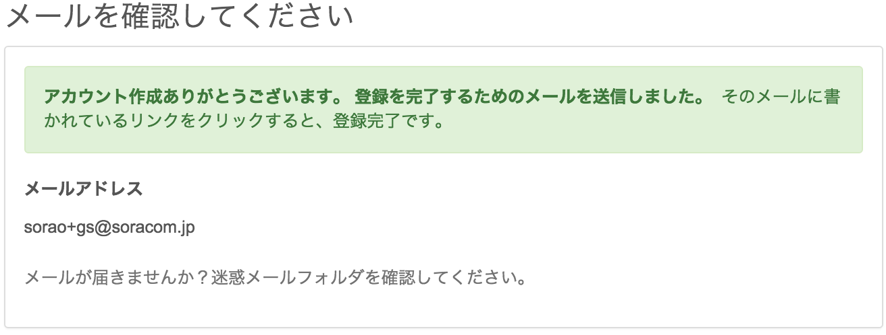
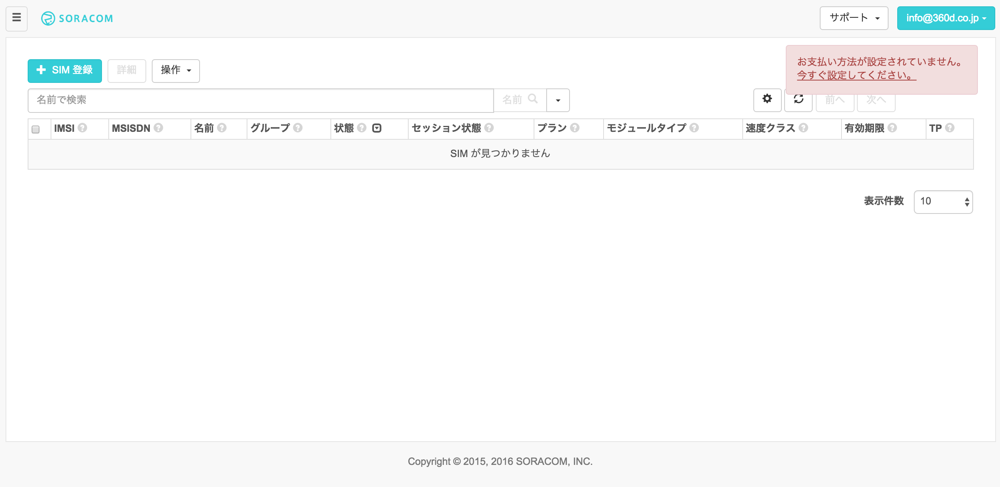
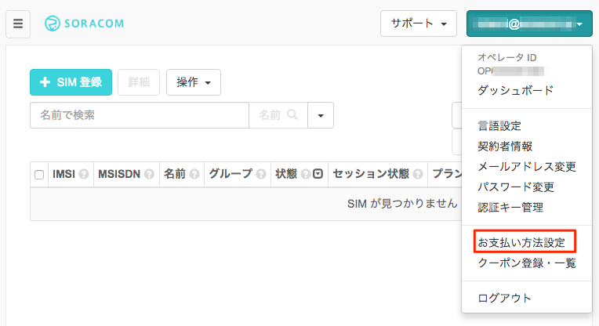
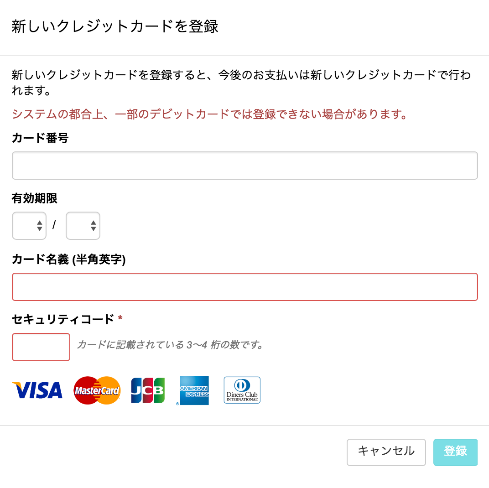
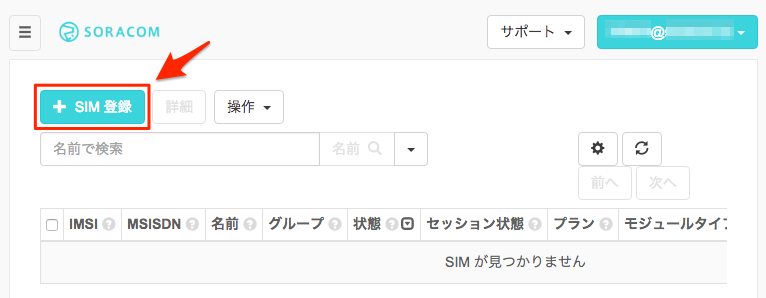
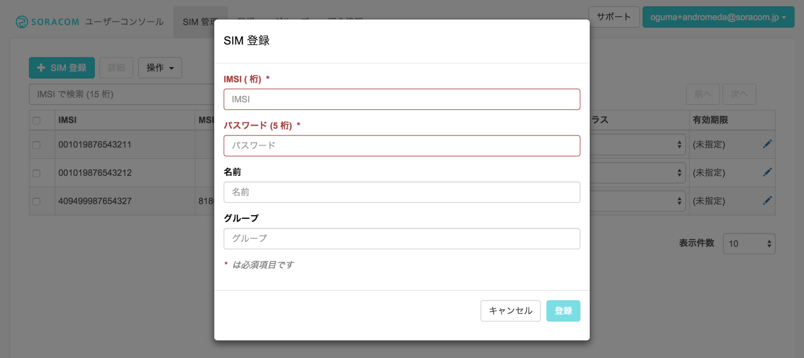
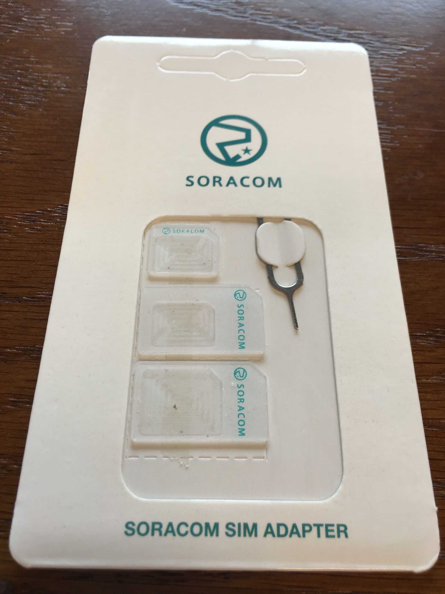
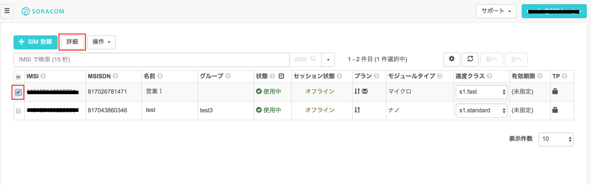
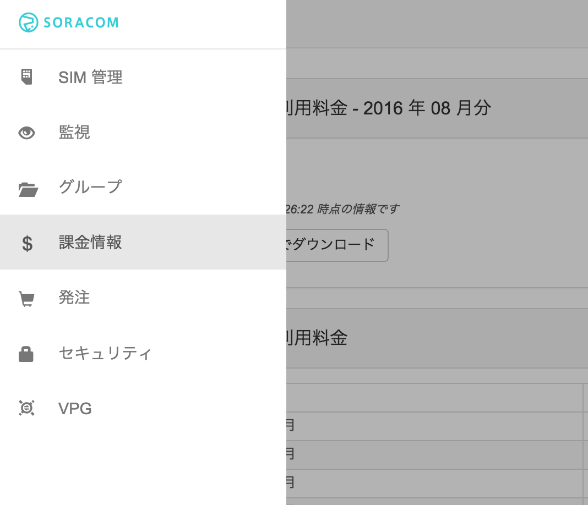
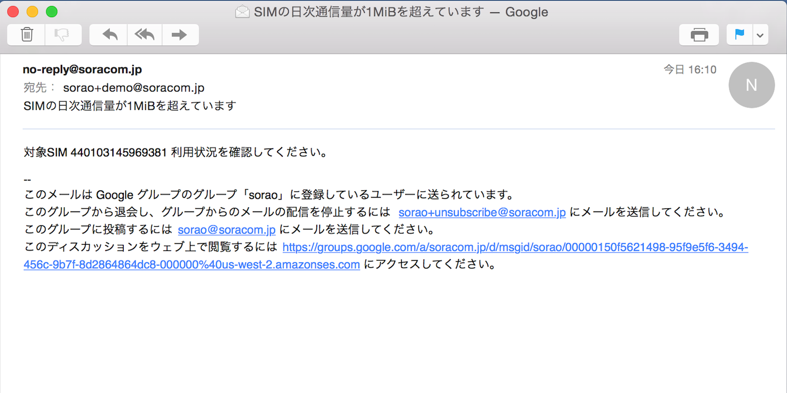

# 「SORACOM x RaspberryPi ハンズオン - 3G接続- 」

本テキストでは、Raspberry Pi を SORACOM Air を使用して 3G 接続する方法について解説します。

使用する機材は、以下を想定しています。

- Raspberry Pi/2/3 Model B
  - OS: Raspbian Lite イメージ
- USBモデム
  - 富士ソフト社製 [FS01BU(終売)](http://www.fsi.co.jp/mobile/plusF/products/FS01BU.html)
  - エイビット社製 [AK-020](http://www.abit.co.jp/product/3glte/ak020.html)

----
目次

- [1章 ユーザーコンソールを使用してAir SIMを管理する](#1-0)
  - [SORACOM ユーザーアカウントの作成と設定](#1-1)
  - [SORACOM アカウントの作成](#1-2)
  - [ユーザーコンソールへのログイン](#1-3)
  - [支払情報の設定](#1-4)
  - [ユーザーコンソールでの Air SIM の登録](#1-5)
- [2章 Raspberry Piへの接続](#2-0)
  - [Mac をお使いの場合](#2-1)
  - [Windows をお使いの場合](#2-2)
- [3章 Air SIMを使って、インターネットに接続する](#3-0)
  - [Raspberry Pi に USBドングルを接続する](#3-1)
  - [必要なパッケージのインストール](#3-2)
  - [接続スクリプトのダウンロード](#3-3)
  - [Air SIM を使って、インターネットに接続する](#3-4)
- [4章 ユーザーコンソールによる通信の確認](#4-0)
  - [データ通信量と利用料金の確認](#4-1)
  - [監視機能の確認](#4-2)

----

## <a name="1-0">1章 ユーザーコンソールを使用してAir SIMを管理する
</a>
ここでは、SORACOM ユーザーコンソール(以降、ユーザーコンソール)を使用して、SORACOM AirのSIM (以降、Air SIM)をSORACOMのユーザーアカウントに登録します。ユーザーコンソールを使用するために、ユーザーアカウントの作成、および、支払情報の設定(クレジットカード情報)の登録を行います。


### <a name="1-1">SORACOM ユーザーアカウントの作成と設定
</a>
ユーザーコンソールを使用するためには、SORACOMユーザーアカウント(以降、SORACOMアカウント)の作成が必要となります。アカウントの作成には、メールアドレスが必要となります。

### <a name="1-2">SORACOM アカウントの作成
</a>
ユーザーコンソールをご利用いただくためには、まずSORACOM アカウントを作成してください。

https://console.soracom.io/#/signup にアクセスします。
使用する SIM の種類を選択します。日本向けの SORACOM Air SIM を利用する場合は、カバレッジタイプ Japan を選択します。


「アカウント作成」画面が表示されますのでメールアドレスおよびパスワードを入力します。
また、契約者が個人であるか法人であるかを選び、法人の場合はさらに契約者の情報を入力します。
最後に規約に同意するためのチェックボックスを入れ、「アカウントを作成」ボタンを押します。

[アカウントを作成] ボタンをクリックします。


複数人でAir SIMの管理を行う場合は、事前にメーリングリストのアドレスを取得するなど、共有のメールアドレスをご利用ください。
下記の画面が表示されるので、メールを確認してください。



メールが届いたらリンクをクリックしてください。


自動的にログイン画面に遷移しますので、メールアドレスとパスワードを入力してログインしてください。

### <a name="1-3">ユーザーコンソールへのログイン
</a>
ログイン画面が表示されるので、アカウント作成時に登録したメールアドレスとパスワードを入力し、 [ログイン] ボタンをクリックしてください。(ログイン画面が表示されない場合はブラウザで https://console.soracom.io にアクセスします。)


以下のような「SIM管理」画面が表示されたらログイン完了です。引き続き、支払情報の設定に進みましょう！


### <a name="1-4">支払情報の設定
</a>
通信料の支払い方法はクレジットカードになります。クレジットカードの情報を登録するには、メイン画面上部のユーザー名から[お支払い方法設定]を開きます。



お支払方法で各情報を入力し、支払い方法を登録します。



### <a name="1-5">ユーザーコンソールでの Air SIM の登録
</a>

ユーザーコンソールにログインして、Air SIM の登録を行います。左上の [SIM登録] ボタンをクリックします。



「SIM登録」画面で、Air SIM の台紙の裏面に貼ってある IMSI と PASSCODE を入力してください。


名前、グループは空欄のままでも構いません。
「技術基準適合証明等について確認しました」チェックボックスを付けてください。
[登録] を押して SIM 登録を完了してください。（複数の Air SIM を続けて登録することも可能です。）




Air SIM を登録した直後の状態は「準備完了」と表示され、通信可能な状態になっています。ただし、まだセッションは確立されていないので、セッション状態は「オフライン」になっていることを確認してください。


SORACOMではSIMの登録や「使用開始」「休止」「解約」といったモバイル通信の状態の更新をユーザー自身がユーザーコンソールを使用して、実施することが可能です。


なお、初めての通信、もしくは、ユーザーコンソール/APIで使用開始処理を行うことで、状態は「使用中」に変わります。 まだ通信を行いたくない場合は、ユーザーコンソールもしくはAPIで休止処理を行ってください。これにより「休止中」の状態となり通信は行われません。


## <a name="2-0">2章 Raspberry Piへの接続
</a>

SORACOMが実施するハンズオンでは、事前にOSを初期化した Raspberry Pi を用意してあります。
割り当てられたRaspberryPiと、そのIPアドレスをご確認ください。
使用する Raspberry Pi のアドレスは、 192.168.123.ドングルの番号 です

> 例: ５番のドングルであれば、 192.168.123.5

### <a name="2-1">Mac をお使いの場合
</a>

自分の端末からRaspberry Piに接続(SSH)します。
ターミナルを立ち上げ、以下のコマンドを実行してください。

#### コマンド
```bash
ssh pi@192.168.123.xxx (割り当てられたIPアドレスを指定してください)
yes (初回接続時のみ)
raspberry
```

#### 実行結果
```text
~$ ssh pi@192.168.123.xxx (割り当てられたIPアドレスを指定してください)
The authenticity of host '192.168.123.xxx (192.168.123.xxx)' can't be established.
ECDSA key fingerprint is db:ed:1b:37:f2:98:c6:f4:d8:6d:cf:5c:31:6a:16:58.
Are you sure you want to continue connecting (yes/no)? yes
Warning: Permanently added '192.168.123.xxx' (ECDSA) to the list of known hosts.
pi@192.168.123.xxx's password: (raspberry と入力)

The programs included with the Debian GNU/Linux system are free software;
the exact distribution terms for each program are described in the
individual files in /usr/share/doc/*/copyright.

Debian GNU/Linux comes with ABSOLUTELY NO WARRANTY, to the extent
permitted by applicable law.
Last login: Thu Sep 24 15:51:43 2015 from 192.168.123.yyy
pi@raspberrypi ~ $
```

### <a name="2-2">Windows をお使いの場合
</a>
Windowsの場合には、TeraTerm等を使ってログインしてください。その際、ユーザ名に pi、パスワードに raspberry を指定する必要があります。


## <a name="3-0">3章 Air SIMを使って、インターネットに接続する
</a>
ここでは、先ほど登録したSORACOM AirのSIM (以降、Air SIM)を使用して、Raspberry Piからインターネットに接続します。

### <a name="3-1">Raspberry Pi に USBドングルを接続する</a>
#### SIMのサイズを変換する


Air SIMを取り外します。Air SIMの端子を触らないように気をつけます。




#### FS01BUの場合


> Air SIMをドングルから取り出す際の注意


#### AK-020の場合


### <a name="3-2">必要なパッケージのインストール
</a>

USBドングルを使用するために、以下のパッケージをインストールし、RaspberryPiをセットアップします。

-	usb-modeswitch (Raspbian のバージョンによっては、デフォルトでインストールされている事もあります)
-	wvdial

#### コマンド
```
sudo apt-get install -y usb-modeswitch wvdial
```

> パッケージのインストール中、  
>  Sorry.  You can retry the autodetection at any time by running "wvdialconf".  
>     (Or you can create /etc/wvdial.conf yourself.)  
> と表示されますが、設定ファイル /etc/wvdial.conf は後ほど実行するスクリプトが自動生成しますので、問題ありません。

### <a name="3-3">接続スクリプトのダウンロード
</a>

以下に、モデムの初期化、APNの設定、ダイアルアップなどを行うスクリプトが用意されています。

http://soracom-files.s3.amazonaws.com/connect_air.sh

以下のコマンドを実行し、このスクリプトをダウンロードし、接続用シェルスクリプトを作成します。

#### コマンド
```
curl -O http://soracom-files.s3.amazonaws.com/connect_air.sh
chmod +x connect_air.sh
sudo mv connect_air.sh /usr/local/sbin/
```

#### 実行結果
```
pi@raspberrypi:~ $ curl -O http://soracom-files.s3.amazonaws.com/connect_air.sh
  % Total    % Received % Xferd  Average Speed   Time    Time     Time  Current
                                 Dload  Upload   Total   Spent    Left  Speed
100  1420  100  1420    0     0   2416      0 --:--:-- --:--:-- --:--:--  2414
pi@raspberrypi ~ $ chmod +x connect_air.sh
pi@raspberrypi ~ $ sudo mv connect_air.sh /usr/local/sbin/
```

### <a name="3-4">Air SIM を使って、インターネットに接続する
</a>

接続の準備ができましたので、接続スクリプトを実行します。接続スクリプトは root 権限で実行する必要があるため、sudoで実行します。

#### コマンド
```
sudo /usr/local/sbin/connect_air.sh
```

#### 実行結果(FS01BU)
```
pi@raspberrypi:~ $ sudo /usr/local/sbin/connect_air.sh
Found FS01BU
Look for target devices ...
 No devices in target mode or class found
Look for default devices ...
   product ID matched
 Found devices in default mode (1)
Access device 006 on bus 001
Current configuration number is 1
Use interface number 0
Use endpoints 0x01 (out) and 0x81 (in)

USB description data (for identification)
-------------------------
Manufacturer: USB Modem
     Product: USB Modem
  Serial No.: 1234567890ABCDEF
-------------------------
Looking for active driver ...
 OK, driver detached
Set up interface 0
Use endpoint 0x01 for message sending ...
Trying to send message 1 to endpoint 0x01 ...
 OK, message successfully sent
Reset response endpoint 0x81
Reset message endpoint 0x01
-> Run lsusb to note any changes. Bye!

insmod /lib/modules/4.4.34-v7+/kernel/drivers/usb/serial/usb_wwan.ko
insmod /lib/modules/4.4.34-v7+/kernel/drivers/usb/serial/option.ko
waiting for modem device
.--> WvDial: Internet dialer version 1.61
--> Initializing modem.
--> Sending: ATZ
ATZ
OK
--> Sending: ATQ0 V1 E1 S0=0 &C1 &D2 +FCLASS=0
ATQ0 V1 E1 S0=0 &C1 &D2 +FCLASS=0
OK
--> Sending: AT+CGDCONT=1,"IP","soracom.io"
AT+CGDCONT=1,"IP","soracom.io"
OK
--> Modem initialized.
--> Sending: ATD*99***1#
--> Waiting for carrier.
ATD*99***1#
CONNECT 14400000
--> Carrier detected.  Starting PPP immediately.
--> Starting pppd at Thu Mar  9 04:00:57 2017
--> Pid of pppd: 1296
--> Using interface ppp0
--> local  IP address 10.xxx.xxx.xxx
--> remote IP address 10.64.64.64
--> primary   DNS address 100.127.0.53
--> secondary DNS address 100.127.1.53
```

#### 実行結果(AK-020)
```
pi@raspberrypi:~ $ sudo /usr/local/sbin/connect_air.sh
Found AK-020
Configuring modem ... done.
waiting for modem device..done.
Resetting modem ...done
could not initialize AK-020
waiting for modem device
--> WvDial: Internet dialer version 1.61
--> Cannot get information for serial port.
--> Initializing modem.
--> Sending: ATZ
ATZ
OK
--> Sending: ATQ0 V1 E1 S0=0 &C1 &D2 +FCLASS=0
ATQ0 V1 E1 S0=0 &C1 &D2 +FCLASS=0
OK
--> Sending: AT+CGDCONT=1,"IP","soracom.io"
AT+CGDCONT=1,"IP","soracom.io"
OK
--> Modem initialized.
--> Sending: ATD*99***1#
--> Waiting for carrier.
ATD*99***1#
CONNECT 21000000
--> Carrier detected.  Starting PPP immediately.
--> Starting pppd at Thu Mar  9 03:58:37 2017
--> Pid of pppd: 903
--> Using interface ppp0
--> local  IP address 10.xxx.xxx.xxx
--> remote IP address 10.64.64.64
--> primary   DNS address 100.127.0.53
--> secondary DNS address 100.127.1.53
```

上記のように表示されると接続完了です。

## <a name="4-0">4章 ユーザーコンソールによる通信の確認
</a>
インターネットに接続できましたので、ユーザーコンソールからデータ通信量、利用料金を確認して、監視機能を設定しましょう。

### <a name="4-1">データ通信量と利用料金の確認
</a>

#### Air SIMのデータ通信量の確認
ユーザーコンソールでは、データ通信量をSORACOM AirのSIM(以降、Air SIM)ごとにチャート形式で確認することができます。<br>
データ通信量を確認したいAir SIMにチェックを入れ [詳細] ボタンをクリックします。

[SIM 詳細] ダイアログが表示されますので、[通信量履歴] タブを開きます。 データ使用量は、表示期間を変更することもできます。

 	データ通信量が反映されるまでに5〜10分かかります。
先ほどのデータ通信が反映されていない場合はしばらくお待ちください。


#### 利用料金の確認

ユーザーコンソールからデータ通信料金と基本料金を確認できます。
メイン画面左上部のボタンを押してメニューを出してから [課金情報] を選択します。




表示されている時間時点の課金情報を確認することができます。


また、画面下部にある [データ使用量実績データを CSV 形式でダウンロード] から、期間を選択して [ダウンロード] ボタンをクリックすることで、基本料金、転送データ量などの詳細を確認することができます。


```
 	請求額詳細のCSVには、IMSIごとに以下の項目が記載されています。
✓	date (日付)
✓	billItemName (basicCharge は基本料金、upload/downloadDataChargeは転送データ量に対する課金)
✓	quantity (数量: upload/downloadDataChargeの場合の単位はバイト)
✓	amount (金額: 日ごとの料金。この項目の総合計が、月額請求額となります)
✓	タグ、グループ
```

### <a name="4-2">監視機能の確認
</a>
通信量にしきい値を設定し、超えた場合にメールでの通知と通信帯域制限をすることができます。監視できる項目は以下のとおりです。

-	各 SIM の日次通信量
-	各 SIM の今月の合計通信量
-	全ての SIM の今月の合計通信

例えば、全ての Air SIM の合計通信量が5000MB以上になった場合にメール通知を受けたい場合や、ある Air SIM の日次通信量が100MB以上になった場合にはその日の通信速度を制限するというような処理を行いたい場合に、この機能を利用することができます。

通信量はメガバイト単位（1以上の整数値）で入力できます。メールの宛先は登録されているメールアドレスです。通信速度を制限した場合は s1.minimum になり、解除された際は、 s1.standard に復帰します。 (APIを用いた場合には、制限時の通信速度、制限解除時の通信速度を任意に設定することも可能です)

Air SIMに監視の設定をしましょう。当ハンズオンの間に通知がくるように、1MiBで設定します。

「SIM詳細」画面で [監視] タブを開き、[SIM] をクリックして、監視設定を行ったら [設定を更新] ボタンをクリックして保存します。  


ここでの設定は、対象のAir SIMごとに有効になります。

監視の設定は、以下の3つを対象することができます。
- Air SIM
- (Air SIMの所属する)グループ
- (登録した)全てのSIM

すぐに、メール通知を確認したい場合は、Raspberry Piから以下のコマンドを実行して、1MiBのダウンロードを実施してみてください。

#### コマンド
```
curl -o /dev/null http://soracom-files.s3.amazonaws.com/1MB
```

#### 実行結果
```
pi@raspberrypi:~ $ curl -o /dev/null http://soracom-files.s3.amazonaws.com/1MB
  % Total    % Received % Xferd  Average Speed   Time    Time     Time  Current
                                 Dload  Upload   Total   Spent    Left  Speed
100 1024k  100 1024k    0     0   512k      0 --:--:-- --:--:-- --:--:--  512k
```

以下のような通知が届きます。(通知は最大で5分程度かかります。)




SORACOMに興味を持っていただいた方は、以下の Getting Startedもご覧ください！

SORACOM Getting Started
https://dev.soracom.io/jp/start/
