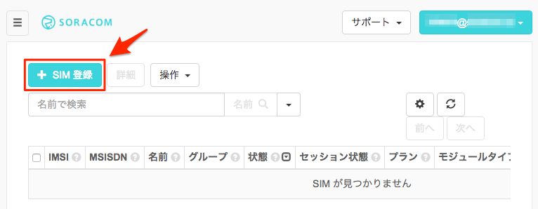
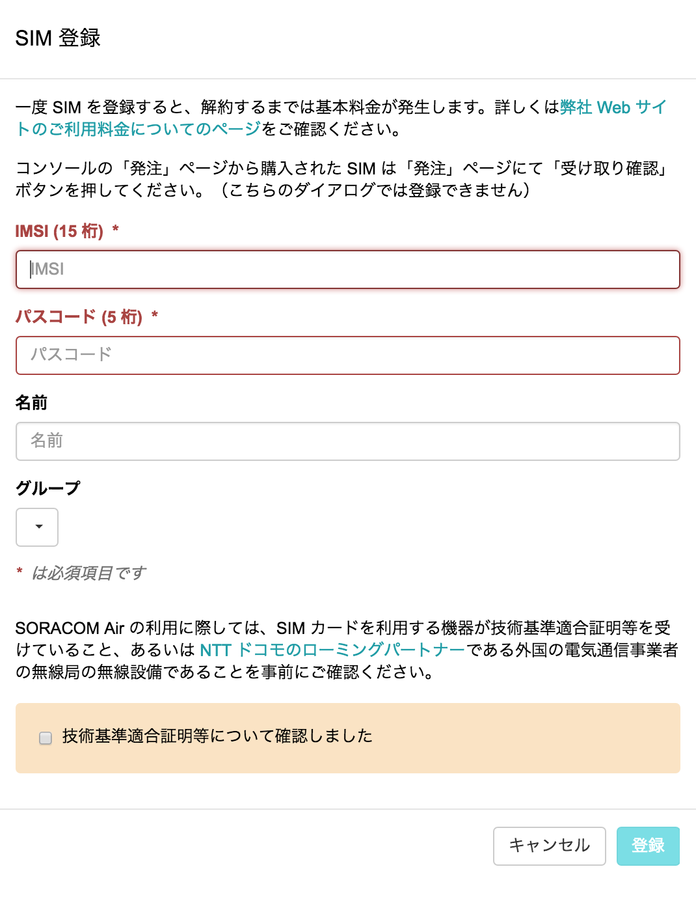
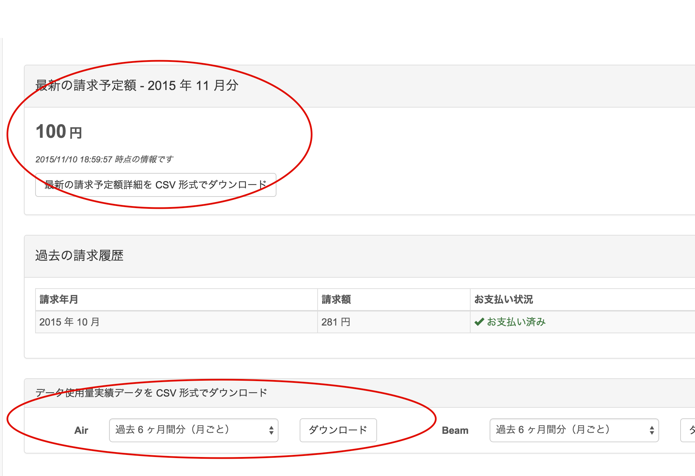

# 「SORACOM x RaspberryPi ハンズオン <br> 〜超音波センサー編〜」

# ハンズオン用テキスト

このハンズオンでは、SORACOMとRaspberry Piと超音波センサを用いてクラウドにデータを送り可視化したり、IFTTTを利用してデータ転送からTwitterへの呟きに連動させます。

----
目次

- [1章 ユーザーコンソールを使用してAir SIMを管理する](#1-0)
  - [SORACOM ユーザーアカウントの作成と設定](#1-1)
  - [SORACOM アカウントの作成](#1-2)
  - [ユーザーコンソールへのログイン](#1-3)
  - [支払情報の設定](#1-4)
  - [ユーザーコンソールでの Air SIM の登録](#1-5)
- [2章 Raspberry Piへの接続](#2-0)
  - [Mac をお使いの場合](#2-1)
  - [Windows をお使いの場合](#2-2)
- [3章 Air SIMを使って、インターネットに接続する](#3-0)
  - [Raspberry Pi に USBドングルを接続する](#3-1)
  - [接続スクリプトのダウンロード](#3-2)
  - [接続確認する](#3-3)
- [4章 ユーザーコンソールによる通信の確認](#4-0)
  - [データ通信量と利用料金の確認](#4-1)
  - [監視機能の確認](#4-2)
- [5章 超音波センサーを使って距離を計測する](#5-0)
  - [超音波センサーの動作原理](#5-1)
  - [配線](#5-2)
  - [センサーをテストしてみる](#5-3)
- [6章 SORACOM Harvest で可視化してみる](#6-0)
  - [SORCOM Harvest とは、](#6-1)
  - [SORACOM Harvest を有効にする](#6-2)
  - [プログラムのダウンロード・実行](#6-3)
- [7章 Twitterと連携してみる](#7-0)
  - [IFTTT とは](#7-1)
  - [IFTTTの設定](#7-2)
  - [アプレットの作成](#7-3)
  - [SORACOM Beam の設定](#7-4)
  - [プログラムのダウンロード・実行](#7-5)
- [おわりに](#9-0)

----

## <a name="1-0">1章 ユーザーコンソールを使用してAir SIMを管理する</a>
ここでは、SORACOM ユーザーコンソール(以降、ユーザーコンソール)を使用して、SORACOM AirのSIM (以降、Air SIM)をSORACOMのユーザーアカウントに登録します。ユーザーコンソールを使用するために、ユーザーアカウントの作成、および、支払情報の設定(クレジットカード情報)の登録を行います。


### <a name="1-1">SORACOM ユーザーアカウントの作成と設定</a>
ユーザーコンソールを使用するためには、SORACOMユーザーアカウント(以降、SORACOMアカウント)の作成が必要となります。アカウントの作成には、メールアドレスが必要となります。

### <a name="1-2">SORACOM アカウントの作成</a>
ユーザーコンソールをご利用いただくためには、まずSORACOM アカウントを作成してください。

https://console.soracom.io/#/signup にアクセスします。
使用する SIM の種類を選択します。日本向けの SORACOM Air SIM を利用する場合は、カバレッジタイプ Japan を選択します。


「アカウント作成」画面が表示されますのでメールアドレスおよびパスワードを入力します。
また、契約者が個人であるか法人であるかを選び、法人の場合はさらに契約者の情報を入力します。
最後に規約に同意するためのチェックボックスを入れ、「アカウントを作成」ボタンを押します。

[アカウントを作成] ボタンをクリックします。


複数人でAir SIMの管理を行う場合は、事前にメーリングリストのアドレスを取得するなど、共有のメールアドレスをご利用ください。
下記の画面が表示されるので、メールを確認してください。


メールが届いたらリンクをクリックしてください。


自動的にログイン画面に遷移しますので、メールアドレスとパスワードを入力してログインしてください。

### <a name="1-3">ユーザーコンソールへのログイン</a>
ログイン画面が表示されるので、アカウント作成時に登録したメールアドレスとパスワードを入力し、 [ログイン] ボタンをクリックしてください。(ログイン画面が表示されない場合はブラウザで https://console.soracom.io にアクセスします。)


以下のような「SIM管理」画面が表示されたらログイン完了です。引き続き、支払情報の設定に進みましょう！


### <a name="1-4">支払情報の設定</a>
通信料の支払い方法はクレジットカードになります。クレジットカードの情報を登録するには、メイン画面上部のユーザー名から[お支払い方法設定]を開きます。


お支払方法で各情報を入力し、支払い方法を登録します。



### <a name="1-5">ユーザーコンソールでの Air SIM の登録</a>

ユーザーコンソールにログインして、Air SIM の登録を行います。左上の [SIM登録] ボタンをクリックします。



「SIM登録」画面で、Air SIM の台紙の裏面に貼ってある IMSI と PASSCODE を入力してください。


名前、グループは空欄のままでも構いません。
「技術基準適合証明等について確認しました」チェックボックスを付けてください。
[登録] を押して SIM 登録を完了してください。（複数の Air SIM を続けて登録することも可能です。）




Air SIM を登録した直後の状態は「準備完了」と表示され、通信可能な状態になっています。ただし、まだセッションは確立されていないので、セッション状態は「オフライン」になっていることを確認してください。


SORACOMではSIMの登録や「使用開始」「休止」「解約」といったモバイル通信の状態の更新をユーザー自身がユーザーコンソールを使用して、実施することが可能です。


なお、初めての通信、もしくは、ユーザーコンソール/APIで使用開始処理を行うことで、状態は「使用中」に変わります。 まだ通信を行いたくない場合は、ユーザーコンソールもしくはAPIで休止処理を行ってください。これにより「休止中」の状態となり通信は行われません。


## <a name="2-0">2章 Raspberry Piへの接続</a>

SORACOMが実施するハンズオンでは、事前にOSを初期化した Raspberry Pi を用意してあります。
割り当てられたRaspberryPiと、そのIPアドレスをご確認ください。
使用する Raspberry Pi のアドレスは、 192.168.123.ドングルの番号 です

> 例: ５番のドングルであれば、 192.168.123.5

### <a name="2-1">Mac をお使いの場合</a>

自分の端末からRaspberry Piに接続(SSH)します。
ターミナルを立ち上げ、以下のコマンドを実行してください。

#### コマンド
```bash
ssh pi@192.168.123.xxx (割り当てられたIPアドレスを指定してください)
yes (初回接続時のみ)
raspberry
```

#### 実行結果
```text
~$ ssh pi@192.168.123.xxx (割り当てられたIPアドレスを指定してください)
The authenticity of host '192.168.123.xxx (192.168.123.xxx)' can't be established.
ECDSA key fingerprint is db:ed:1b:37:f2:98:c6:f4:d8:6d:cf:5c:31:6a:16:58.
Are you sure you want to continue connecting (yes/no)? yes
Warning: Permanently added '192.168.123.xxx' (ECDSA) to the list of known hosts.
pi@192.168.123.xxx's password: (raspberry と入力)

The programs included with the Debian GNU/Linux system are free software;
the exact distribution terms for each program are described in the
individual files in /usr/share/doc/*/copyright.

Debian GNU/Linux comes with ABSOLUTELY NO WARRANTY, to the extent
permitted by applicable law.
Last login: Thu Sep 24 15:51:43 2015 from 192.168.123.yyy
pi@raspberrypi ~ $
```

### <a name="2-2">Windows をお使いの場合</a>
Windowsの場合には、TeraTerm等を使ってログインしてください。その際、ユーザ名に pi、パスワードに raspberry を指定する必要があります。


## <a name="3-0">3章 Air SIMを使って、インターネットに接続する</a>
ここでは、先ほど登録したSORACOM AirのSIM (以降、Air SIM)を使用して、Raspberry Piからインターネットに接続します。

### <a name="3-1">Raspberry Pi に USBドングルを接続する</a>


Air SIMを取り外します。Air SIMの端子を触らないように気をつけます。


#### Air SIMをドングルから取り出す際の注意


### <a name="3-2">接続スクリプトのダウンロード</a>

> ここから先の作業は、Raspberry Pi にログインした状態でコマンドを実行してください

以下に、モデムの初期化、APNの設定、ダイアルアップなどを行うスクリプトが用意されています。

https://soracom-files.s3.amazonaws.com/setup_air.sh

以下のコマンドを実行し、このスクリプトをダウンロードし、接続用シェルスクリプトを作成します。

#### コマンド
```
curl -O https://soracom-files.s3.amazonaws.com/setup_air.sh
sudo bash setup_air.sh
```

#### 実行結果
```
pi@raspberrypi:~ $ curl -O https://soracom-files.s3.amazonaws.com/setup_air.sh

  % Total    % Received % Xferd  Average Speed   Time    Time     Time  Current
                                 Dload  Upload   Total   Spent    Left  Speed
100  4040  100  4040    0     0  17211      0 --:--:-- --:--:-- --:--:-- 17264
pi@raspberrypi:~ $ sudo bash setup_air.sh
--- 1. Check required packages
wvdial is not installed! installing wvdial...
  :
  :
ok.

--- 2. Patching /lib/systemd/system/ifup@.service
ok.

--- 3. Generate config files
Adding network interface 'wwan0'.
Adding udev rules for modem detection.
ok.

--- 4. Connect
Found un-initilized modem. Trying to initialize it ...
Now you are all set.

Tips:
 - When you plug your usb-modem, it will automatically connect.
 - If you want to disconnect manually or connect again, you can use 'sudo ifdown wwan0' / 'sudo ifup wwan0' commands.
 - Or you can just execute 'sudo wvdial'.
```

これで、自動的に 3G モデムが初期化され、Raspberry Pi が SORACOM 経由でインターネットに接続します。 また、再起動時やモデムを接続した際にも、自動的に接続されるようになっています。

**このスクリプトをインストールするとRaspberry Pi が起動すると自動的にAir SIMでネットワーク接続が行われるようになります。データの送受信には通信料金が発生しますのでご注意ください。**

### <a name="3-3">接続確認する</a>

接続が出来ている時は、ppp0インターフェースが存在しているはずなので、以下のコマンドで接続状況を確認出来ます。

#### コマンド
```
ifconfig ppp0
```

#### 実行結果
```
pi@raspberrypi:~ $ ifconfig ppp0
ppp0      Link encap:Point-to-Point Protocol
          inet addr:10.xxx.xxx.xxx  P-t-P:10.64.64.64  Mask:255.255.255.255
          UP POINTOPOINT RUNNING NOARP MULTICAST  MTU:1500  Metric:1
          RX packets:133 errors:0 dropped:0 overruns:0 frame:0
          TX packets:134 errors:0 dropped:0 overruns:0 carrier:0
          collisions:0 txqueuelen:3
          RX bytes:2092 (2.0 KiB)  TX bytes:4039 (3.9 KiB)
```

"inet addr" の後ろに表示されているのが、デバイスに割り当てられた IP アドレスとなります。

次に、インターネットへの疎通が出来るかどうかを確認しましょう。

Google Public DNS (8.8.8.8) への到達性を ping コマンドで調べます。

#### コマンド

※下記コマンドは、一行ずつ実行してください

```
ping 8.8.8.8
(Ctrl+C で止める)
```

#### 実行結果
```
pi@raspberrypi:~ $ ping 8.8.8.8
PING 8.8.8.8 (8.8.8.8) 56(84) bytes of data.
64 bytes from 8.8.8.8: icmp_seq=1 ttl=55 time=343 ms
64 bytes from 8.8.8.8: icmp_seq=2 ttl=55 time=342 ms
64 bytes from 8.8.8.8: icmp_seq=3 ttl=55 time=361 ms
64 bytes from 8.8.8.8: icmp_seq=4 ttl=55 time=340 ms
^C
--- 8.8.8.8 ping statistics ---
4 packets transmitted, 4 received, 0% packet loss, time 3002ms
rtt min/avg/max/mdev = 340.908/347.329/361.814/8.434 ms
```

ping コマンドの応答からインターネットへの疎通が取れていることが確認できました。

## <a name="4-0">4章 ユーザーコンソールによる通信の確認</a>
インターネットに接続できましたので、ユーザーコンソールからデータ通信量、利用料金を確認して、監視機能を設定しましょう。

### <a name="4-1">データ通信量と利用料金の確認</a>

#### Air SIMのデータ通信量の確認
ユーザーコンソールでは、データ通信量をSORACOM AirのSIM(以降、Air SIM)ごとにチャート形式で確認することができます。<br>
データ通信量を確認したいAir SIMにチェックを入れ [詳細] ボタンをクリックします。

[SIM 詳細] ダイアログが表示されますので、[通信量履歴] タブを開きます。 データ使用量は、表示期間を変更することもできます。

 	データ通信量が反映されるまでに5〜10分かかります。
先ほどのデータ通信が反映されていない場合はしばらくお待ちください。


#### 利用料金の確認

ユーザーコンソールからデータ通信料金と基本料金を確認できます。
メイン画面左上部のボタンを押してメニューを出してから [課金情報] を選択します。


表示されている時間時点の課金情報を確認することができます。




また、画面下部にある [データ使用量実績データを CSV 形式でダウンロード] から、期間を選択して [ダウンロード] ボタンをクリックすることで、基本料金、転送データ量などの詳細を確認することができます。


```
 	請求額詳細のCSVには、IMSIごとに以下の項目が記載されています。
✓	date (日付)
✓	billItemName (basicCharge は基本料金、upload/downloadDataChargeは転送データ量に対する課金)
✓	quantity (数量: upload/downloadDataChargeの場合の単位はバイト)
✓	amount (金額: 日ごとの料金。この項目の総合計が、月額請求額となります)
✓	タグ、グループ
```

### <a name="4-2">監視機能の確認</a>
通信量にしきい値を設定し、超えた場合にメールでの通知と通信帯域制限をすることができます。監視できる項目は以下のとおりです。

-	各 SIM の日次通信量
-	各 SIM の今月の合計通信量
-	全ての SIM の今月の合計通信

例えば、全ての Air SIM の合計通信量が5000MB以上になった場合にメール通知を受けたい場合や、ある Air SIM の日次通信量が100MB以上になった場合にはその日の通信速度を制限するというような処理を行いたい場合に、この機能を利用することができます。

通信量はメガバイト単位（1以上の整数値）で入力できます。メールの宛先は登録されているメールアドレスです。通信速度を制限した場合は s1.minimum になり、解除された際は、 s1.standard に復帰します。 (APIを用いた場合には、制限時の通信速度、制限解除時の通信速度を任意に設定することも可能です)

Air SIMに監視の設定をしましょう。当ハンズオンの間に通知がくるように、1MiBで設定します。

「SIM詳細」画面で [監視] タブを開き、[SIM] をクリックして、監視設定を行ったら [設定を更新] ボタンをクリックして保存します。  


ここでの設定は、対象のAir SIMごとに有効になります。

監視の設定は、以下の3つを対象することができます。
- Air SIM
- (Air SIMの所属する)グループ
- (登録した)全てのSIM

すぐに、メール通知を確認したい場合は、Raspberry Piから以下のコマンドを実行して、1MiBのダウンロードを実施してみてください。

#### コマンド
```
curl -o /dev/null http://soracom-files.s3.amazonaws.com/1MB
```

#### 実行結果
```
pi@raspberrypi:~ $ curl -o /dev/null http://soracom-files.s3.amazonaws.com/1MB
  % Total    % Received % Xferd  Average Speed   Time    Time     Time  Current
                                 Dload  Upload   Total   Spent    Left  Speed
100 1024k  100 1024k    0     0   512k      0 --:--:-- --:--:-- --:--:--  512k
```

以下のような通知が届きます。(通知は最大で5分程度かかります。)


ここまでで、1〜4章までが完了しました。

●	1章 ユーザーコンソールを使用してAir SIMを管理する<br>
●	2章 Raspberry Piのセットアップ<br>
●	3章 Air SIMを使って、インターネットに接続する<br>
●	4章 ユーザーコンソールによる通信の確認<br>

## <a name="5-0">5章 超音波センサーを使って距離を計測する</a>

### <a name="5-1">超音波センサーの動作原理</a>
超音波の反射時間を利用して非接触で測距するモジュールです。外部からトリガパルスを入力すると超音波パルス（８波）が送信され、出力された反射時間信号をマイコンで計算することによって距離を測ることができます。


- 具体的にはセンサーの Trig ピンにパルス(短い時間)電圧をかけて測定を開始
- EchoピンがHIGHである時間の長さを計測

### <a name="5-2">配線</a>

1.必要なパーツが揃っているか確認しましょう

- 超音波センサー HC-SR04 (スピーカのような形の青い基板)

- ブレッドボード(穴がたくさん空いた白い板)

- ジャンパーコード(オス-メス/赤黒黄青の４本)


2.最初に、センサーをブレッドボードに刺します(端から２列目に刺すと安定します)


3.ジャンパーコードを刺していきます(センサーの表面のVCC→GNDの順に、赤・青・黄・黒)


4.ラズパイにケーブルを刺します<br>

-	赤いケーブルを最後に接続してください
-	刺すピンを間違えると故障の原因になるので、十分気をつけてください


### <a name="5-3">センサーをテストしてみる</a>
以下のコマンドで、プログラムをダウンロード・実行し、正しくセンサー値が読み出せるか試しましょう

#### コマンド
```
curl -O http://soracom-files.s3.amazonaws.com/sensor_test.py
python sensor_test.py
```

#### 実行結果
```
pi@raspberrypi:~ $ curl -O http://soracom-files.s3.amazonaws.com/sensor_test.py
  % Total    % Received % Xferd  Average Speed   Time    Time     Time  Current
                                 Dload  Upload   Total   Spent    Left  Speed
100  1197  100  1197    0     0  17386      0 --:--:-- --:--:-- --:--:-- 17602
pi@raspberrypi ~ $ python sensor_test.py
距離: 40.8 cm
距離: 40.4 cm
距離: 39.8 cm
     :
(Ctrl+C で止めることができます)
```

#### トラブルシュート
何も画面に出力されない場合は、接続するピンを間違えている可能性が高いですので、もう一度ケーブルを接続する位置を確かめましょう。

## <a name="6-0">6章 SORACOM Harvest で可視化してみる</a>
SORACOM のサービス、Harvest を体験してみましょう。

### <a name="6-1">SORCOM Harvest とは、</a>
SORACOM Harvest(以下、Harvest) は、IoTデバイスからのデータを収集、蓄積するサービスです。

SORACOM Air が提供するモバイル通信を使って、センサーデータや位置情報等を、モバイル通信を介して容易に手間なくクラウド上の「SORACOM」プラットフォームに蓄積することができます。
保存されたデータには受信時刻や SIM の ID が自動的に付与され、「SORACOM」のユーザーコンソール内で、グラフ化して閲覧したり、API を通じて取得することができます。なお、アップロードされたデータは、40日間保存されます。


> 注意: SORACOM Harvest を使うには追加の費用がかかります  
> 書き込みリクエスト: 1日 2000リクエストまで、1SIMあたり 1日5円  
> 1日で2000回を超えると、1リクエスト当り0.004円  

### <a name="6-2">SORACOM Harvest を有効にする</a>
SORACOM Harvest を使うには、Group の設定で、Harvest を有効にする必要があります。

グループ設定を開き、SORACOM Harvest を開いて、ON にして、保存を押します。


### <a name="6-3">プログラムのダウンロード・実行</a>

#### コマンド
```
sudo apt-get update
sudo apt-get install -y python-pip
sudo pip install request
curl -O http://soracom-files.s3.amazonaws.com/send_to_harvest.py
python send_to_harvest.py
```

#### 実行結果
```
pi@raspberrypi:~ $ sudo apt-get install -y python-pip
 :
pi@raspberrypi:~ $ sudo pip install request
 :
pi@raspberrypi:~ $ curl -O http://soracom-files.s3.amazonaws.com/send_to_harvest.py
  % Total    % Received % Xferd  Average Speed   Time    Time     Time  Current
                                 Dload  Upload   Total   Spent    Left  Speed
100  2443  100  2443    0     0   3966      0 --:--:-- --:--:-- --:--:--  3972
pi@raspberrypi:~ $ python send_to_harvest.py
- 距離を計測します
距離: 15.1 cm
- データを送信します
<Response [201]>

- 距離を計測します
距離: 4.4 cm
- データを送信します
<Response [201]>
```

> 正常にデータが送信されたらレスポンスコードが 201 になります

#### データの確認
コンソールから、送信されたデータを確認してみましょう。

SIMを選択して、操作から「データを確認」を選びます。


グラフが表示されていると思います。


スクリプトのデフォルト設定では５秒に一度データが送信されるので、自動更新のボタンをオンにすると、グラフも自動的に更新されます。

とても簡単に可視化が出来たのがおわかりいただけたと思います。

## <a name="7-0">7章 Twitterと連携してみる</a>

IFTTTというサービスを使うと、デバイスから簡単に様々なサービスと連携を行う事が出来ます。
この章では、センサーで障害物を検知した際に、SORACOM Beam 経由で IFTTT の Maker Channel を呼び出し、Twitter へとリアルタイムに通知を行ってみましょう。

### <a name="7-1">IFTTT とは</a>
IFTTT(https://ifttt.com/) とは、IF-This-Then-That の略で、もし「これ」が起きたら「あれ」を実行する、つまり「これ」がトリガーとなって、「あれ」をアクションとして実行する、サービスとなります。
様々なサービスや機器と連携していて、何度かクリックするだけで簡単な仕組みを作る事が出来ます。
今回のハンズオンでは、HTTPSのリクエストをトリガーとして、アクションとして Twitter につぶやくために、IFTTT を使います。

### <a name="7-2">IFTTTの設定</a>
まずアカウントをお持ちでない方は、IFTTT のサイト https://ifttt.com/ で、Sign Up してください。


### <a name="7-3">アプレットの作成</a>
次にサービス同士の組み合わせ(Applet=アプレットと呼ばれます)を作成します。

Sign up 後の上部のメニューから My Applets を選択し、New Applet ボタンをクリックするか、 https://ifttt.com/create にアクセスすると Applet の新規作成画面が表示されます。


表示された文字列から this をクリックし、表示された検索ボックスで webhooks 検索します。次に表示された Webhooks のパネルを選択してください。


IFFFT のアカウント内で初めて Webhook を利用する場合は Connect ボタンが表示されるのでクリックします。


トリガーとして Receve a web request が書かれたパネルを選択します。


 Event Name を設定します(ここでは、sensor とします)

 

これでトリガーの設定は完了です。次にアクションとして、Twitter の設定を行います。
that をクリックし、テキストボックスに twitter と入れ、Twitter チャンネルを選び、Connect を押します。


IFFFT のアカウント内で初めて Twitter 連携を利用する場合は Connect ボタンが表示されるのでクリックします。


Twitter の認証画面になるので、ご自身のアカウントでログインして認証を完了してください。


アクションは左上の、Post a tweet と書いてあるパネルを選択してください。


Twitter の Tweet text には、例えば下記のような文言を入れてみてください。グレーの ``Value1`` などの文字は Add ingredient ボタンをクリックすることにより選択して入力することも可能です。


> センサーの状態が "{{Value1}}" に変化しました(前回からの経過時間:{{Value2}}秒) 時刻:{{OccurredAt}} #soracomhandson

Finish をおして、アプレットの作成が完了します。


最後に Webhooks のページ https://ifttt.com/maker_webhooks を開いて、右上の Documentation ボタンをクリックします。


URL の中の key を確認します(後ほど使いますので、どこかにメモしておいてください)


### <a name="7-4">SORACOM Beam の設定</a>

IFTTTへのデータ転送を設定します。IFTTTへのデータ転送は[HTTPエントリポイント]を使用します。[SORACOM Beam 設定] から[HTTPエントリポイント]をクリックします。


表示された画面で以下のように設定してください。

- 設定名：IFTTT(別の名前でも構いません)
- エントリポイントパス： /
- 転送先プロトコル：HTTPS
- 転送先ホスト名：maker.ifttt.com
- 転送先パス： /trigger/sensor/with/key/{maker_key}

> {maker_key} は、Webhooks にコネクトすると発行される文字列です。以下のページから確認できます。
> https://ifttt.com/maker_webhooks


[保存]をクリックします。
以上でBeamの設定は完了です。

> ここで設定した通り、IFTTTへのアクセスURLは、{maker_key}を含んでいますが、Beamを使用することで、デバイスに認証情報をもたせる必要がなくなります。  
> これにより、認証情報が盗まれるリスクを回避できます。また、変更になった場合もたくさんのデバイスに手を入れることなく、変更を適用することができます。

### <a name="7-5">プログラムのダウンロード・実行</a>

IFTTTへの送信をおこないます。
以下のコマンドを実行し、プログラムをダウンロード・実行し、Beamを経由して正しくデータが送信できるか確認しましょう。

ESの場合と同様に、Beamを使用する(「send_to_ifttt.py」の実行時)には、SORACOM Airで通信している必要があります。

#### コマンド
```
curl -O http://soracom-files.s3.amazonaws.com/send_to_ifttt.py
python send_to_ifttt.py
```

#### 実行結果
```
pi@raspberrypi:~ $ curl -O http://soracom-files.s3.amazonaws.com/send_to_ifttt.py
  % Total    % Received % Xferd  Average Speed   Time    Time     Time  Current
                                 Dload  Upload   Total   Spent    Left  Speed
100  2925  100  2925    0     0  36564      0 --:--:-- --:--:-- --:--:-- 37025
pi@raspberrypi ~ $ python send_to_ifttt.py
- 条件設定
障害物を 10 cm 以内に 3 回検知したら IFTTT にデータを送信します
センサーを手で遮ったり、何か物を置いてみたりしてみましょう
- 準備完了
距離(cm): 5.3 <= 10 , 回数: 1 / 3
距離(cm): 5.6 <= 10 , 回数: 2 / 3
距離(cm): 5.2 <= 10 , 回数: 3 / 3
- ステータスが 'in'(何か物体がある) に変化しました
- Beam 経由でデータを送信します
status changed to 'in' : {"value3": "", "value2": "5", "value1": "in"}
<Response [200]>
距離(cm): 54.9 > 10 , 回数: 1 / 3
距離(cm): 55.2 > 10 , 回数: 2 / 3
距離(cm): 55.3 > 10 , 回数: 3 / 3
- ステータスが 'out'(何も物体がない) に変化しました
- Beam 経由でデータを送信します
status changed to 'out' : {"value3": "", "value2": "9", "value1": "out"}
<Response [200]>
```

> 正常にデータが送信されたらレスポンスコードが 200 になります

すると、下記のようなツイートが行われます。


ハッシュタグで検索してみましょう

https://twitter.com/search?f=tweets&q=%23soracomhandson&src=typd

## <a name="9-0">おわりに</a>

おめでとうございます！皆さんは、SORACOM x RaspberryPiハンズオン〜超音波センサー編〜を完了しました。SORACOMを使ったハンズオンを楽しんで頂けましたでしょうか？

さらにSORACOMに興味を持っていただいた方は、以下の Getting Startedもご覧ください！

> SORACOM Getting Started
> https://dev.soracom.io/jp/start/
