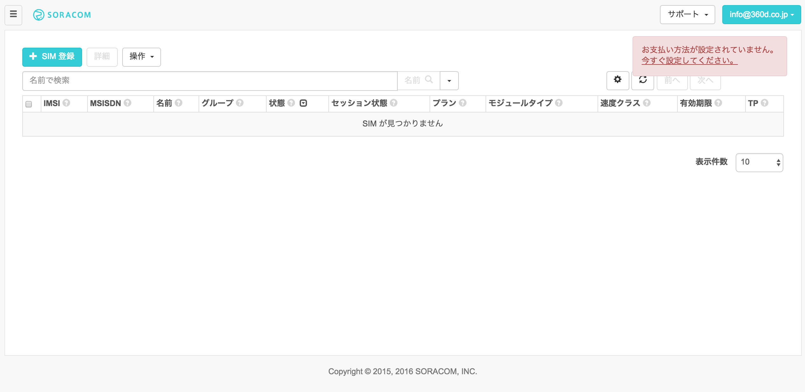
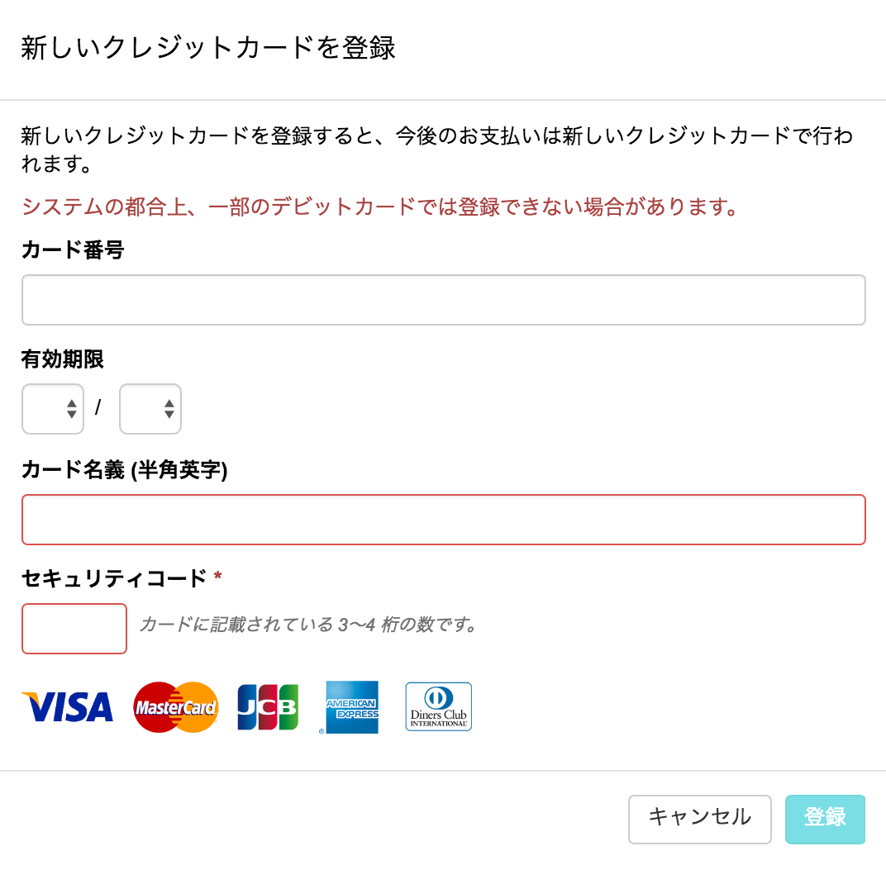
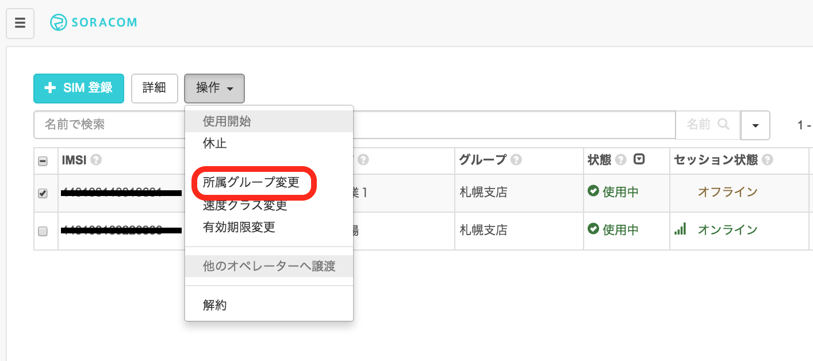

# 「SORACOM x RaspberryPi × Ruby ハンズオン <br> 〜超音波センサー編〜」

# ハンズオン用テキスト


### 2016年11月12日
### 株式会社ソラコム


#### [1章 ユーザーコンソールを使用してAir SIMを管理する](#section1)
[SORACOM ユーザーアカウントの作成と設定](#section1-1) <br>
[SORACOM アカウントの作成](#section1-2)<br>
[ユーザーコンソールへのログイン](#section1-3)<br>
[支払情報の設定](#section1-4)<br>
[Air SIM の登録](#section1-5)<br>
[ユーザーコンソールでの Air SIM の登録](#section1-6)<br>

#### [2章 Raspberry Piへの接続](#section2)

#### [3章 Air SIMを使って、インターネットに接続する](#section3)
[Raspberry Pi に USBドングルを接続する](#section3-1)<br>
[接続スクリプトのダウンロード](#section3-2)<br>
[Air SIM を使って、インターネットに接続する](#section3-3)<br>

#### [4章 ユーザーコンソールによる通信の確認](#section4)
[データ通信量と利用料金の確認](#section4-1)<br>
[Air SIMのデータ通信量の確認](#section4-2)<br>
[利用料金の確認](#section4-3)<br>
[監視機能の確認](#section4-4)<br>

#### [5章 超音波センサーを使って距離を計測する](#section5)
[超音波センサーの動作原理](#section5-1)<br>
[配線](#section5-2)<br>
[センサーをテストしてみる](#section5-3)<br>
[トラブルシュート](#section5-4)
<br>

#### [6章 クラウドにデータを送る](#section6)
[SORACOM Beamとは](#section6-1)<br>
[SORACOM Beamの設定](#section6-2)<br>
[グループの作成](#section6-3)<br>
[SIMのグループ割り当て](#section6-4)<br>
[ESへのデータ転送設定](#section6-5)<br>
[メタデータサービスの設定](#section6-6)<br>
[プログラムのダウンロード・実行](#section6-7)<br>
[クラウド上でデータを確認する](#section6-8)<br>

#### [7章 Twitterと連携してみる](#section7)
[IFTTT とは](#section7-1)<br>
[IFTTTの設定](#section7-2)<br>
[レシピの作成](#seciton7-3)<br>
[SORACOM Beam の設定](#seciton7-4)<br>
[プログラムのダウンロード・実行](#section7-5)<br>

## はじめに

このハンズオンでは、SORACOMとRaspberry Piと超音波センサを用いてクラウドにデータを送り可視化したり、IFTTTを利用してデータ転送からTwitterへの呟きに連動させます。まずは、SORACOMのユーザーアカウントを作成してみましょう。

## <a name="section1">1章 ユーザーコンソールを使用してAir SIMを管理する
ここでは、SORACOM ユーザーコンソール(以降、ユーザーコンソール)を使用して、SORACOM AirのSIM (以降、Air SIM)をSORACOMのユーザーアカウントに登録します。ユーザーコンソールを使用するために、ユーザーアカウントの作成、および、支払情報の設定(クレジットカード情報)の登録を行います。


#### <a name="section1-1">1.SORACOM ユーザーアカウントの作成と設定
ユーザーコンソールを使用するためには、SORACOMユーザーアカウント(以降、SORACOMアカウント)の作成が必要となります。アカウントの作成には、メールアドレスが必要となります。

#### <a name="section1-2">SORACOM アカウントの作成
ユーザーコンソールをご利用いただくためには、まずSORACOM アカウントを作成してください。
https://console.soracom.io/#/signup にアクセスします。
「アカウント作成」画面が表示されますのでメールアドレスおよびパスワードを入力して、[アカウントを作成] ボタンをクリックします。


複数人でAir SIMの管理を行う場合は、事前にメーリングリストのアドレスを取得するなど、共有のメールアドレスをご利用ください。
下記の画面が表示されるので、メールを確認してください。


メールが届いたらリンクをクリックしてください。


自動的にログイン画面に遷移しますので、メールアドレスとパスワードを入力してログインしてください。

#### <a name="section1-3">ユーザーコンソールへのログイン
ログイン画面が表示されるので、アカウント作成時に登録したメールアドレスとパスワードを入力し、 [ログイン] ボタンをクリックしてください。(ログイン画面が表示されない場合はブラウザで https://console.soracom.io にアクセスします。)


以下のような「SIM管理」画面が表示されたらログイン完了です。引き続き、支払情報の設定に進みましょう！




#### <a name="section1-4">支払情報の設定
通信料の支払い方法はクレジットカードになります。クレジットカードの情報を登録するには、メイン画面上部のユーザー名から[お支払い方法設定]を開きます。


お支払方法で各情報を入力し、支払い方法を登録します。





### <a name="section1-5">3.Air SIM の登録

#### <a name="section1-6">ユーザーコンソールでの Air SIM の登録

ユーザーコンソールにログインして、Air SIM の登録を行います。左上の [SIM登録] ボタンをクリックします。


「SIM登録」画面で、Air SIM の台紙の裏面に貼ってある IMSI と PASSCODE を入力してください。


名前、グループは空欄のままでも構いません。[登録] を押して SIM 登録を完了してください。（複数の Air SIM を続けて登録することも可能です。）


Air SIM を登録した直後の状態は「準備完了」と表示され、通信可能な状態になっています。ただし、まだセッションは確立されていないので、セッション状態は「オフライン」になっていることを確認してください。


SORACOMではSIMの登録や「使用開始」「休止」「解約」といったモバイル通信の状態の更新をユーザー自身がユーザーコンソールを使用して、実施することが可能です。


なお、初めての通信、もしくは、ユーザーコンソール/APIで使用開始処理を行うことで、状態は「使用中」に変わります。 まだ通信を行いたくない場合は、ユーザーコンソールもしくはAPIで休止処理を行ってください。これにより「休止中」の状態となり通信は行われません。


## <a name = "section2">2章 Raspberry Piへの接続
### Raspberry Piへの接続

> SORACOMが実施するハンズオンでは、事前にOSを初期化した Raspberry Pi を用意してあります。
> 割り当てられたRaspberryPiと、そのIPアドレスをご確認ください。
> 使用する Raspberry Pi のアドレスは、 192.168.123.(100+ドングルの番号) です
>
> 例: ５番のドングルであれば、 192.168.123.105

### Mac をお使いの場合

自分の端末からRaspberry Piに接続(SSH)します。
ターミナルを立ち上げ、以下のコマンドを実行してください。

#### コマンド
```bash
ssh pi@192.168.123.xxx (割り当てられたIPアドレスを指定してください)
yes (初回接続時のみ)
raspberry
```

#### 実行結果
```text
~$ ssh pi@192.168.123.xxx (割り当てられたIPアドレスを指定してください)
The authenticity of host '192.168.123.xxx (192.168.123.xxx)' can't be established.
ECDSA key fingerprint is db:ed:1b:37:f2:98:c6:f4:d8:6d:cf:5c:31:6a:16:58.
Are you sure you want to continue connecting (yes/no)? yes
Warning: Permanently added '192.168.123.xxx' (ECDSA) to the list of known hosts.
pi@192.168.123.3's password: (raspberry と入力)

The programs included with the Debian GNU/Linux system are free software;
the exact distribution terms for each program are described in the
individual files in /usr/share/doc/*/copyright.

Debian GNU/Linux comes with ABSOLUTELY NO WARRANTY, to the extent
permitted by applicable law.
Last login: Thu Sep 24 15:51:43 2015 from 192.168.123.254
pi@raspberrypi ~ $
```

### Windows をお使いの場合
Windowsの場合には、TeraTerm等を使ってログインしてください。その際、ユーザ名に pi、パスワードに raspberry を指定する必要があります。


### Ruby のインストール
このテキストでは、Ruby で書かれたスクリプトを実行しますので、Ruby の実行環境が必要となります。
Raspbian のパッケージで提供されている Ruby はバージョンが古い(2.1系)ため、(現時点で)最新安定板の 2.3.1 を使用します。

Raspberry Pi 上でビルドを行うと非常に時間がかかるため、今回はビルド済みのバイナリをコピーして使用します。

#### コマンド
```bash
curl -O http://type100.local/ruby.tgz && tar zxvf ruby.tgz
```

#### 実行結果
```text
pi@raspberrypi:~ $ curl -O http://type100.local/ruby.tgz && tar zxvf ruby.tgz
% Total    % Received % Xferd  Average Speed   Time    Time     Time  Current
                               Dload  Upload   Total   Spent    Left  Speed
100 42.6M  100 42.6M    0     0  10.7M      0  0:00:03  0:00:03 --:--:-- 10.7M
.bashrc
.rbenv/
.rbenv/.travis.yml
  :
(中略)
  :
.rbenv/version
```

早速インストールした Ruby を試してみましょう

#### コマンド
```bash
source .bashrc
ruby -v
```

#### 実行結果
```text
pi@raspberrypi:~ $ source .bashrc
pi@raspberrypi:~ $ ruby -v
ruby 2.3.1p112 (2016-04-26 revision 54768) [armv7l-linux-eabihf]
```

### (参考)自分で Ruby のビルドを行う
rbenv を利用します。rbenv のインストールに git コマンドが必要なため、先に git をインストールします。
また、後ほど Ruby を ビルドするのに必要となるパッケージもインストールしておきます。

#### コマンド
```bash
sudo apt-get update
sudo apt install git libssl-dev libreadline-dev
```

次に rbenv のレポジトリを clone します。

#### コマンド
```
git clone https://github.com/sstephenson/rbenv.git ~/.rbenv
git clone https://github.com/sstephenson/ruby-build.git ~/.rbenv/plugins/ruby-build
echo 'export PATH="$HOME/.rbenv/bin:$PATH"' >> ~/.bashrc
echo 'eval "$(rbenv init -)"' >> ~/.bashrc
source .bashrc
rbenv
```

#### 実行結果
```
pi@raspberrypi:~ $ git clone https://github.com/sstephenson/rbenv.git ~/.rbenv
Cloning into '/home/pi/.rbenv'...
remote: Counting objects: 2542, done.
remote: Total 2542 (delta 0), reused 0 (delta 0), pack-reused 2542
Receiving objects: 100% (2542/2542), 461.07 KiB | 375.00 KiB/s, done.
Resolving deltas: 100% (1598/1598), done.
Checking connectivity... done.
pi@raspberrypi:~ $ git clone https://github.com/sstephenson/ruby-build.git ~/.rbenv/plugins/ruby-build
Cloning into '/home/pi/.rbenv/plugins/ruby-build'...
remote: Counting objects: 6993, done.
remote: Compressing objects: 100% (10/10), done.
remote: Total 6993 (delta 2), reused 0 (delta 0), pack-reused 6981
Receiving objects: 100% (6993/6993), 1.36 MiB | 495.00 KiB/s, done.
Resolving deltas: 100% (4153/4153), done.
Checking connectivity... done.
pi@raspberrypi:~ $ echo 'export PATH="$HOME/.rbenv/bin:$PATH"' >> ~/.bashrc
pi@raspberrypi:~ $ echo 'eval "$(rbenv init -)"' >> ~/.bashrc
pi@raspberrypi:~ $ source .bashrc
pi@pi@raspberrypi:~ $ rbenv
rbenv 1.0.0-33-gc7dcaf1
Usage: rbenv <command> [<args>]

Some useful rbenv commands are:
   commands    List all available rbenv commands
   local       Set or show the local application-specific Ruby version
   global      Set or show the global Ruby version
   shell       Set or show the shell-specific Ruby version
   install     Install a Ruby version using ruby-build
   uninstall   Uninstall a specific Ruby version
   rehash      Rehash rbenv shims (run this after installing executables)
   version     Show the current Ruby version and its origin
   versions    List all Ruby versions available to rbenv
   which       Display the full path to an executable
   whence      List all Ruby versions that contain the given executable

See `rbenv help <command>' for information on a specific command.
For full documentation, see: https://github.com/rbenv/rbenv#readme
```

ここから実際に Ruby をビルドする作業となります。(現時点で)最新安定板の 2.3.1 をインストールします。

#### コマンド
```bash
rbenv install 2.3.1
```

#### 実行結果
```text
pi@raspberrypi:~ $ rbenv install 2.3.1
Downloading ruby-2.3.1.tar.bz2...
-> https://cache.ruby-lang.org/pub/ruby/2.3/ruby-2.3.1.tar.bz2
Installing ruby-2.3.1...
```

Raspberry Pi 3 でおよそ 30 分程度、Raspberry Pi 2 でおよそ １時間程度、かかります。

## <a name="section3">3章 Air SIMを使って、インターネットに接続する
ここでは、先ほど登録したSORACOM AirのSIM (以降、Air SIM)を使用して、Raspberry Piからインターネットに接続します。

### <a name = "section3−1">1.	Raspberry Pi に USBドングルを接続する


Air SIMを取り外します。Air SIMの端子を触らないように気をつけます。


#### Air SIMをドングルから取り出す際の注意


###  <a name = "section3-2">2. 接続スクリプトのダウンロード
> ここから先の作業は、Raspberry Pi にログインした状態でコマンドを実行してください

以下に、モデムの初期化、APNの設定、ダイアルアップなどを行うスクリプトが用意されています。

https://soracom-files.s3.amazonaws.com/setup_air.sh

以下のコマンドを実行し、このスクリプトをダウンロードし、接続用シェルスクリプトを作成します。

#### コマンド
```
curl -O https://soracom-files.s3.amazonaws.com/setup_air.sh
sudo bash setup_air.sh
```

#### 実行結果
```
pi@raspberrypi:~ $ curl -O https://soracom-files.s3.amazonaws.com/setup_air.sh

  % Total    % Received % Xferd  Average Speed   Time    Time     Time  Current
                                 Dload  Upload   Total   Spent    Left  Speed
100  4040  100  4040    0     0  17211      0 --:--:-- --:--:-- --:--:-- 17264
pi@raspberrypi:~ $ sudo bash setup_air.sh
--- 1. Check required packages
wvdial is not installed! installing wvdial...
  :
  :
ok.

--- 2. Patching /lib/systemd/system/ifup@.service
ok.

--- 3. Generate config files
Adding network interface 'wwan0'.
Adding udev rules for modem detection.
ok.

--- 4. Connect
Found un-initilized modem. Trying to initialize it ...
Now you are all set.

Tips:
 - When you plug your usb-modem, it will automatically connect.
 - If you want to disconnect manually or connect again, you can use 'sudo ifdown wwan0' / 'sudo ifup wwan0' commands.
 - Or you can just execute 'sudo wvdial'.
```

これで、自動的に 3G モデムが初期化され、Raspberry Pi が SORACOM 経由でインターネットに接続します。 また、再起動時やモデムを接続した際にも、自動的に接続されるようになっています。

**このスクリプトをインストールするとRaspberry Pi が起動すると自動的にAir SIMでネットワーク接続が行われるようになります。データの送受信には通信料金が発生しますのでご注意ください。**

### <a name = "section3−3">3.	Air SIM を使って、インターネットに接続する

接続が出来ている時は、ppp0インターフェースが存在しているはずなので、以下のコマンドで接続状況を確認出来ます。

#### コマンド
```
ifconfig ppp0
```

#### 実行結果
```
pi@raspberrypi:~ $ ifconfig ppp0
ppp0      Link encap:Point-to-Point Protocol
          inet addr:10.xxx.xxx.xxx  P-t-P:10.64.64.64  Mask:255.255.255.255
          UP POINTOPOINT RUNNING NOARP MULTICAST  MTU:1500  Metric:1
          RX packets:133 errors:0 dropped:0 overruns:0 frame:0
          TX packets:134 errors:0 dropped:0 overruns:0 carrier:0
          collisions:0 txqueuelen:3
          RX bytes:2092 (2.0 KiB)  TX bytes:4039 (3.9 KiB)
```

"inet addr" の後ろに表示されているのが、デバイスに割り当てられた IP アドレスとなります。

次に、インターネットへの疎通が出来るかどうかを確認しましょう。

Google Public DNS (8.8.8.8) への到達性を ping コマンドで調べます。

#### コマンド

※下記コマンドは、一行ずつ実行してください

```
ping 8.8.8.8
(Ctrl+C で止める)
```

#### 実行結果
```
pi@raspberrypi:~ $ ping 8.8.8.8
PING 8.8.8.8 (8.8.8.8) 56(84) bytes of data.
64 bytes from 8.8.8.8: icmp_seq=1 ttl=55 time=343 ms
64 bytes from 8.8.8.8: icmp_seq=2 ttl=55 time=342 ms
64 bytes from 8.8.8.8: icmp_seq=3 ttl=55 time=361 ms
64 bytes from 8.8.8.8: icmp_seq=4 ttl=55 time=340 ms
^C
--- 8.8.8.8 ping statistics ---
4 packets transmitted, 4 received, 0% packet loss, time 3002ms
rtt min/avg/max/mdev = 340.908/347.329/361.814/8.434 ms
```

ping コマンドの応答からインターネットへの疎通が取れていることが確認できました。

## <a name = "section4"> 4章 ユーザーコンソールによる通信の確認
インターネットに接続できましたので、ユーザーコンソールからデータ通信量、利用料金を確認して、監視機能を設定しましょう。


### <a name = "section4-1">1.	データ通信量と利用料金の確認

#### <a name = "section4-2">Air SIMのデータ通信量の確認
ユーザーコンソールでは、データ通信量をSORACOM AirのSIM(以降、Air SIM)ごとにチャート形式で確認することができます。<br>
データ通信量を確認したいAir SIMにチェックを入れ [詳細] ボタンをクリックします。

[SIM 詳細] ダイアログが表示されますので、[通信量履歴] タブを開きます。 データ使用量は、表示期間を変更することもできます。

 	データ通信量が反映されるまでに5〜10分かかります。
先ほどのデータ通信が反映されていない場合はしばらくお待ちください。


#### <a name = "section4-3">利用料金の確認

ユーザーコンソールからデータ通信料金と基本料金を確認できます。
メイン画面上部のナビゲーションバーから [課金情報] を選択します。


表示されている時間時点の課金情報を確認することができます。


また、画面下部にある [データ使用量実績データを CSV 形式でダウンロード] から、期間を選択して [ダウンロード] ボタンをクリックすることで、基本料金、転送データ量などの詳細を確認することができます。


```
 	請求額詳細のCSVには、IMSIごとに以下の項目が記載されています。
✓	date (日付)
✓	billItemName (basicCharge は基本料金、upload/downloadDataChargeは転送データ量に対する課金)
✓	quantity (数量: upload/downloadDataChargeの場合の単位はバイト)
✓	amount (金額: 日ごとの料金。この項目の総合計が、月額請求額となります)
✓	タグ、グループ
```

#### <a name = "section4-4">監視機能の確認
通信量にしきい値を設定し、超えた場合にメールでの通知と通信帯域制限をすることができます。監視できる項目は以下のとおりです。
●	各 SIM の日次通信量
●	各 SIM の今月の合計通信量
●	全ての SIM の今月の合計通信

例えば、全ての Air SIM の合計通信量が5000MB以上になった場合にメール通知を受けたい場合や、ある Air SIM の日次通信量が100MB以上になった場合にはその日の通信速度を制限するというような処理を行いたい場合に、この機能を利用することができます。

通信量はメガバイト単位（1以上の整数値）で入力できます。メールの宛先は登録されているメールアドレスです。通信速度を制限した場合は s1.minimum になり、解除された際は、 s1.standard に復帰します。 (APIを用いた場合には、制限時の通信速度、制限解除時の通信速度を任意に設定することも可能です)

Air SIMに監視の設定をしましょう。当ハンズオンの間に通知がくるように、1MiBで設定します。

「SIM詳細」画面で [監視] タブを開き、[SIM] をクリックして、監視設定を行ったら [設定を更新] ボタンをクリックして保存します。  


ここでの設定は、対象のAir SIMごとに有効になります。

```
 	監視の設定は、以下の3つを対象することができます。
✓	Air SIM<br>
✓	(Air SIMの所属する)グループ<br>
✓	(登録した)全てのSIM
```


すぐに、メール通知を確認したい場合は、Raspberry Piから以下のコマンドを実行して、1MiBのダウンロードを実施してみてください。

```
pi@raspberrypi ~ $ wget http://soracom-files.s3.amazonaws.com/1MB
```

以下のような通知が届きます。(通知は最大で5分程度かかります。)


ここまでで、1〜4章までが完了しました。

●	1章 ユーザーコンソールを使用してAir SIMを管理する<br>
●	2章 Raspberry Piのセットアップ<br>
●	3章 Air SIMを使って、インターネットに接続する<br>
●	4章 ユーザーコンソールによる通信の確認<br>


 

## <a name = "section5">5章 超音波センサーを使って距離を計測する

### <a name = "section5-1">1.	超音波センサーの動作原理
超音波の反射時間を利用して非接触で測距するモジュールです。外部からトリガパルスを入力すると超音波パルス（８波）が送信され、出力された反射時間信号をマイコンで計算することによって距離を測ることができます。


 -具体的にはセンサーの Trig ピンにパルス(短い時間)電圧をかけて測定を開始<br>
 -EchoピンがHIGHである時間の長さを計測

### <a name = "section5-2">2.	配線

1.必要なパーツが揃っているか確認しましょう

- 超音波センサー HC-SR04 (スピーカのような形の青い基板)

- ブレッドボード(穴がたくさん空いた白い板)

- ジャンパーコード(オス-メス/赤黒黄青の４本)


2.最初に、センサーをブレッドボードに刺します(端から２列目に刺すと安定します)


3.ジャンパーコードを刺していきます(センサーの表面のVCC→GNDの順に、赤・青・黄・黒)


4.ラズパイにケーブルを刺します<br>

●	刺すピンを間違えると故障の原因になるので、十分気をつけてください<br>
●	赤いケーブルを最後に接続してください


### <a name = "section5-3">3.センサーをテストしてみる
以下のコマンドで、プログラムをダウンロード・実行し、正しくセンサー値が読み出せるか試しましょう

#### コマンド
```
curl -O http://soracom-files.s3.amazonaws.com/ruby_scripts.tgz
tar zxvf ruby_scripts.tgz
ruby sensor_test.rb
```

#### 実行結果
```
pi@raspberrypi:~ $ curl -O http://soracom-files.s3.amazonaws.com/ruby_scripts.tgz
  % Total    % Received % Xferd  Average Speed   Time    Time     Time  Current
                                 Dload  Upload   Total   Spent    Left  Speed
100  2118  100  2118    0     0   7624      0 --:--:-- --:--:-- --:--:--  7646
pi@raspberrypi:~ $ tar zxvf ruby_scripts.tgz
GPIO.rb
send_to_cloud.rb
send_to_ifttt.rb
sensor_test.rb
pi@raspberrypi:~ $ ruby sensor_test.rb
距離: 40.8 cm
距離: 40.4 cm
距離: 39.8 cm
     :
(Ctrl+C で止めることができます)
```

### <a name = "section5-4">4.トラブルシュート

何も出力されない場合<br>
接続するピンを間違えている可能性が高いです<br>
もう一度ケーブルを接続する位置を確かめましょう


 

## <a name = "section6">6章 クラウドにデータを送る


センサーで障害物を検知した時に、SORACOM Beam を使ってクラウドへデータを送ってみましょう。
今回のハンズオンではAWSのElasticsearch Service(以下、ES)へデータを送って、可視化を行います。このハンズオンでは簡略化のため、すでにハンズオン用に事前にセットアップされたESのエンドポイントを用いてハンズオンを行います。


#### <a name = "section6-1">1.	SORACOM Beamとは

SORACOM Beam とは、IoTデバイスにかかる暗号化等の高負荷処理や接続先の設定を、クラウドにオフロードできるサービスです。Beam を利用することによって、暗号化処理が難しいデバイスに代わって、デバイスからサーバー間の通信を暗号化することが可能になります。
プロトコル変換を行うこともできます。例えば、デバイスからはシンプルなTCP、UDPで送信し、BeamでHTTP/HTTPSに変換してクラウドや任意のサーバーに転送することができます。

現在、以下のプロトコル変換に対応しています。


また、上記のプロトコル変換に加え、Webサイト全体を Beam で転送することもできます。(Webサイトエントリポイント) 全てのパスに対して HTTP で受けた通信を、HTTP または HTTPS で転送を行う設定です。

#### <a name = "section6-2">2.	SORACOM Beamの設定
当ハンズオンでは、以下の2つのBeamを使用します。

●	ESへのデータ転送設定 (Webエンドポイント)<br>
●	IFTTTへのデータ転送設定 (HTTP → HTTPSへの変換)

ここでは、ESへのデータ転送設定 (Webエンドポイント)を設定します。
BeamはAir SIMのグループに対して設定するので、まず、グループを作成します。


###### <a name = "section6-3">グループの作成

コンソールのメニューから[グループ]から、[追加]をクリックします。


グループ名を入力して、[グループ作成]をクリックしてください。


次に、SIMをこのグループに紐付けします。


###### <a name = "section6-4">SIMのグループ割り当て


SIM管理画面から、SIMを選択して、操作→所属グループ変更を押します


つづいて、Beamの設定を行います。

###### <a name = "section6-5">ESへのデータ転送設定
先ほど作成したグループを選択し、[SORACOM Beam 設定] のタブを選択します。


ESへのデータ転送は[Webエントリポイント]を使用します。[SORACOM Beam 設定] から[Webサイトエントリポイント]をクリックします。


表示された画面で以下のように設定してください。

```
●	設定名：ES(別の名前でも構いません)
●	転送先のプロトコル：HTTPS
●	ホスト名： search-handson-z3uroa6oh3aky2j3juhpot5evq.ap-northeast-1.es.amazonaws.com
```


> 下記からコピー＆ペーストしてください  
> search-handson-z3uroa6oh3aky2j3juhpot5evq.ap-northeast-1.es.amazonaws.com

[保存]をクリックします。

以上でBeamの設定は完了です。


###### <a name = "section6-6">メタデータサービスの設定
次にメタデータサービスを設定してください。
メタデータサービスとは、SORACOM Beamではなく、SORACOM Airのサービスとなります。
デバイス自身が使用している Air SIM の情報を HTTP 経由で取得、更新することができます。

当ハンズオンでは、メタデータサービスを使用して、ESにデータを送信する際にSIMのID(IMSI)を付与して送信します。

先ほど作成したグループを選択し、[SORACOM Air 設定] のタブを選択します。


[メタデータサービス設定]を[ON]にして、[保存]をクリックします。


### <a name = "section6-7">3.	プログラムのダウンロード・実行

クラウドへの送信をおこないます。
以下のコマンドを実行し、Beamを経由して正しくデータが送信できるか確認しましょう。

> Beamを使用する(「send_to_cloud.rb」の実行時)には、SORACOM Airで通信している必要があります。

#### コマンド
```
ruby send_to_cloud.rb
```

#### 実行結果
```
pi@raspberrypi:~ $ ruby send_to_cloud.rb
- メタデータサービスにアクセスして IMSI を確認中 ... 440103128085585
- 条件設定
障害物を 10 cm 以内に 3 回検知したらクラウドにデータを送信します
センサーを手で遮ったり、何か物を置いてみたりしてみましょう
- 準備完了
距離(cm) 5.8 <= 10.0 , 回数: 1 / 3
距離(cm) 5.3 <= 10.0 , 回数: 2 / 3
距離(cm) 4.9 <= 10.0 , 回数: 3 / 3
- ステータスが 'in' (何か物体がある) に変化しました
- Beam 経由でデータを送信します
{"_index"=>"sensor", "_type"=>"event", "_id"=>"AVhWLEpfs5NL1_gtA_V0", "_version"=>1, "created"=>true}
距離(cm) 80.3 > 10.0 , 回数: 1 / 3
距離(cm) 194.4 > 10.0 , 回数: 2 / 3
距離(cm) 326.6 > 10.0 , 回数: 3 / 3
- ステータスが 'out' (何も物体がない) に変化しました
- Beam 経由でデータを送信します
{"_index"=>"sensor", "_type"=>"event", "_id"=>"AVhWLGXDs5NL1_gtA_V1", "_version"=>1, "created"=>true}
```

>  正常にデータが送信されたら上記のようにレスポンスの created が true  になります

#### <a name = "section6-8">4.	クラウド上でデータを確認する
Elasticsearch Service 上にインストールされている Kibana にアクセスします。

https://search-handson-z3uroa6oh3aky2j3juhpot5evq.ap-northeast-1.es.amazonaws.com/_plugin/kibana/


全ての SIM カードからの情報が集まっていますので、自分の SIM だけの情報を見たい場合には、検索ウィンドウに imsi:[自分のSIMカードのIMSI]  と入れてフィルタ出来ます。

最短で5秒毎に更新する事が出来ますので、リアルタイムにデータが受信されるのを確認してみましょう。


 

## <a name = "section7">7章 Twitterと連携してみる

IFTTTというサービスを使うと、デバイスから簡単に様々なサービスと連携を行う事が出来ます。
この章では、センサーで障害物を検知した際に、SORACOM Beam 経由で IFTTT の Maker Channel を呼び出し、Twitter へとリアルタイムに通知を行ってみましょう。

#### <a name = "section7-1">1.	IFTTT とは
IFTTT(https://ifttt.com/) とは、IF-This-Then-That の略で、もし「これ」が起きたら「あれ」を実行する、つまり「これ」がトリガーとなって、「あれ」をアクションとして実行する、サービスとなります。
様々なサービスや機器と連携していて、何度かクリックするだけで簡単な仕組みを作る事が出来ます。
今回のハンズオンでは、HTTPSのリクエストをトリガーとして、アクションとして Twitter につぶやくために、IFTTT を使います。

#### <a name = "section7-1">2.	IFTTTの設定
まずアカウントをお持ちでない方は、IFTTT のサイト https://ifttt.com/ で、Sign Up してください。


 

#### <a name = "section7-3">3.	アプレットの作成
次にサービス同士の組み合わせ(Applet=アプレットと呼ばれます)を作成します。

左上のメニューから、 My Applets をクリックするか、 https://ifttt.com/my_applets にアクセスします。


This をクリックし、テキストボックスに maker と入れると、下記のような画面となるので、Maker を選び、Connect を押してサービスに接続します。


トリガーとして Receve a web request を選びます。


 Event Name を設定します(ここでは、sensor とします)

 

これでトリガーの設定は完了です。次にアクションとして、Twitter の設定を行います。
That をクリックし、テキストボックスに twitter と入れ、Twitter チャンネルを選び、Connect を押します。


Twitter の認証画面になるので、ご自身のアカウントでログインして認証を完了してください。


アクションは左上の、Post a tweet を選んでください。


Twitter の Tweet text には、例えば下記のような文言を入れてみてください 


> センサーの状態が "{{Value1}}" に変化しました(前回からの経過時間:{{Value2}}秒) 時刻:{{OccurredAt}} #soracomhandson

Finish をおして、アプレットの作成が完了します。


最後に Maker channel のページ https://ifttt.com/maker を開いて、右側の Settings を開きます。


URL の中の key を確認します(後ほど使いますので、どこかにメモしておいてください)


#### <a name = "section7-4">4.	SORACOM Beam の設定

IFTTTへのデータ転送を設定します。IFTTTへのデータ転送は[HTTPエントリポイント]を使用します。[SORACOM Beam 設定] から[HTTPエントリポイント]をクリックします。


表示された画面で以下のように設定してください。

●	設定名：IFTTT(別の名前でも構いません)
●	エントリポイントパス： /
●	転送先プロトコル：HTTPS
●	転送先ホスト名：maker.ifttt.com
●	転送先パス： /trigger/sensor/with/key/{maker_key}
○	{maker_key} は、Maker Channelをコネクトすると発行される文字列です。以下のページから確認できます。
○	https://ifttt.com/maker


[保存]をクリックします。
以上でBeamの設定は完了です。

```
 	ここで設定した通り、IFTTTへのアクセスURLは、{maker_key}を含んでいますが、Beamを使用することで、デバイスに認証情報をもたせる必要がなくなります。
これにより、認証情報が盗まれるリスクを回避できます。また、変更になった場合もたくさんのデバイスに手を入れることなく、変更を適用することができます。
```


### <a name = "section7-5">5.	プログラムのダウンロード・実行

IFTTTへの送信をおこないます。
以下のコマンドを実行し、Beamを経由して正しくデータが送信できるか確認しましょう。

ESの場合と同様に、Beamを使用する(「send_to_ifttt.rb」の実行時)には、SORACOM Airで通信している必要があります。

#### コマンド
```
ruby send_to_ifttt.rb
```

#### 実行結果
```
pi@raspberrypi:~ $ ruby send_to_ifttt.rb
- メタデータサービスにアクセスして IMSI を確認中 ... 440103128085585
- 条件設定
障害物を 10 cm 以内に 3 回検知したら IFTTT にデータを送信します
センサーを手で遮ったり、何か物を置いてみたりしてみましょう
- 準備完了
距離(cm) 3.3 <= 10.0 , 回数: 1 / 3
距離(cm) 4.5 <= 10.0 , 回数: 2 / 3
距離(cm) 4.0 <= 10.0 , 回数: 3 / 3
- ステータスが 'in' (何か物体がある) に変化しました
- Beam 経由でデータを送信します
送信するデータ: {"value1":"in","value2":"4","value3":""}
[200] Congratulations! You've fired the sensor event
距離(cm) 112.5 > 10.0 , 回数: 1 / 3
距離(cm) 112.1 > 10.0 , 回数: 2 / 3
距離(cm) 144.9 > 10.0 , 回数: 3 / 3
- ステータスが 'out' (何も物体がない) に変化しました
- Beam 経由でデータを送信します
送信するデータ: {"value1":"out","value2":"12","value3":""}
[200] Congratulations! You've fired the sensor event
```

> レスポンスが [200] Congratulations! You've fired the sensor event となったら、IFTTTへの通信は成功しています

すると、下記のようなツイートが行われます。


ハッシュタグで検索してみましょう
https://twitter.com/search?f=tweets&q=%23soracomhandson&src=typd


おめでとうございます！皆さんは、SORACOM x RaspberryPiハンズオン〜超音波センサー編〜を完了しました。SORACOMを使ったハンズオンを楽しんで頂けましたでしょうか？

さらにSORACOMに興味を持っていただいた方は、以下の Getting Startedもご覧ください！

SORACOM Getting Started
https://dev.soracom.io/jp/start/
